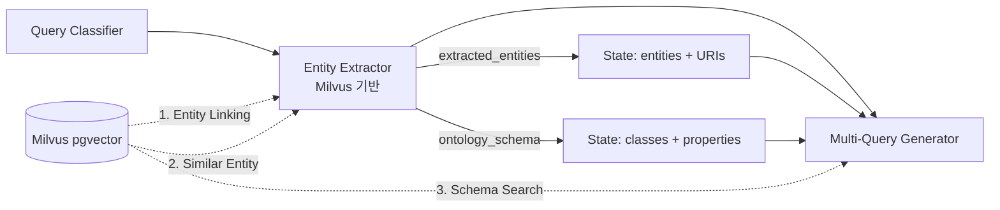

# Entity Extractor Node - Milvus 기반 설계

## 📋 개요

`entity_extractor_node.py`는 **Milvus pgvector**를 사용하여 사용자 질문에서 역사적 엔티티를 추출하고 온톨로지 URI로 매핑하는 노드입니다.

**현재 상태:** 설계 완료 (Milvus 연결은 추후 구현)

---

## 🎯 3가지 핵심 기능

### 1. Entity Linking (엔티티 매핑)

**목적:** 자연어 엔티티 → 온톨로지 URI 변환

**예시:**
```
입력: "이순신이 임진왜란에서 어떤 역할을 했나요?"
↓
추출된 엔티티:
- "이순신" → hist:YiSunSin (Person, 유사도: 0.98)
- "임진왜란" → hist:ImjinWar (Event, 유사도: 0.95)
```

**Milvus 검색 방식:**
```python
# 1. 질문 임베딩
query_vector = embeddings.embed_query("이순신이 임진왜란에서...")

# 2. Milvus 벡터 검색 (COSINE 유사도)
results = collection.search(
    data=[query_vector],
    anns_field="embedding",
    param={"metric_type": "COSINE"},
    limit=10,
    output_fields=["entity_name", "entity_type", "uri", "aliases"]
)
```

**Milvus 컬렉션: `historical_entities`**

| 필드 | 타입 | 설명 | 예시 |
|------|------|------|------|
| `entity_name` | VARCHAR | 한글 이름 | "이순신" |
| `entity_type` | VARCHAR | 엔티티 타입 | "Person" |
| `uri` | VARCHAR | 온톨로지 URI | "hist:YiSunSin" |
| `aliases` | ARRAY | 별칭 목록 | ["충무공", "李舜臣"] |
| `description` | VARCHAR | 설명 | "조선 수군 통제사" |
| `embedding` | FLOAT_VECTOR | 벡터 임베딩 (768차원) | [0.123, 0.456, ...] |

---

### 2. Similar Entity Search (유사 엔티티 검색)

**목적:** 동명이인, 관련 인물, 유사 사건 검색

**예시:**
```
메인 엔티티: "이순신" (hist:YiSunSin)
↓
유사 엔티티 검색:
- "원균" (hist:WonGyun, 유사도: 0.82) - "조선 수군 장수"
- "권율" (hist:GwonYul, 유사도: 0.78) - "조선 육군 장수"
```

**활용:**
- SPARQL 쿼리 확장 (관련 인물도 포함)
- 스토리 생성 시 풍부한 맥락 제공
- "이순신 외에 다른 장수들은?"과 같은 질문 대응

**Milvus 검색 방식:**
```python
# 엔티티 자체를 임베딩하여 유사한 엔티티 검색
entity_vector = embeddings.embed_query("이순신")

results = collection.search(
    data=[entity_vector],
    anns_field="embedding",
    param={"metric_type": "COSINE"},
    limit=5,
    expr=f"entity_type == 'Person' and uri != 'hist:YiSunSin'",  # 같은 타입, 다른 URI
    output_fields=["entity_name", "uri", "description"]
)
```

---

### 3. Schema Search (온톨로지 스키마 검색)

**목적:** MultiQueryGenerator에서 SPARQL 생성 시 사용할 클래스/속성 검색

**예시:**
```
추출된 엔티티 타입: ["Person", "Event"]
↓
온톨로지 스키마 검색:
{
  "classes": ["hist:Person", "hist:Event", "hist:Place", "hist:Nation"],
  "properties": {
    "Person": ["hist:participatesIn", "hist:hasRole", "hist:commands"],
    "Event": ["hist:occursAt", "hist:hasDate", "hist:leadsTo", "hist:causedBy"]
  }
}
```

**활용:**
- SPARQL 쿼리 자동 생성 시 올바른 속성 사용
- "이순신이 **참여한** 전투는?" → `hist:participatesIn` 사용
- "임진왜란이 **발생한** 장소는?" → `hist:occursAt` 사용

**Milvus 컬렉션: `ontology_schema`**

| 필드 | 타입 | 설명 | 예시 |
|------|------|------|------|
| `class_name` | VARCHAR | 온톨로지 클래스 | "hist:Person" |
| `properties` | ARRAY | 해당 클래스의 속성 목록 | ["hist:participatesIn", ...] |
| `schema_type` | VARCHAR | "class" or "property" | "class" |
| `domain` | VARCHAR | 속성의 도메인 | "hist:Person" |
| `range` | VARCHAR | 속성의 범위 | "hist:Event" |
| `embedding` | FLOAT_VECTOR | 스키마 임베딩 | [0.789, ...] |

**Milvus 검색 방식:**
```python
# 엔티티 타입을 임베딩하여 관련 스키마 검색
type_vector = embeddings.embed_query("Person ontology class")

results = schema_collection.search(
    data=[type_vector],
    anns_field="embedding",
    param={"metric_type": "COSINE"},
    limit=10,
    expr="schema_type == 'class' or schema_type == 'property'",
    output_fields=["class_name", "properties", "domain", "range"]
)
```

---

## 🏗️ 클래스 구조

### `MilvusEntityExtractor`

**주요 메서드:**

#### 1. `extract_entities(query: str) -> List[Dict]`
- **역할:** 메인 엔티티 추출 함수
- **처리 과정:**
  1. 질문 임베딩 생성
  2. Milvus 벡터 검색 (Entity Linking)
  3. 유사 엔티티 확장 (Similar Entity Search)
  4. 필터링 및 순위 정렬
- **반환 형식:**
```python
[
  {
    "name": "이순신",
    "type": "Person",
    "uri": "hist:YiSunSin",
    "similarity": 0.98,
    "aliases": ["충무공", "李舜臣"],
    "description": "조선 수군 통제사",
    "similar_entities": [
      {"name": "원균", "uri": "hist:WonGyun", "similarity": 0.82},
      {"name": "권율", "uri": "hist:GwonYul", "similarity": 0.78}
    ]
  },
  ...
]
```

#### 2. `_search_entities(query_vector: List[float], top_k: int) -> List[Dict]`
- **역할:** Milvus Entity Linking 검색
- **반환:** 상위 K개 엔티티

#### 3. `_enrich_with_similar_entities(entities: List[Dict], top_k: int) -> List[Dict]`
- **역할:** 각 엔티티마다 유사 엔티티 추가
- **반환:** `similar_entities` 필드가 추가된 엔티티 목록

#### 4. `_filter_and_rank_entities(entities: List[Dict]) -> List[Dict]`
- **역할:** 유사도 임계값 필터링 (0.7 이상) 및 정렬
- **반환:** 상위 10개 엔티티

#### 5. `search_ontology_schema(entity_types: List[str]) -> Dict[str, Any]`
- **역할:** 온톨로지 스키마 검색 (MultiQueryGenerator용)
- **반환:** 클래스 목록 및 속성 매핑

---

## 🔗 노드 함수: `entity_extractor_node(state: GraphState)`

**입력 (GraphState):**
- `query`: 사용자 질문

**출력 (GraphState에 추가):**
- `extracted_entities`: 추출된 엔티티 목록 (URI, 유사도, 유사 엔티티 포함)
- `ontology_schema`: 온톨로지 스키마 (클래스, 속성)

**처리 과정:**
```
1. MilvusEntityExtractor 초기화
   ↓
2. extract_entities(query) 실행
   → Entity Linking (Milvus 벡터 검색)
   → Similar Entity Search (유사 엔티티 확장)
   → 필터링 및 정렬
   ↓
3. search_ontology_schema(entity_types) 실행
   → Schema Search (클래스/속성 검색)
   ↓
4. State 업데이트 및 반환
```

---

## 📊 전체 워크플로우에서의 역할



**다음 노드 (MultiQueryGenerator)에서 활용:**
- `extracted_entities`: SPARQL 쿼리에 URI 삽입
  ```sparql
  SELECT ?event WHERE {
    hist:YiSunSin hist:participatesIn ?event  # URI 사용
  }
  ```
- `ontology_schema`: SPARQL 쿼리에 올바른 속성 사용
  ```sparql
  # Person의 속성: hist:participatesIn, hist:hasRole, ...
  # Event의 속성: hist:occursAt, hist:leadsTo, ...
  ```

---

## 🔧 환경 변수 설정

```bash
# Milvus 설정
MILVUS_HOST=localhost
MILVUS_PORT=19530

# Embedding 모델
EMBEDDING_MODEL=text-embedding-3-small
OPENAI_API_KEY=your_api_key_here
```

---

## 📝 TODO: 추후 구현 사항

### 1. Milvus 연결 구현
```python
# connections.connect 주석 제거
from pymilvus import Collection, connections

connections.connect(host=self.milvus_host, port=self.milvus_port)
self.entity_coll = Collection(self.entity_collection)
self.schema_coll = Collection(self.schema_collection)
```

### 2. Mock 데이터 → 실제 검색 로직 교체
- `_search_entities()`: 실제 Milvus 검색 코드 활성화
- `_enrich_with_similar_entities()`: 실제 유사 엔티티 검색 활성화
- `search_ontology_schema()`: 실제 스키마 검색 활성화

### 3. Milvus 컬렉션 생성
- `historical_entities` 컬렉션 생성 (인물, 사건, 장소 등)
- `ontology_schema` 컬렉션 생성 (클래스, 속성)
- 인덱스 생성 (HNSW, IVF_FLAT 등)

### 4. 데이터 임베딩 및 업로드
- `data/` 디렉토리의 역사 데이터 임베딩
- Milvus 컬렉션에 벡터 업로드

---

## 🧪 테스트 시나리오

### 시나리오 1: 단순 인물 질문
```
입력: "이순신이 누구인가요?"
↓
Entity Linking: "이순신" → hist:YiSunSin (0.98)
Similar Entity: "원균", "권율"
Schema Search: Person 클래스 속성
```

### 시나리오 2: 복합 질문 (인물 + 사건)
```
입력: "이순신이 임진왜란에서 어떤 역할을 했나요?"
↓
Entity Linking:
- "이순신" → hist:YiSunSin (0.98)
- "임진왜란" → hist:ImjinWar (0.95)
Similar Entity:
- "원균", "권율" (Person)
- "명량해전", "한산도대첩" (Event)
Schema Search:
- Person: ["hist:participatesIn", "hist:hasRole"]
- Event: ["hist:occursAt", "hist:hasDate"]
```

### 시나리오 3: What-if 질문
```
입력: "만약 원균이 명량해전을 지휘했다면?"
↓
Entity Linking:
- "원균" → hist:WonGyun (0.92)
- "명량해전" → hist:BattleOfMyeongnyang (0.96)
Similar Entity:
- "이순신", "권율" (Person)
- "한산도대첩", "부산포해전" (Event)
Schema Search:
- Person: ["hist:commands", "hist:participatesIn"]
- Event: ["hist:hasCommander", "hist:hasOutcome"]
```

---

## 📈 성능 고려사항

### 1. 임베딩 캐싱
- 자주 검색되는 엔티티는 임베딩 캐싱
- Redis 또는 in-memory cache 사용

### 2. Milvus 인덱스 최적화
- HNSW 인덱스 (빠른 검색)
- nprobe 파라미터 조정 (정확도 vs 속도)

### 3. 병렬 검색
- Entity Linking과 Schema Search 병렬 실행
- ThreadPoolExecutor 활용

---

## 🎓 참고 자료

- [Milvus 공식 문서](https://milvus.io/docs)
- [pymilvus 라이브러리](https://github.com/milvus-io/pymilvus)
- [OpenAI Embeddings](https://platform.openai.com/docs/guides/embeddings)
