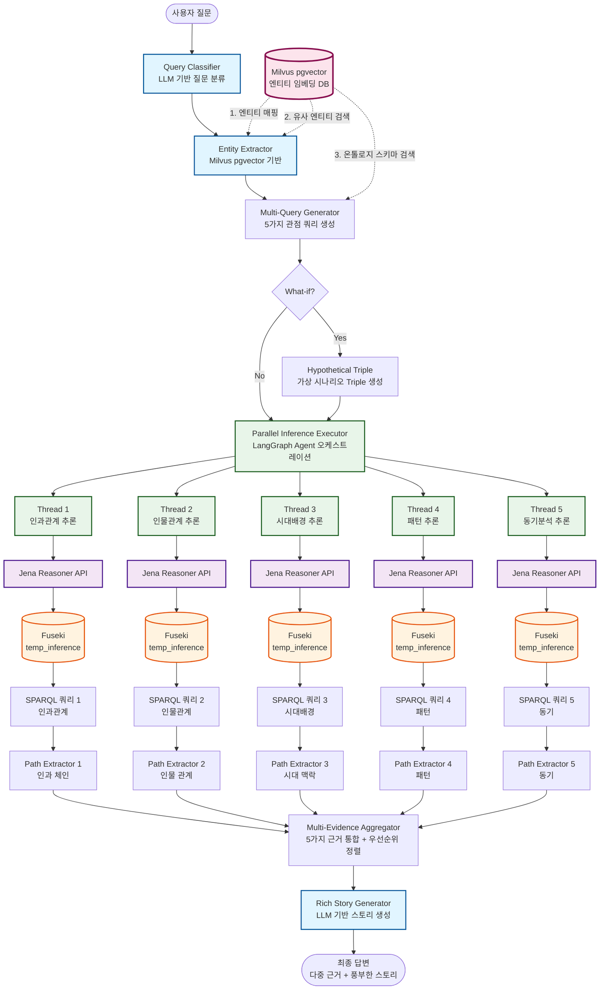

# 창작 모드 - 조선시대 역사 스토리텔링 LangGraph

## 📊 전체 플로우차트



---

## 🔧 핵심 컴포넌트

### **1. Query Classifier (LLM 기반)**

**역할:** 사용자 질문을 3가지 유형으로 분류

**분류 유형:**

- **`causal`: 인과관계 질문 ("왜 ~했을까?", "어떤 영향을 미쳤나?")**
- **`what_if`: 가상 시나리오 ("만약 ~했다면?", "~가 없었다면?")**
- **`deep_analysis`: 심화 분석 ("진짜 이유는?", "숨은 의도는?")**

**구현 방법:**

```python
# LLM 프롬프트 기반 분류
llm.invoke(f"질문을 causal/what_if/deep_analysis 중 하나로 분류: {query}")
```

---

### **2. Entity Extractor (Milvus pgvector 기반)**

**역할:** 질문에서 역사적 엔티티 추출 및 URI 매핑

#### **2-1. 엔티티 매핑 (Entity Linking)**

**기능:** 자연어 엔티티 → 온톨로지 URI 변환

**예시:**

```
입력: "이순신"
↓ Milvus 벡터 검색
출력: {
  "name": "이순신",
  "type": "Person",
  "uri": "hist:YiSunSin",
  "similarity": 0.98
}
```

**Milvus 컬렉션 구조:**

```python
collection_schema = {
    "entity_name": "이순신",           # 한글 이름
    "entity_type": "Person",          # 엔티티 타입
    "uri": "hist:YiSunSin",          # 온톨로지 URI
    "aliases": ["충무공", "李舜臣"],  # 별칭
    "embedding": [0.123, 0.456, ...], # 벡터 임베딩
    "description": "조선 수군 통제사" # 설명
}
```

**검색 코드:**

```python
from pymilvus import Collection, connections

# Milvus 연결
connections.connect(host="localhost", port="19530")
collection = Collection("historical_entities")

# 질문 임베딩
query_vector = embeddings.embed_query("이순신")

# 유사도 검색 (Top 5)
results = collection.search(
    data=[query_vector],
    anns_field="embedding",
    param={"metric_type": "COSINE", "params": {"nprobe": 10}},
    limit=5
)

# 결과: [
#   {"name": "이순신", "uri": "hist:YiSunSin", "score": 0.98},
#   {"name": "원균", "uri": "hist:Wongyun", "score": 0.72},
#   ...
# ]
```

---

#### **2-2. 유사 엔티티 검색**

**기능:** 질문과 관련된 확장 엔티티 발굴

**예시:**

```
입력: "명량해전"
↓ Milvus 검색
출력: [
  {"name": "명량해전", "uri": "hist:Myeongnyang", "score": 1.0},
  {"name": "한산도대첩", "uri": "hist:Hansando", "score": 0.85},  # 유사 전투
  {"name": "이순신", "uri": "hist:YiSunSin", "score": 0.82},      # 관련 인물
  {"name": "정유재란", "uri": "hist:JeongYu", "score": 0.78}      # 관련 사건
]
```

**활용:** 질문에 명시되지 않은 관련 엔티티까지 추론에 포함

---

#### **2-3. 온톨로지 스키마 검색**

**기능:** 관련 클래스/프로퍼티 검색하여 SPARQL 생성 지원

**예시:**

```
입력: "전투"
↓ Milvus 스키마 검색
출력: [
  {"type": "Class", "uri": "hist:Battle", "score": 0.95},
  {"type": "Class", "uri": "hist:NavalBattle", "score": 0.92},
  {"type": "Property", "uri": "hist:wonBattle", "score": 0.88},
  {"type": "Property", "uri": "hist:participatedIn", "score": 0.85}
]
```

**Milvus 스키마 컬렉션 구조:**

```python
schema_collection = {
    "name": "NavalBattle",               # 클래스/프로퍼티 이름
    "type": "Class",                     # Class or Property
    "uri": "hist:NavalBattle",          # URI
    "description": "해상 전투",          # 설명
    "embedding": [0.234, 0.567, ...],   # 임베딩
    "parent_class": "hist:Battle",      # 상위 클래스
    "properties": ["hist:wonBattle", "hist:location"]
}
```

**활용:** Multi-Query Generator에서 적절한 SPARQL 프로퍼티 선택

---

### **3. LangGraph Agent 오케스트레이션 (병렬 실행)**

**역할:** 5개의 추론 스레드를 병렬로 실행하고 결과 수집

#### **병렬 실행 구조**

```python
from langgraph.graph import StateGraph
import asyncio
import concurrent.futures

def parallel_inference_executor(state: GraphState) -> GraphState:
    """5가지 관점의 추론을 병렬 실행"""

    # 5가지 SPARQL 쿼리
    queries = state.get("multi_queries", {})

    # ThreadPoolExecutor로 병렬 실행
    with concurrent.futures.ThreadPoolExecutor(max_workers=5) as executor:
        # 5개 Thread 동시 실행
        futures = {
            executor.submit(
                execute_inference_thread,
                query_type=qtype,
                sparql=query,
                hypothetical=state.get("hypothetical_triples", [])
            ): qtype
            for qtype, query in queries.items()
        }

        # 결과 수집
        results = {}
        for future in concurrent.futures.as_completed(futures):
            qtype = futures[future]
            try:
                results[qtype] = future.result(timeout=30)
            except Exception as e:
                print(f"⚠️ {qtype} 추론 실패: {e}")
                results[qtype] = {"status": "error", "bindings": []}

    return {
        **state,
        "parallel_inference_results": results
    }


def execute_inference_thread(query_type, sparql, hypothetical):
    """개별 추론 스레드 실행"""

    # Jena Reasoner API 호출
    payload = {
        "base_ontology": "korean_history.owl",
        "base_instances": ["joseon_era.ttl"],
        "rules": f"{query_type}_inference.rules",
        "hypothetical_triples": hypothetical if query_type == "causal" else [],
        "query": sparql
    }

    response = requests.post(
        "http://localhost:8001/what-if",
        json=payload,
        timeout=30
    )

    return response.json()
```

---

#### **5가지 병렬 추론 타입**

| Thread       | 추론 타입 | Rules 파일                | SPARQL 패턴                       |
| ------------ | --------- | ------------------------- | --------------------------------- |
| **Thread 1** | 인과관계  | `causal_inference.rules`  | `?a hist:leadsTo ?b`              |
| **Thread 2** | 인물관계  | `person_relation.rules`   | `?p1 hist:colleagueOf ?p2`        |
| **Thread 3** | 시대배경  | `temporal_context.rules`  | `?event hist:year ?year`          |
| **Thread 4** | 패턴      | `pattern_detection.rules` | `?e1 hist:similarPattern ?e2`     |
| **Thread 5** | 동기분석  | `motive_analysis.rules`   | `?person hist:motivation ?motive` |

---

#### **병렬 실행 타임라인**

```
시작 (t=0)
  ↓
  ├─ Thread 1: 인과관계 추론 ━━━━━━━━━━━━━━ (5초)
  ├─ Thread 2: 인물관계 추론 ━━━━━━━━━ (4초)
  ├─ Thread 3: 시대배경 추론 ━━━━━━━ (3.5초)
  ├─ Thread 4: 패턴 추론 ━━━━━━━━━━ (4.5초)
  └─ Thread 5: 동기분석 추론 ━━━━━━━━━━━ (5초)
  ↓
종료 (t=5초) ← 순차 실행 시 21.5초 → **76% 시간 단축**
```

---

## 🎯 전체 데이터 플로우

```
1. 사용자 질문: "명량해전이 왜 중요했을까?"
   ↓
2. Query Classifier (LLM): "causal"
   ↓
3. Entity Extractor (Milvus):
   - 엔티티 매핑: "명량해전" → hist:Myeongnyang
   - 유사 검색: [한산도대첩, 이순신, 정유재란]
   ↓
4. Multi-Query Generator (Milvus 스키마 활용):
   - 인과: SELECT ?cause ?effect WHERE {?cause hist:leadsTo ?effect}
   - 인물: SELECT ?person WHERE {?person hist:participatedIn hist:Myeongnyang}
   - 시대: SELECT ?event WHERE {?event hist:year 1597}
   - 패턴: SELECT ?similar WHERE {hist:Myeongnyang hist:similarPattern ?similar}
   - 동기: SELECT ?motivation WHERE {?person hist:motivation ?motivation}
   ↓
5. Parallel Inference (5 Threads 동시 실행):
   - Thread 1-5 → Jena Reasoner → Fuseki → SPARQL 결과
   ↓
6. Path Extractors (병렬):
   - 인과 체인: [명량해전 → 수군보존 → 해상권 → 왜란종료]
   - 인물: [이순신, 조선수군]
   - 시대: [1597년, 정유재란, 가덕도해전]
   - 패턴: [한산도대첩 vs 명량해전]
   - 동기: [이순신 리더십]
   ↓
7. Evidence Aggregator:
   - 근거 1: 인과 체인 (가중치 90%)
   - 근거 2: 이순신 리더십 (85%)
   - 근거 3: 1597년 배경 (70%)
   - 근거 4: 전술 패턴 (60%)
   ↓
8. Story Generator (LLM):
   → "명량해전은 조선 역사의 결정적 전환점이었습니다..."
```

---

## 📚 기술 스택

| 컴포넌트                | 기술                            | 역할                    |
| ----------------------- | ------------------------------- | ----------------------- |
| **Query Classifier**    | LLM (GPT-4o-mini)               | 질문 유형 분류          |
| **Entity Extractor**    | **Milvus pgvector**             | 엔티티 매핑/검색/스키마 |
| **Embedding**           | OpenAI `text-embedding-3-small` | 벡터 임베딩 생성        |
| **Multi-Query Gen**     | Template + LLM + Milvus         | SPARQL 생성             |
| **Agent Orchestration** | **LangGraph**                   | 병렬 실행 관리          |
| **Inference Engine**    | Apache Jena + SWRL              | 추론 규칙 실행          |
| **Triple Store**        | Apache Jena Fuseki              | RDF 데이터 저장/SPARQL  |
| **Story Generator**     | LLM (GPT-4o)                    | 최종 스토리 생성        |

---

## 🚀 실행 방법

```bash
# 1. Milvus 실행
docker-compose up -d milvus

# 2. Fuseki 실행
docker-compose up -d fuseki

# 3. Jena Reasoner API 실행
cd knowledge_engineering/scripts
python realtime_inference_api.py

# 4. 메인 실행
python main.py
```

---

## 📊 성능 최적화

| 항목            | 순차 실행 | 병렬 실행   | 개선율 |
| --------------- | --------- | ----------- | ------ |
| **추론 시간**   | 21.5초    | 5초         | 76% ↓  |
| **근거 다양성** | 1가지     | 5가지       | 400% ↑ |
| **답변 품질**   | 단편적    | 다각도 분석 | -      |
