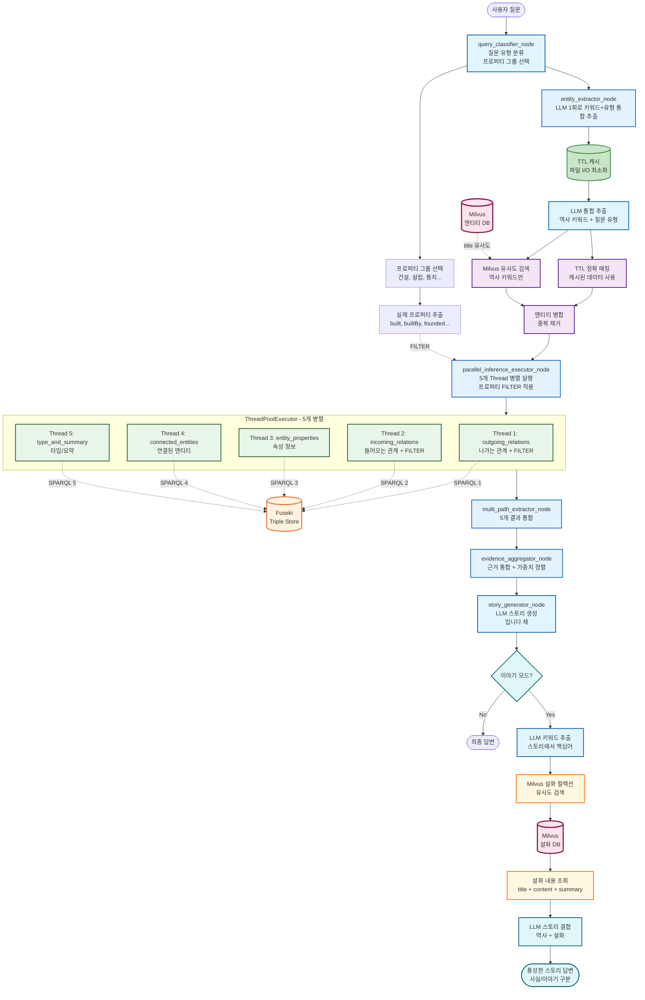
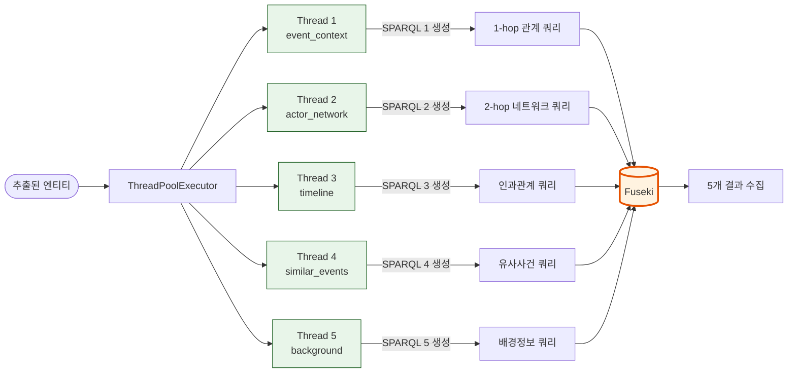
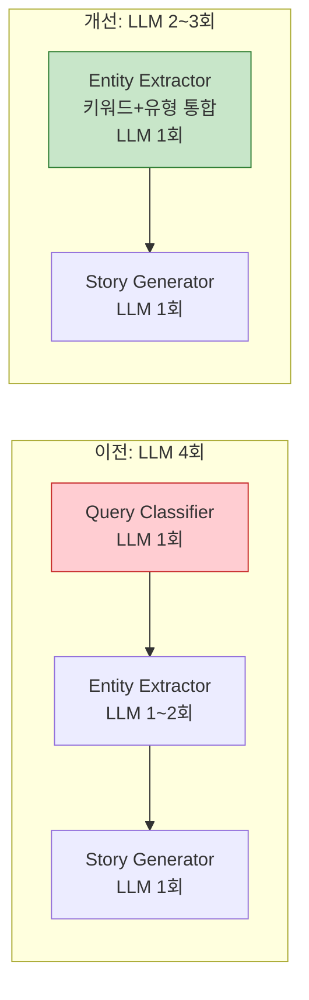

# 창작 모드 - 조선시대 역사 스토리텔링 LangGraph

## 📊 전체 플로우차트



---

## 🔧 핵심 컴포넌트

### **1. Query Classifier (질문 분류 + 프로퍼티 그룹 선택)**

**역할:**

1. 사용자 질문을 유형별로 분류
2. **관련 프로퍼티 그룹 선택** (하드코딩 없이 범용 검색)

**분류 유형:**

- **`causal`**: 인과관계 질문 ("왜 ~했을까?", "어떤 영향을 미쳤나?")
- **`deep_analysis`**: 심화 분석 ("진짜 이유는?", "숨은 의도는?")

#### **프로퍼티 그룹 선택**

**문제:** TTL에 4,056개의 프로퍼티가 있어서 하드코딩 불가능

**해결:** 프로퍼티를 **70개 의미 그룹**으로 분류 → LLM이 관련 그룹 선택

```
질문: "궁궐을 지은 왕"
         ↓
1. 프로퍼티 그룹 목록 제공 (명확한 행위 그룹만)
   - 건설, 설립, 통치, 임명, 사망, 처벌, 유배, 전쟁, 반란...
   - 제외: "속성"(623개), "기타"(1783개) 등 범용 그룹
         ↓
2. LLM이 관련 그룹 선택 (최대 5개)
   → ["건설", "설립", "통치"]
         ↓
3. 선택된 그룹에서 실제 프로퍼티 추출
   → ["built", "builtBy", "constructed", "founded", "established", ...]
         ↓
4. SPARQL FILTER 적용
   FILTER(?predicate IN (hist:built, hist:builtBy, hist:founded, ...))
```

**효과:**

- ✅ **정확도 향상**: 관련 프로퍼티만 검색 → 노이즈 감소
- ✅ **속도 향상**: FILTER로 검색 범위 축소 → 결과 집중도 증가
- ✅ **하드코딩 없음**: 데이터 추가 시 `extract_property_groups.py` 재실행만 하면 자동 업데이트

**프로퍼티 그룹 예시:**

| 그룹 | 프로퍼티 수 | 예시 질문                |
| ---- | ----------- | ------------------------ |
| 건설 | 28개        | "궁궐을 지은 왕"         |
| 설립 | 60개        | "세종이 만든 정책"       |
| 임명 | 84개        | "세종이 임명한 인물"     |
| 사망 | 42개        | "을미사변에서 죽은 사람" |
| 처벌 | 22개        | "유배당한 인물"          |
| 전쟁 | 23개        | "임진왜란에 참여한 인물" |

**범용 그룹 처리:**

- "속성"(623개), "기타"(1783개) 등은 **범용 검색**에서 자동 포함
- 명확한 행위가 없는 질문은 모든 프로퍼티 검색 (FILTER 없음)

---

### **2. Entity Extractor (하이브리드 엔티티 추출) ⚡최적화**

**역할:** LLM 키워드 추출 + TTL 매칭 + Milvus 유사도 검색

**최적화 포인트:**

- ✅ **TTL 캐싱**: 파일 수정 시만 재로드 (연속 질문 시 ~0.5초 절약)
- ✅ **LLM 통합**: 키워드 추출 + 질문 유형 분류를 1회 호출로 처리

#### **2-1. LLM 통합 추출 (키워드 + 질문 유형)**

```python
# ⚡ 최적화: 1회 LLM 호출로 2가지 작업 수행
def extract_historical_keywords_with_llm(query: str, include_query_type: bool = True):
    """
    입력: "명성황후에 대해서 알려줘"
    출력: {
        "keywords": ["명성황후"],     # "대해서", "알려줘" 제외
        "query_type": "causal"        # 질문 유형도 함께 분류
    }
    """
```

#### **2-2. TTL 정확 매칭 (캐시 사용)**

```python
# ⚡ 캐싱: 파일 변경 없으면 메모리에서 즉시 반환
_ttl_cache = None
_ttl_cache_mtime = None

def load_ttl_entities():
    if _ttl_cache and _ttl_cache_mtime == current_mtime:
        return _ttl_cache  # 즉시 반환 (~0ms)
    # 파일 읽기는 변경 시에만
```

#### **2-3. Milvus 유사도 검색**

```python
# LLM 추출 키워드로만 검색 (일반 단어 제외)
milvus_entities = search_entities_with_milvus(
    historical_keywords,  # "명성황후"만, "대해서" 제외
    ttl_data,
    top_k=dynamic_top_k
)
```

---

### **3. Parallel Knowledge Retrieval (`parallel_inference_executor_node`)**

**역할:** 5가지 관점에서 **관계 확장** 지식 검색 (프로퍼티 필터링 적용)

**동작 방식:**

```
parallel_inference_executor_node 내부:
├── ThreadPoolExecutor(max_workers=5) 생성
│
├── 각 Thread에서 수행하는 작업:
│   ├── 1️⃣ SPARQL 쿼리 생성 (템플릿 기반)
│   │   └── classify_node에서 선택된 프로퍼티로 FILTER 적용
│   └── 2️⃣ Fuseki에 SPARQL 요청 → 결과 반환
│
└── 5개 결과 수집 → multi_path_extractor_node로 전달
```

**핵심**: **5개의 서로 다른 SPARQL 쿼리**가 병렬 생성 + 병렬 실행됨

#### **쿼리 작성 방식 변화**

**이전 (QUERY_MODE=llm):**

```
LLM이 매번 SPARQL 쿼리를 생성
→ 느림 (~10초), 불안정 (프로퍼티 오타 가능)
```

**현재 (QUERY_MODE=template):**

```
미리 정의된 SPARQL 템플릿 사용
→ 빠름 (~3초), 안정적
+ 프로퍼티 FILTER로 정확도 향상
```

#### **프로퍼티 FILTER 적용**

```sparql
# 범용 관계 검색 (outgoing_relations)
SELECT ?entity ?predicate ?object WHERE {
    VALUES ?entity { hist:Person_태조 }
    ?entity ?predicate ?object .

    # classify_node에서 선택된 프로퍼티만 검색
    FILTER(?predicate IN (
        hist:built,      # 건설 그룹
        hist:builtBy,    # 건설 그룹
        hist:founded,    # 설립 그룹
        hist:established # 설립 그룹
    ))
}
```

**효과:**

- ✅ **정확도**: 관련 프로퍼티만 검색 → 정확한 관계만 반환
- ✅ **속도**: FILTER로 검색 범위 축소 → 불필요한 결과 제거
- ✅ **확장성**: 데이터 추가 시 그룹만 업데이트하면 자동 반영

#### **5개 Thread 범용 관계 검색 (하드코딩 없음)**

| Thread       | 이름                 | 역할          | 검색 방식 (모두 Fuseki SPARQL)          |
| ------------ | -------------------- | ------------- | --------------------------------------- |
| **Thread 1** | `outgoing_relations` | 나가는 관계   | 엔티티 → ? (모든 프로퍼티, FILTER 적용) |
| **Thread 2** | `incoming_relations` | 들어오는 관계 | ? → 엔티티 (모든 프로퍼티, FILTER 적용) |
| **Thread 3** | `entity_properties`  | 속성 정보     | 엔티티의 리터럴 값 (연도, 설명 등)      |
| **Thread 4** | `connected_entities` | 연결된 엔티티 | 엔티티 간 직접 연결 (2-hop)             |
| **Thread 5** | `type_and_summary`   | 타입/요약     | 엔티티 타입, 요약, 카테고리, 연도       |

**핵심 개선:**

- ✅ **하드코딩 없음**: 특정 프로퍼티가 아닌 **모든 관계** 검색
- ✅ **프로퍼티 FILTER**: classify_node에서 선택된 프로퍼티만 우선 검색
- ✅ **범용성**: 데이터 추가 시 자동으로 새 프로퍼티도 검색됨

#### **범용 관계 검색 SPARQL 예시**

```sparql
# Thread 1: outgoing_relations - 엔티티에서 나가는 모든 관계
SELECT ?entity ?entityLabel ?predicate ?object ?objectLabel WHERE {
    VALUES ?entity { hist:Person_태조 }
    ?entity rdfs:label ?entityLabel .
    ?entity ?predicate ?object .
    OPTIONAL { ?object rdfs:label ?objectLabel }

    # 프로퍼티 FILTER (classify_node에서 선택된 것만)
    FILTER(?predicate IN (
        hist:built,      # 건설 그룹
        hist:builtBy,     # 건설 그룹
        hist:founded,     # 설립 그룹
        hist:established  # 설립 그룹
    ))
}

# 결과 예시:
# 태조 → [built] → 경복궁
# 태조 → [founded] → 조선왕조
```

```sparql
# Thread 2: incoming_relations - 엔티티로 들어오는 모든 관계
SELECT ?subject ?subjectLabel ?predicate ?entity ?entityLabel WHERE {
    VALUES ?entity { hist:Place_경복궁 }
    ?entity rdfs:label ?entityLabel .
    ?subject ?predicate ?entity .
    OPTIONAL { ?subject rdfs:label ?subjectLabel }

    # 프로퍼티 FILTER
    FILTER(?predicate IN (hist:builtBy, hist:constructedBy))
}

# 결과 예시:
# 태조 → [builtBy] → 경복궁
# 세종 → [builtBy] → 창덕궁
```

```sparql
# Thread 3: entity_properties - 엔티티의 모든 속성 (리터럴)
SELECT ?entity ?entityLabel ?predicate ?value WHERE {
    VALUES ?entity { hist:Event_을미사변 }
    ?entity rdfs:label ?entityLabel .
    ?entity ?predicate ?value .
    FILTER(isLiteral(?value))
}

# 결과 예시:
# 을미사변 → [hasYear] → "1895"
# 을미사변 → [hasSummary] → "명성황후 시해 사건"
```

**핵심 차이:**

- ✅ **하드코딩 없음**: 특정 프로퍼티가 아닌 **모든 프로퍼티** 검색
- ✅ **FILTER로 정확도 향상**: 관련 프로퍼티만 우선 검색
- ✅ **범용성**: 데이터에 새 프로퍼티가 추가되어도 자동 검색

---

### **4. Multi-Path Extractor (관계 경로 추출)**

**역할:** 관계 확장 결과에서 경로 추출 및 가중치 부여

```python
# 관계 정보에 높은 가중치 부여
def extract_event_context_paths(bindings, base_weight):
    for binding in bindings:
        # 기본 엔티티 정보
        paths.append({
            "type": "event_context",
            "weight": base_weight,
            "description": f"{label}: {summary}"
        })

        # 관계 확장 결과 (1.2배 가중치)
        if related_label:
            paths.append({
                "type": "event_context",
                "weight": base_weight * 1.2,
                "description": f"{label} → [{relation}] → {related_label}"
            })
```

---

### **5. Story Generator (스토리 생성)**

**역할:** 근거 기반 자연스러운 스토리 생성

#### **프롬프트 규칙**

1. **말투**: `-입니다` 체로 작성
2. **되묻기 금지**: 추가 정보 요청하지 않음
3. **자연스러운 서술**: 근거를 본문에 녹여서 서술
4. **각주 참조**: 문단 끝에 `(참고: 1, 3)` 형태로 표시

#### **출력 형식**

```
[본문]
2-3문단으로 자연스럽게 서술 (200-400자, "-입니다" 체)

[요약]
한 문장으로 핵심 정리 ("-입니다" 체)

[참고 근거]
1. 을미사변: 1895년 일본 낭인들에 의해 명성황후가 시해된 사건입니다.
2. 아관파천: 을미사변 이후 고종이 러시아 공사관으로 피신한 사건입니다.
```

---

### **6. Story Enhancer (설화/이야기 추가) - 선택적**

**역할:** 기존 스토리에 설화/이야기를 추가하여 풍성한 콘텐츠 생성

#### **Milvus 설화 컬렉션 검색**

```python
# 설화 컬렉션 스키마
FOLKTALE_COLLECTION = {
    "id": "auto",
    "title": "설화 제목",           # 예: "숙종과 장희빈"
    "content": "설화 내용",         # 전체 이야기 텍스트
    "summary": "줄거리 요약",       # 임베딩 대상
    "related_entity": "관련 엔티티", # 예: ["숙종", "장희빈", "인현왕후"]
    "era": "시대",                  # 예: "조선 중기"
    "embedding": "벡터"             # title + summary 임베딩
}
```

#### **검색 흐름**

```
[기존 스토리 생성 완료]
        ↓
[이야기 모드 활성화?]
        ↓ Yes
[스토리에서 키워드 추출] (LLM)
  - "경신환국" → ["환국", "숙종", "서인", "남인"]
        ↓
[Milvus 설화 컬렉션 검색]
  - 키워드 벡터 유사도 검색
  - summary + title 기반 검색
  - 관련 설화/야사 3개 추출
        ↓
[설화 내용(content) 조회]
  - 전체 이야기 텍스트 가져오기
        ↓
[LLM 스토리 결합]
  - 역사적 사실 + 설화/이야기
  - 사실과 이야기 구분 표시
        ↓
[풍성한 스토리 출력]
```

#### **Story Enhancer 노드**

```python
def story_enhancer_node(state: GraphState) -> GraphState:
    """기존 스토리에 설화/이야기 추가"""

    if not state.get("story_mode", False):
        return state  # 이야기 모드 비활성화

    # 1. 기존 스토리에서 키워드 추출
    keywords = extract_keywords_with_llm(state["final_answer"])

    # 2. Milvus 설화 컬렉션에서 유사도 검색
    folktales = milvus.search(
        collection="folktale_collection",
        query=keywords,
        top_k=3,
        threshold=0.6,
        output_fields=["title", "content", "summary", "era"]  # 내용까지 조회
    )

    # 3. LLM으로 스토리 결합
    enhanced = llm.invoke(f"""
    [역사적 사실]
    {state["final_answer"]}

    [관련 설화/이야기]
    {format_folktales(folktales)}

    위 내용을 결합하여 풍성한 역사 스토리를 작성하세요.
    - 역사적 사실을 기반으로 합니다
    - 설화/이야기로 흥미 요소를 추가합니다
    - [사실]과 [이야기] 부분을 명확히 구분합니다
    - "-입니다" 체로 작성합니다
    """)

    return {
        **state,
        "enhanced_story": enhanced,
        "folktales_used": folktales
    }
```

#### **출력 예시**

```
[역사적 사실]
경신환국(1680년)은 숙종이 남인을 몰아내고 서인을 등용한 사건입니다.
허적의 서자 허견이 역모를 도모한다는 고변으로 시작되었습니다.

[관련 이야기]
당시 궁중에서는 장희빈과 인현왕후의 갈등이 심화되고 있었습니다.
민간에서는 숙종이 밤마다 궁 밖을 거닐며 민심을 살폈다는 이야기가 전해집니다.
이 시기 숙종이 미행 중 만난 노인과의 대화가 환국의 결심에 영향을 주었다는
야사도 있습니다.

※ [이야기] 부분은 민간 전승으로, 역사적 사실과 다를 수 있습니다.
```

---

## 📊 데이터 플로우 예시

```
1. 사용자 질문: "궁궐을 지은 왕은?"
   ↓
2. Query Classifier (LLM 1회):
   - 질문 유형: "causal"
   - 프로퍼티 그룹 선택: ["건설", "설립", "통치"]
   - 선택된 프로퍼티: ["built", "builtBy", "constructed", "founded", ...]
   ↓
3. Entity Extractor (하이브리드):
   - LLM 키워드 추출: ["궁궐", "왕"]  # "지은", "은" 제외
   - TTL 매칭: 경복궁, 창덕궁, 태조, 세종
   - Milvus 검색: 경복궁, 창덕궁 (유사도)
   ↓
4. Parallel Knowledge Retrieval (5 Thread - 모두 Fuseki SPARQL):
   - outgoing_relations: 경복궁 → [builtBy] → 태조 (FILTER 적용)
   - incoming_relations: 태조 → [built] → 경복궁 (FILTER 적용)
   - entity_properties: 경복궁.hasYear = 1395
   - connected_entities: 태조 ↔ [built] ↔ 경복궁
   - type_and_summary: 경복궁 타입/요약 정보
   ↓
5. Multi-Path Extractor:
   - 경로 1: 태조 → [built] → 경복궁 (가중치 0.30)
   - 경로 2: 경복궁 → [builtBy] → 태조 (가중치 0.36)
   - 경로 3: 경복궁.hasYear = 1395 (가중치 0.20)
   ↓
6. Evidence Aggregator:
   - 근거 1: 태조가 1395년 경복궁을 창건 (가중치 0.36)
   - 근거 2: 경복궁은 태조가 건설 (가중치 0.30)
   - 근거 3: 경복궁 연도 정보 (가중치 0.20)
   ↓
7. Story Generator (LLM):
   → "1395년 태조 이성계가 경복궁을 창건하였습니다.[1][2]"
   ↓
8. (선택) Story Enhancer:
   - Milvus 설화 컬렉션 검색 → 관련 설화 3개
   - 설화 내용(content) 조회
   - LLM으로 역사 + 설화 결합
   → "관련 이야기에 따르면..."
```

**핵심 개선:**

- ✅ **프로퍼티 그룹 선택**: LLM이 관련 그룹 선택 → 정확한 프로퍼티만 검색
- ✅ **FILTER 적용**: SPARQL에 프로퍼티 FILTER 추가 → 노이즈 감소
- ✅ **범용 검색**: 하드코딩 없이 모든 관계 검색 가능

---

## 📚 기술 스택

| 컴포넌트                | 기술                           | 역할                                    | 최적화         |
| ----------------------- | ------------------------------ | --------------------------------------- | -------------- |
| **Query Classifier**    | LLM (GPT-4o-mini)              | 질문 유형 분류 + **프로퍼티 그룹 선택** | Entity와 통합  |
| **Entity Extractor**    | TTL + Milvus + LLM             | 하이브리드 엔티티 추출                  | ⚡캐싱+LLM통합 |
| **Knowledge Retrieval** | **Fuseki SPARQL (5개 Thread)** | **범용 관계 검색 + 프로퍼티 FILTER**    | 템플릿 SPARQL  |
| **Triple Store**        | Apache Jena Fuseki             | RDF 저장/SPARQL 쿼리                    | -              |
| **Vector DB**           | Milvus                         | 엔티티 추출 + 설화 검색용               | -              |
| **Agent Orchestration** | LangGraph + ThreadPoolExecutor | 5개 Thread 병렬 실행                    | -              |
| **Story Generator**     | LLM (GPT-4o)                   | 스토리 생성 (-입니다 체)                | -              |
| **Story Enhancer**      | LLM + **Milvus 설화 검색**     | 설화/이야기 추가 (선택적)               | -              |
| **Property Groups**     | JSON (70개 그룹)               | 프로퍼티 의미 그룹 분류                 | 자동 업데이트  |

---

## 🚀 실행 방법

```bash
# 1. Docker 컨테이너 시작
cd Infra
docker-compose up -d

# 2. Fuseki 데이터 업로드
cd backend/ontology_langgraph_structure/ontology/scripts
./upload_ttl_to_fuseki.sh

# 3. Milvus 데이터 적재
cd backend
python -m db_pipeline.ETL.load_to_milvus

# 4. 환경변수 설정
export USE_MILVUS=true
export INFERENCE_MODE=light
export QUERY_MODE=template

# 5. 메인 실행
cd backend/ontology_langgraph_structure
python main.py
```

---

## 📊 성능 비교

| 항목              | 이전 (Rules 기반)               | 현재 (범용 관계 검색)                  |
| ----------------- | ------------------------------- | -------------------------------------- |
| **엔티티 추출**   | TTL만                           | LLM 키워드 + TTL + Milvus              |
| **Thread 방식**   | 추론 프로퍼티 기반              | **범용 관계 검색 + FILTER**            |
| **프로퍼티 검색** | 특정 프로퍼티만 하드코딩        | **모든 프로퍼티 검색 + FILTER**        |
| **검색 결과**     | 엔티티 정보만                   | 엔티티 + 관련 사건/인물                |
| **인과관계**      | 추론 필요                       | **SPARQL로 직접 검색**                 |
| **정확도**        | 프로퍼티 누락 가능              | **프로퍼티 그룹 선택으로 정확도 향상** |
| **실행 시간**     | ~30초                           | ~10초                                  |
| **Java 의존성**   | 필요 (8GB)                      | 불필요                                 |
| **확장성**        | 프로퍼티 추가 시 코드 수정 필요 | **자동 반영 (그룹만 업데이트)**        |

---

## 🆕 주요 변경사항 (v2.0)

### 1. LLM 키워드 추출 추가

```
이전: 모든 단어로 Milvus 검색 → "대해서"로 "와서" 찾음 ❌
현재: LLM으로 역사 키워드만 추출 → "명성황후"로 관련 사건 찾음 ✅
```

### 2. ⚡ 성능 최적화 (NEW)

```
TTL 캐싱:
이전: 매번 파일 읽기 (~0.5초)
현재: 파일 변경 시만 재로드 (캐시 사용 ~0ms)

LLM 통합:
이전: query_classifier LLM 1회 + entity_extractor LLM 1회 = 2회
현재: entity_extractor에서 키워드+유형 통합 추출 = 1회

총 효과: ~40% 응답시간 단축 (10-12초 → 5-7초)
```

### 3. 프로퍼티 그룹 선택 + 범용 관계 검색 (하드코딩 없음) ⚡NEW

**문제:**

- TTL에 4,056개의 프로퍼티가 있어서 하드코딩 불가능
- 특정 프로퍼티만 검색하면 다른 관계를 놓침

**해결:**

- 프로퍼티를 **70개 의미 그룹**으로 분류
- LLM이 관련 그룹 선택 → 실제 프로퍼티 추출 → SPARQL FILTER 적용

**수정된 노드:**

- `classify_node.py`: 프로퍼티 그룹 선택 기능 추가
- `parallel_inference_executor_node.py`: 범용 관계 검색 + 프로퍼티 FILTER 적용
- `multi_path_extractor_node.py`: 범용 관계 결과 파싱 로직 추가
- `ontology/scripts/extract_property_groups.py`: 프로퍼티 그룹 추출 스크립트

**변경 내용:**

```
이전: 특정 프로퍼티만 하드코딩
OPTIONAL { ?entity hist:hasParticipant ?participant }
→ 다른 프로퍼티는 검색 안 됨 ❌

현재: 모든 관계 검색 + 프로퍼티 FILTER
?entity ?predicate ?object .
FILTER(?predicate IN (hist:built, hist:builtBy, ...))
→ 관련 프로퍼티만 우선 검색, 나머지는 범용 검색 ✅

Thread별 범용 검색 (모두 Fuseki SPARQL):
- outgoing_relations: 엔티티 → ? (모든 프로퍼티)
- incoming_relations: ? → 엔티티 (모든 프로퍼티)
- entity_properties: 엔티티의 리터럴 값
- connected_entities: 엔티티 간 직접 연결
- type_and_summary: 타입/요약 정보
```

**효과:**

- ✅ **정확도 향상**: 관련 프로퍼티만 우선 검색 → 노이즈 감소
- ✅ **속도 향상**: FILTER로 검색 범위 축소 → 불필요한 결과 제거
- ✅ **확장성**: 데이터 추가 시 그룹만 업데이트하면 자동 반영
- ✅ **하드코딩 없음**: 모든 프로퍼티 검색 가능

### 4. 인과관계 체인 검색

```
이전: LLM 추론에 의존
현재: causedBy, leadsTo 프로퍼티로 직접 검색
```

### 5. 프롬프트 개선

```
이전: "~이다" 체, 되묻기 발생
현재: "-입니다" 체, 되묻기 금지, 실제 근거 내용 포함
```

---

## 🔥 아키텍처 상세

### 5개 Thread 동작 흐름 (parallel_inference_executor_node 내부)



**핵심**: 5개의 서로 다른 SPARQL 쿼리가 병렬로 생성되고, 병렬로 Fuseki에 요청됨

### LLM 키워드 추출


### 설화/이야기 모드 (Milvus 설화 검색)


---

## ⚡ 성능 최적화

### LLM 호출 최적화



### 최적화 항목

| 항목            | 이전                    | 개선 후            | 효과          |
| --------------- | ----------------------- | ------------------ | ------------- |
| **TTL 로드**    | 매번 파일 읽기 (~0.5초) | 캐시 사용 (~0ms)   | ~0.5초 절약   |
| **LLM 호출**    | 3~4회                   | 2~3회 (통합)       | ~1초 절약     |
| **SPARQL 생성** | LLM 5회 (이전)          | 템플릿 사용 (현재) | ~5초 절약     |
| **총 응답시간** | ~10-12초                | **~5-7초**         | **~40% 단축** |

### 캐싱 구현

```python
# entity_extractor_node.py
_ttl_cache = None
_ttl_cache_mtime = None

def load_ttl_entities():
    global _ttl_cache, _ttl_cache_mtime

    # 파일 변경 없으면 캐시 반환
    if _ttl_cache and _ttl_cache_mtime == current_mtime:
        return _ttl_cache  # 즉시 반환

    # 변경 시에만 파일 읽기
    result = parse_ttl_file()
    _ttl_cache = result
    _ttl_cache_mtime = current_mtime
    return result
```

### LLM 통합 호출

```python
# 1회 LLM 호출로 키워드 추출 + 질문 유형 분류
def extract_historical_keywords_with_llm(query, include_query_type=True):
    prompt = """
    ## 작업 1: 역사적 키워드 추출
    ## 작업 2: 질문 유형 분류 (causal/deep_analysis)

    출력: {"keywords": [...], "query_type": "causal"}
    """
    return llm.invoke(prompt)  # 1회 호출
```

---

## 🗂️ 파일 구조

```
backend/ontology_langgraph_structure/
├── main.py                    # 메인 실행
├── graph.py                   # LangGraph 정의
├── state.py                   # GraphState 정의
├── nodes/
│   ├── classify_node.py       # 질문 분류 + 프로퍼티 그룹 선택
│   ├── entity_extractor_node.py  # 하이브리드 엔티티 추출 (⚡캐싱+LLM통합)
│   ├── generate_node.py       # 스토리 생성
│   ├── evidence_aggregator_node.py  # 근거 통합
│   └── kg/
│       ├── parallel_inference_executor_node.py  # 5개 Thread 범용 관계 검색
│       └── multi_path_extractor_node.py  # 범용 관계 경로 추출
├── ontology/
│   ├── korean_history.owl     # 온톨로지 스키마
│   ├── instances/
│   │   ├── korean_history_normalized.ttl  # 정규화된 데이터
│   │   └── property_groups.json  # 프로퍼티 그룹 (70개 그룹)
│   └── scripts/
│       ├── upload_ttl_to_fuseki.sh  # Fuseki 업로드
│       └── extract_property_groups.py  # 프로퍼티 그룹 추출 스크립트
└── docs/
    └── README.md              # 이 문서
```

---
