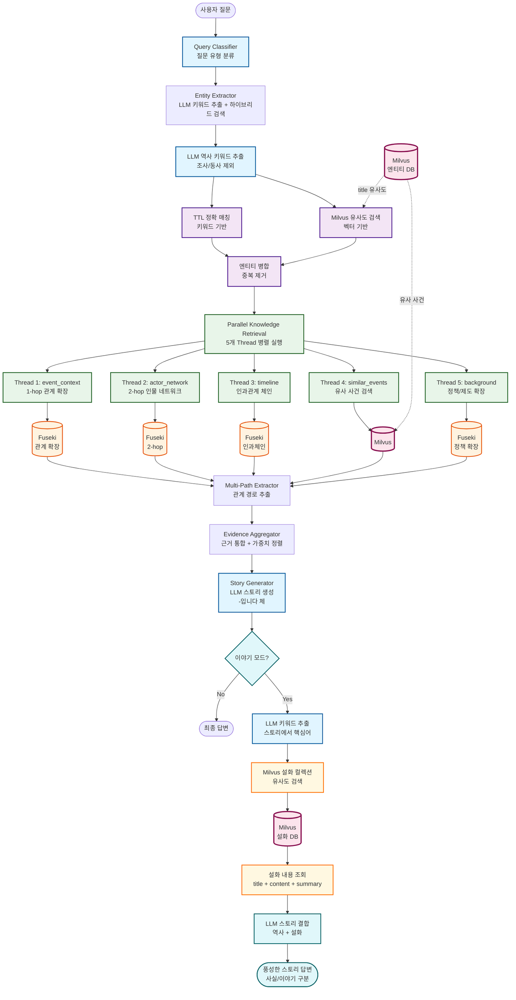
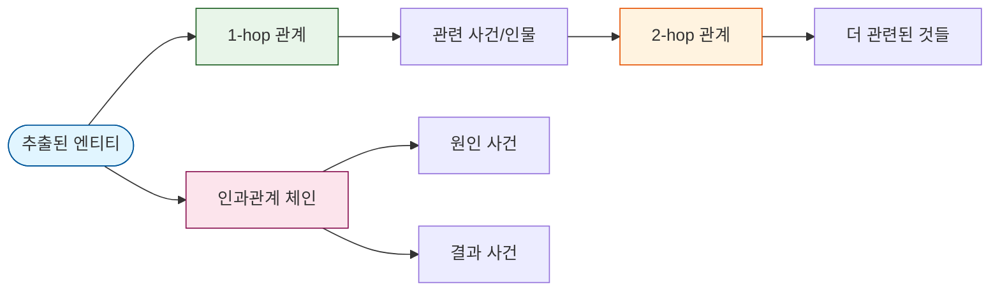
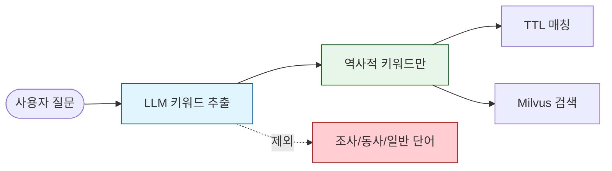
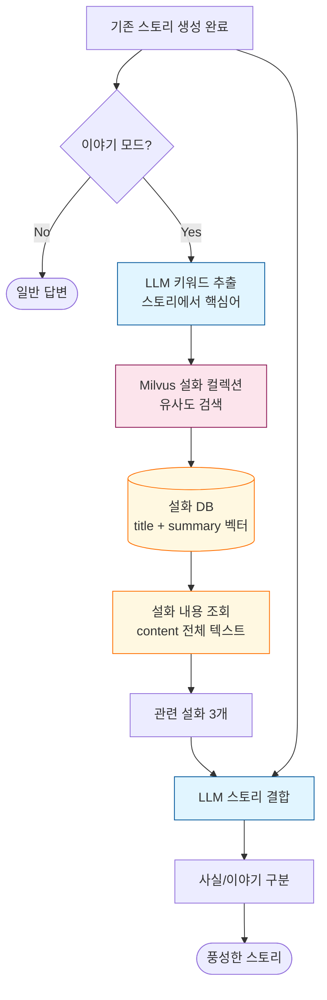

# 창작 모드 - 조선시대 역사 스토리텔링 LangGraph

## 📊 전체 플로우차트



---

## 🔧 핵심 컴포넌트

### **1. Query Classifier (질문 분류)**

**역할:** 사용자 질문을 유형별로 분류

**분류 유형:**

- **`causal`**: 인과관계 질문 ("왜 ~했을까?", "어떤 영향을 미쳤나?")
- **`deep_analysis`**: 심화 분석 ("진짜 이유는?", "숨은 의도는?")
- **`factual`**: 사실 확인 ("~은 언제 일어났나?")
- **`comparative`**: 비교 분석 ("A와 B의 차이는?")

---

### **2. Entity Extractor (하이브리드 엔티티 추출)**

**역할:** LLM 키워드 추출 + TTL 매칭 + Milvus 유사도 검색

#### **2-1. LLM 역사 키워드 추출 (NEW)**

```python
# 조사/동사/일반 단어 제외, 역사적 키워드만 추출
def extract_historical_keywords_with_llm(query: str) -> list:
    """
    입력: "명성황후에 대해서 알려줘"
    출력: ["명성황후"]  # "대해서", "알려줘" 제외
    """
```

#### **2-2. TTL 정확 매칭**

```python
# 키워드로 TTL 라벨 매칭
for keyword in historical_keywords:
    if keyword in ttl_data["label_to_uri"]:
        # 정확 매칭
    else:
        # 부분 매칭 (키워드가 라벨에 포함된 경우)
```

#### **2-3. Milvus 유사도 검색**

```python
# LLM 추출 키워드로만 검색 (일반 단어 제외)
milvus_entities = search_entities_with_milvus(
    historical_keywords,  # "명성황후"만, "대해서" 제외
    ttl_data,
    top_k=dynamic_top_k
)
```

---

### **3. Parallel Knowledge Retrieval (5개 Thread 관계 확장)**

**역할:** 5가지 관점에서 **관계 확장** 지식 검색

#### **5개 Thread 관계 확장 방식**

| Thread       | 이름             | 역할            | 관계 확장                               |
| ------------ | ---------------- | --------------- | --------------------------------------- |
| **Thread 1** | `event_context`  | 사건 맥락       | **1-hop**: 엔티티 → 참여자/장소/결과    |
| **Thread 2** | `actor_network`  | 인물 네트워크   | **2-hop**: 인물 → 참여 사건 → 다른 인물 |
| **Thread 3** | `timeline`       | 시간순/인과관계 | **인과 체인**: 원인 → 사건 → 결과       |
| **Thread 4** | `similar_events` | 유사 사건       | Milvus 벡터 검색                        |
| **Thread 5** | `background`     | 배경 정보       | **정책 확장**: 사건 → 관련 정책         |

#### **관계 확장 SPARQL 예시**

```sparql
# Thread 1: event_context - 1-hop 관계 확장
SELECT ?entity ?label ?summary ?related ?relatedLabel ?relationType WHERE {
    VALUES ?entity { hist:Person_명성황후 }
    ?entity rdfs:label ?label .

    # 1-hop 관계 확장: 엔티티와 연결된 모든 것
    OPTIONAL {
        ?entity ?relationType ?related .
        ?related rdfs:label ?relatedLabel .
        FILTER(?relationType IN (
            hist:hasParticipant, hist:participatesIn,
            hist:leadsTo, hist:causedBy
        ))
    }
}

# 결과 예시:
# 명성황후 → [참여] → 을미사변
# 명성황후 → [결과] → 민씨 척족 몰락
```

```sparql
# Thread 2: actor_network - 2-hop 인물 네트워크
SELECT ?person ?label ?hop1 ?hop1Label ?hop2 ?hop2Label WHERE {
    VALUES ?entity { hist:Person_명성황후 }
    ?entity rdfs:label ?label .
    BIND(?entity AS ?person)

    # 1-hop: 인물과 직접 연결된 것 (사건, 기관)
    OPTIONAL {
        ?entity ?rel1 ?hop1 .
        ?hop1 rdfs:label ?hop1Label .

        # 2-hop: 관련 사건의 다른 참여자
        OPTIONAL {
            ?hop1 hist:hasParticipant ?hop2 .
            ?hop2 rdfs:label ?hop2Label .
            FILTER(?hop2 != ?entity)
        }
    }
}

# 결과 예시:
# 명성황후 → [참여] → 을미사변 → [참여자] → 일본 낭인
```

```sparql
# Thread 3: timeline - 인과관계 체인
SELECT ?event ?label ?year ?causedBy ?causedByLabel ?leadsTo ?leadsToLabel WHERE {
    VALUES ?entity { hist:Event_을미사변 }
    ?entity rdfs:label ?label .

    # 인과관계 체인
    OPTIONAL { ?entity hist:causedBy ?causedBy . ?causedBy rdfs:label ?causedByLabel }
    OPTIONAL { ?entity hist:leadsTo ?leadsTo . ?leadsTo rdfs:label ?leadsToLabel }
}

# 결과 예시:
# 삼국간섭 → [원인] → 을미사변 → [결과] → 아관파천
```

---

### **4. Multi-Path Extractor (관계 경로 추출)**

**역할:** 관계 확장 결과에서 경로 추출 및 가중치 부여

```python
# 관계 정보에 높은 가중치 부여
def extract_event_context_paths(bindings, base_weight):
    for binding in bindings:
        # 기본 엔티티 정보
        paths.append({
            "type": "event_context",
            "weight": base_weight,
            "description": f"{label}: {summary}"
        })

        # 관계 확장 결과 (1.2배 가중치)
        if related_label:
            paths.append({
                "type": "event_context",
                "weight": base_weight * 1.2,
                "description": f"{label} → [{relation}] → {related_label}"
            })
```

---

### **5. Story Generator (스토리 생성)**

**역할:** 근거 기반 자연스러운 스토리 생성

#### **프롬프트 규칙**

1. **말투**: `-입니다` 체로 작성
2. **되묻기 금지**: 추가 정보 요청하지 않음
3. **자연스러운 서술**: 근거를 본문에 녹여서 서술
4. **각주 참조**: 문단 끝에 `(참고: 1, 3)` 형태로 표시

#### **출력 형식**

```
[본문]
2-3문단으로 자연스럽게 서술 (200-400자, "-입니다" 체)

[요약]
한 문장으로 핵심 정리 ("-입니다" 체)

[참고 근거]
1. 을미사변: 1895년 일본 낭인들에 의해 명성황후가 시해된 사건입니다.
2. 아관파천: 을미사변 이후 고종이 러시아 공사관으로 피신한 사건입니다.
```

---

### **6. Story Enhancer (설화/이야기 추가) - 선택적**

**역할:** 기존 스토리에 설화/이야기를 추가하여 풍성한 콘텐츠 생성

#### **Milvus 설화 컬렉션 검색**

```python
# 설화 컬렉션 스키마
FOLKTALE_COLLECTION = {
    "id": "auto",
    "title": "설화 제목",           # 예: "숙종과 장희빈"
    "content": "설화 내용",         # 전체 이야기 텍스트
    "summary": "줄거리 요약",       # 임베딩 대상
    "related_entity": "관련 엔티티", # 예: ["숙종", "장희빈", "인현왕후"]
    "era": "시대",                  # 예: "조선 중기"
    "embedding": "벡터"             # title + summary 임베딩
}
```

#### **검색 흐름**

```
[기존 스토리 생성 완료]
        ↓
[이야기 모드 활성화?]
        ↓ Yes
[스토리에서 키워드 추출] (LLM)
  - "경신환국" → ["환국", "숙종", "서인", "남인"]
        ↓
[Milvus 설화 컬렉션 검색]
  - 키워드 벡터 유사도 검색
  - summary + title 기반 검색
  - 관련 설화/야사 3개 추출
        ↓
[설화 내용(content) 조회]
  - 전체 이야기 텍스트 가져오기
        ↓
[LLM 스토리 결합]
  - 역사적 사실 + 설화/이야기
  - 사실과 이야기 구분 표시
        ↓
[풍성한 스토리 출력]
```

#### **Story Enhancer 노드**

```python
def story_enhancer_node(state: GraphState) -> GraphState:
    """기존 스토리에 설화/이야기 추가"""

    if not state.get("story_mode", False):
        return state  # 이야기 모드 비활성화

    # 1. 기존 스토리에서 키워드 추출
    keywords = extract_keywords_with_llm(state["final_answer"])

    # 2. Milvus 설화 컬렉션에서 유사도 검색
    folktales = milvus.search(
        collection="folktale_collection",
        query=keywords,
        top_k=3,
        threshold=0.6,
        output_fields=["title", "content", "summary", "era"]  # 내용까지 조회
    )

    # 3. LLM으로 스토리 결합
    enhanced = llm.invoke(f"""
    [역사적 사실]
    {state["final_answer"]}

    [관련 설화/이야기]
    {format_folktales(folktales)}

    위 내용을 결합하여 풍성한 역사 스토리를 작성하세요.
    - 역사적 사실을 기반으로 합니다
    - 설화/이야기로 흥미 요소를 추가합니다
    - [사실]과 [이야기] 부분을 명확히 구분합니다
    - "-입니다" 체로 작성합니다
    """)

    return {
        **state,
        "enhanced_story": enhanced,
        "folktales_used": folktales
    }
```

#### **출력 예시**

```
[역사적 사실]
경신환국(1680년)은 숙종이 남인을 몰아내고 서인을 등용한 사건입니다.
허적의 서자 허견이 역모를 도모한다는 고변으로 시작되었습니다.

[관련 이야기]
당시 궁중에서는 장희빈과 인현왕후의 갈등이 심화되고 있었습니다.
민간에서는 숙종이 밤마다 궁 밖을 거닐며 민심을 살폈다는 이야기가 전해집니다.
이 시기 숙종이 미행 중 만난 노인과의 대화가 환국의 결심에 영향을 주었다는
야사도 있습니다.

※ [이야기] 부분은 민간 전승으로, 역사적 사실과 다를 수 있습니다.
```

---

## 📊 데이터 플로우 예시

```
1. 사용자 질문: "명성황후에 대해 알려줘"
   ↓
2. Query Classifier: "deep_analysis"
   ↓
3. LLM 키워드 추출: ["명성황후"]  # "대해", "알려줘" 제외
   ↓
4. Entity Extractor (하이브리드):
   - TTL 매칭: 명성황후
   - Milvus 검색: 을미사변, 민비복위
   ↓
5. Parallel Knowledge Retrieval (5 Thread 관계 확장):
   - event_context: 명성황후 → [참여] → 을미사변
   - actor_network: 명성황후 ↔ [을미사변] ↔ 일본 낭인
   - timeline: 삼국간섭 → 을미사변 → 아관파천
   - similar_events: 민비복위, 갑신정변
   - background: 명성황후 → 민씨 척족 정치
   ↓
6. Evidence Aggregator:
   - 근거 1: 명성황후 → 을미사변 (가중치 0.36)
   - 근거 2: 을미사변 → 아관파천 (0.30)
   - 근거 3: 민씨 척족 정치 (0.25)
   ↓
7. Story Generator (LLM):
   → "명성황후는 조선 말기 고종의 왕비로..."
   ↓
8. (선택) Story Enhancer:
   - Milvus 설화 컬렉션 검색 → 관련 설화 3개
   - 설화 내용(content) 조회
   - LLM으로 역사 + 설화 결합
   → "관련 이야기에 따르면..."
```

---

## 📚 기술 스택

| 컴포넌트                | 기술                           | 역할                      |
| ----------------------- | ------------------------------ | ------------------------- |
| **Query Classifier**    | LLM (GPT-4o-mini)              | 질문 유형 분류            |
| **Keyword Extractor**   | LLM                            | 역사적 키워드 추출        |
| **Entity Extractor**    | TTL + Milvus                   | 하이브리드 엔티티 추출    |
| **Knowledge Retrieval** | Fuseki SPARQL                  | **관계 확장** 검색        |
| **Vector Search**       | Milvus                         | 유사도 검색               |
| **Agent Orchestration** | LangGraph + ThreadPoolExecutor | 5개 Thread 병렬 실행      |
| **Triple Store**        | Apache Jena Fuseki             | RDF 저장/SPARQL           |
| **Story Generator**     | LLM (GPT-4o)                   | 스토리 생성               |
| **Story Enhancer**      | LLM + **Milvus 설화 검색**     | 설화/이야기 추가 (선택적) |

---

## 🚀 실행 방법

```bash
# 1. Docker 컨테이너 시작
cd Infra
docker-compose up -d

# 2. Fuseki 데이터 업로드
cd backend/ontology_langgraph_structure/ontology/scripts
./upload_ttl_to_fuseki.sh

# 3. Milvus 데이터 적재
cd backend
python -m db_pipeline.ETL.load_to_milvus

# 4. 환경변수 설정
export USE_MILVUS=true
export INFERENCE_MODE=light
export QUERY_MODE=template

# 5. 메인 실행
cd backend/ontology_langgraph_structure
python main.py
```

---

## 📊 성능 비교

| 항목            | 이전 (Rules 기반)  | 현재 (관계 확장)           |
| --------------- | ------------------ | -------------------------- |
| **엔티티 추출** | TTL만              | LLM 키워드 + TTL + Milvus  |
| **Thread 방식** | 추론 프로퍼티 기반 | **1-hop, 2-hop 관계 확장** |
| **검색 결과**   | 엔티티 정보만      | 엔티티 + 관련 사건/인물    |
| **인과관계**    | 추론 필요          | **SPARQL로 직접 검색**     |
| **실행 시간**   | ~30초              | ~10초                      |
| **Java 의존성** | 필요 (8GB)         | 불필요                     |

---

## 🆕 주요 변경사항 (v2.0)

### 1. LLM 키워드 추출 추가

```
이전: 모든 단어로 Milvus 검색 → "대해서"로 "와서" 찾음 ❌
현재: LLM으로 역사 키워드만 추출 → "명성황후"로 관련 사건 찾음 ✅
```

### 2. 관계 확장 SPARQL

```
이전: VALUES ?entity { ... } → 엔티티 정보만
현재: ?entity ?relation ?related → 1-hop, 2-hop 관계 확장
```

### 3. 인과관계 체인 검색

```
이전: LLM 추론에 의존
현재: causedBy, leadsTo 프로퍼티로 직접 검색
```

### 4. 프롬프트 개선

```
이전: "~이다" 체, 되묻기 발생
현재: "-입니다" 체, 되묻기 금지, 실제 근거 내용 포함
```

---

## 🔥 아키텍처 상세

### 관계 확장 검색 흐름



### LLM 키워드 추출



### 설화/이야기 모드 (Milvus 설화 검색)



---

## 🗂️ 파일 구조

```
backend/ontology_langgraph_structure/
├── main.py                    # 메인 실행
├── graph.py                   # LangGraph 정의
├── state.py                   # GraphState 정의
├── nodes/
│   ├── classify_node.py       # 질문 분류
│   ├── entity_extractor_node.py  # 하이브리드 엔티티 추출
│   ├── generate_node.py       # 스토리 생성
│   ├── evidence_aggregator_node.py  # 근거 통합
│   └── kg/
│       ├── parallel_inference_executor_node.py  # 5개 Thread 관계 확장
│       └── multi_path_extractor_node.py  # 관계 경로 추출
├── ontology/
│   ├── korean_history.owl     # 온톨로지 스키마
│   ├── instances/
│   │   └── korean_history_normalized.ttl  # 정규화된 데이터
│   └── scripts/
│       └── upload_ttl_to_fuseki.sh  # Fuseki 업로드
└── docs/
    └── README.md              # 이 문서
```

---
