# HisToK - Learn Korean History through an AI Influencer

> LLM 활용 인공지능 인플루언서 기반 한국사 학습 플랫폼

**SKN 18기 3TEAM** | Members: 이상효, 박세영, 김영우, 양진아, 안시현, 장이건

---

## 📋 Table of Contents

1. [프로젝트 개요](#프로젝트-개요)
2. [서비스 전체 구조](#서비스-전체-구조)
3. [데이터 아키텍처](#데이터-아키텍처)
4. [RAG 그래프 시스템](#rag-그래프-시스템)
5. [서비스 구현](#서비스-구현)
6. [기술 스택](#기술-스택)
7. [결론 및 향후 계획](#결론-및-향후-계획)

---

## 프로젝트 개요

### 배경 및 동기

K-콘텐츠의 글로벌 흥행이 단순한 엔터테인먼트 소비를 넘어 한국의 전통문화와 역사적 배경에 대한 능동적인 탐구로 확장되고 있습니다. 한국 역사 검색량이 185% 이상 증가하고, 국립중앙박물관 외국인 관람객이 급증하는 등 한국 역사에 대한 글로벌 관심이 폭발적으로 성장하고 있습니다.

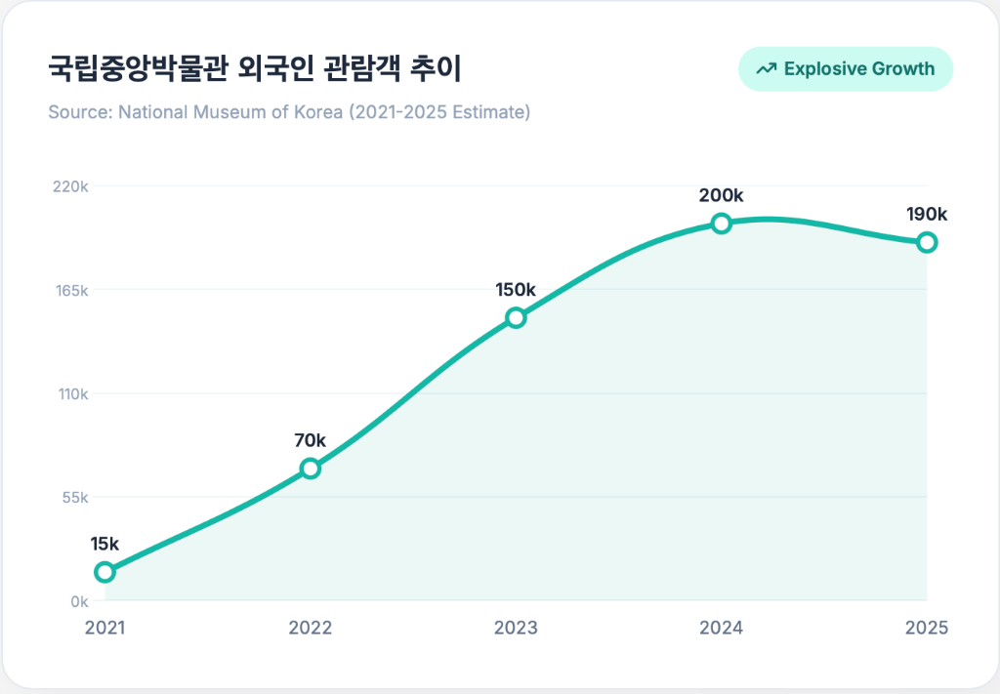

### 문제 정의

그러나 K-콘텐츠의 성공 이면에는 심각한 문제들이 존재합니다.

**문화 공정(Cultural Appropriation)**: 중국의 '동북공정'과 연계하여 한복을 한푸(Hanfu)의 아류로 주장하는 등 조직적인 역사 왜곡 시도가 지속되고 있습니다. 아마존 등 글로벌 플랫폼에서 중국 의상이 'Hanbok'으로 판매되거나 혼용 표기되어 외국인에게 잘못된 인식을 심어주고 있습니다.

|     2022 베이징 올림픽 한복 논란     |        아마존 한복 오표기 사례         |
| :----------------------------------: | :------------------------------------: |
| 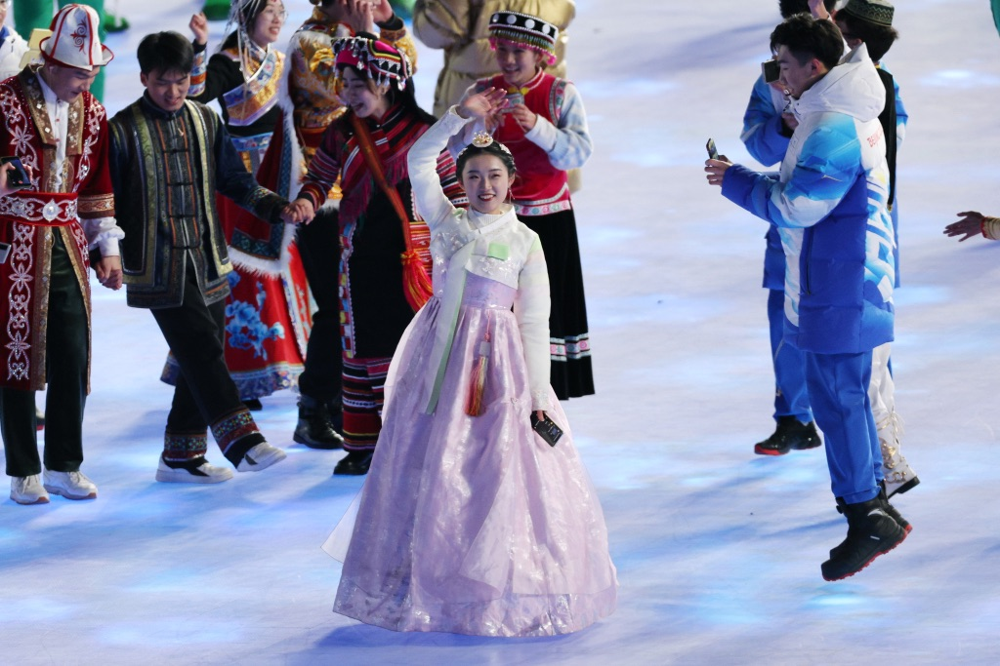 | 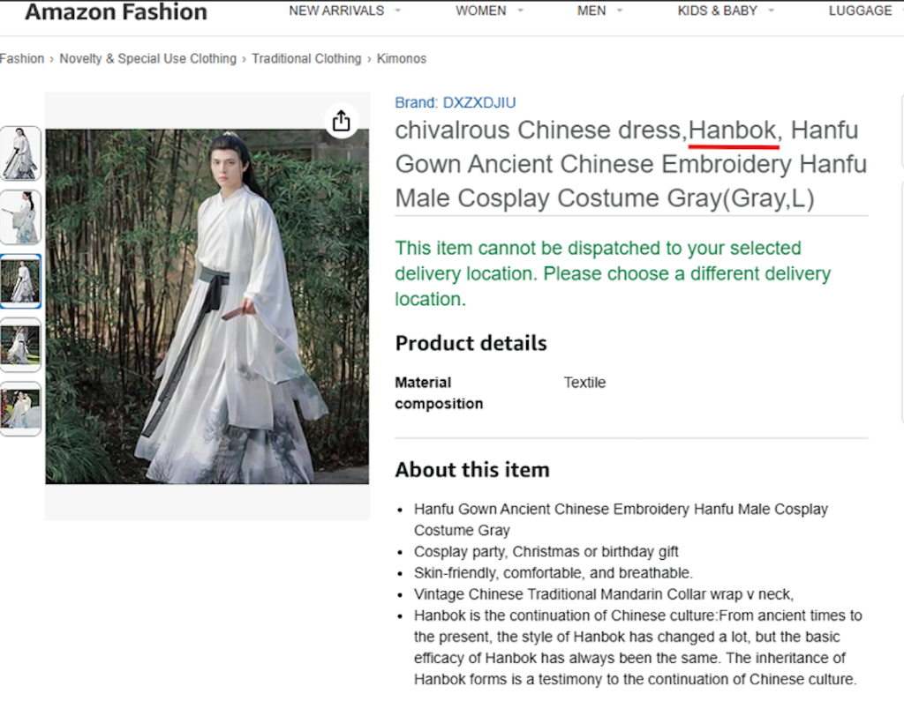 |

**외국인 학습자의 3가지 핵심 장벽**:

- **긴 영상 & 낮은 흥미도**: 기존 YouTube 역사 콘텐츠는 20~60분의 긴 호흡으로 숏폼에 익숙한 외국인 학습자에게 높은 진입 장벽
- **오번역**: "Japan's Dog(일본의 앞잡이)", "Qing→King" 등 심각한 오번역 정보가 필터링 없이 노출
- **콘텐츠 발견의 어려움**: 언어 장벽과 정보 과잉 속에서 양질의 역사 콘텐츠를 발견하기 어려움

### 프로젝트 지향점

| 문제                  | 해결책                                                                   |
| --------------------- | ------------------------------------------------------------------------ |
| 긴 영상 / 낮은 몰입도 | **숏폼 & AI 인플루언서** - 친숙한 AI 캐릭터와 트렌디한 숏폼 포맷 도입    |
| 역사 왜곡 / 오역      | **영어 표기 파인튜닝** - 고유명사 및 역사적 용어의 정확한 영문 표기 학습 |
| 콘텐츠 발견 어려움    | **RAG 시스템 & Ontology 추론** - 근거 기반 답변 생성 및 사실 검증 강화   |
| 수동적 학습           | **게이미피케이션** - Unity 3D 기반 인터랙티브 퀴즈 게임                  |

---

## 서비스 전체 구조

### 핵심 기능 Overview

HisToK는 4가지 핵심 축으로 사용자 경험을 완성합니다.

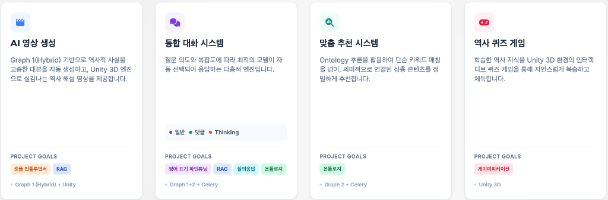

- **AI 영상 생성**: Graph 1(Hybrid) 기반으로 역사적 사실을 고증한 대본을 자동 생성하고, Unity 3D 엔진으로 실감나는 역사 해설 영상을 제공합니다.
- **통합 대화 시스템**: 질문 의도와 복잡도에 따라 최적의 모델이 자동 선택되어 응답하는 다층적 엔진입니다. 일반 챗봇과 Thinking 챗봇을 Graph 1+2와 Celery를 통해 구현합니다.
- **맞춤 추천 시스템**: Ontology 추론을 활용하여 단순 키워드 매칭을 넘어, 의미적으로 연결된 심층 콘텐츠를 정밀하게 추천합니다.
- **역사 퀴즈 게임**: 학습한 역사 지식을 Unity 3D 환경의 인터랙티브 퀴즈 게임을 통해 자연스럽게 복습하고 체득합니다.

### 시스템 아키텍처

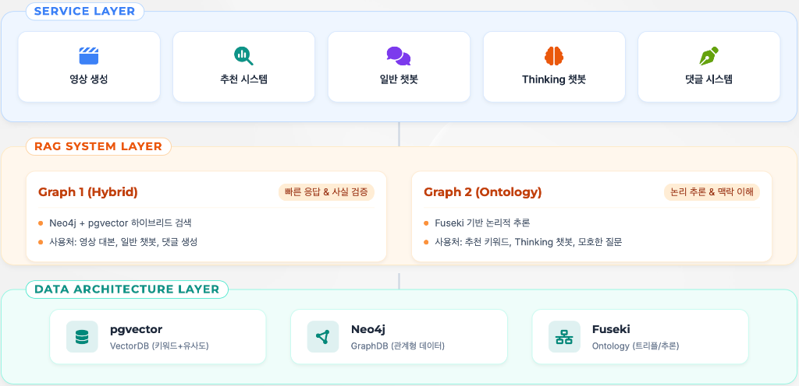

### 사용자 여정 (User Journey)

1. **Discover**: 숏폼 영상이나 추천 피드를 통해 흥미로운 한국 역사 콘텐츠 발견
2. **Ask**: 궁금한 점을 AI 챗봇에게 질문하여 즉각적인 답변 획득
3. **Explore**: 답변의 근거(Evidence)와 연관 지식을 통해 심층 학습
4. **Engage**: 학습 내용을 바탕으로 퀴즈 게임 참여 및 커뮤니티 활동
5. **Explore More**: 확장된 지식 검색을 통해 체계적인 역사 지식 구축

---

## 데이터 아키텍처

### Why RAG?

LLM만으로는 조선왕조실록 등 방대한 기록의 디테일한 정보가 부족하고, 모르는 사실을 그럴듯하게 지어내는 Hallucination 위험이 있습니다. RAG 도입을 통해 검증된 역사 DB(한국민족문화대백과사전)를 검색하여 답변을 생성함으로써 정확도를 보장합니다.

### Why Graph DB?

역사적 사건은 독립적으로 존재하지 않습니다. 인물, 사건, 배경, 시간의 흐름이 복잡하게 얽힌 거대한 지식 네트워크입니다. Vector DB만으로는 텍스트의 의미적 유사성만 판단할 뿐, 명확한 사실 관계나 논리적 연결 고리를 이해하지 못합니다.

Graph DB는 Node(개체)와 Edge(관계)를 통해 단편적 사실을 넘어 지식을 무한히 확장적으로 탐색하고, Multi-hop 검색을 통해 직접적인 언급이 없어도 연결된 인물/사건을 추론하여 탐색할 수 있습니다.

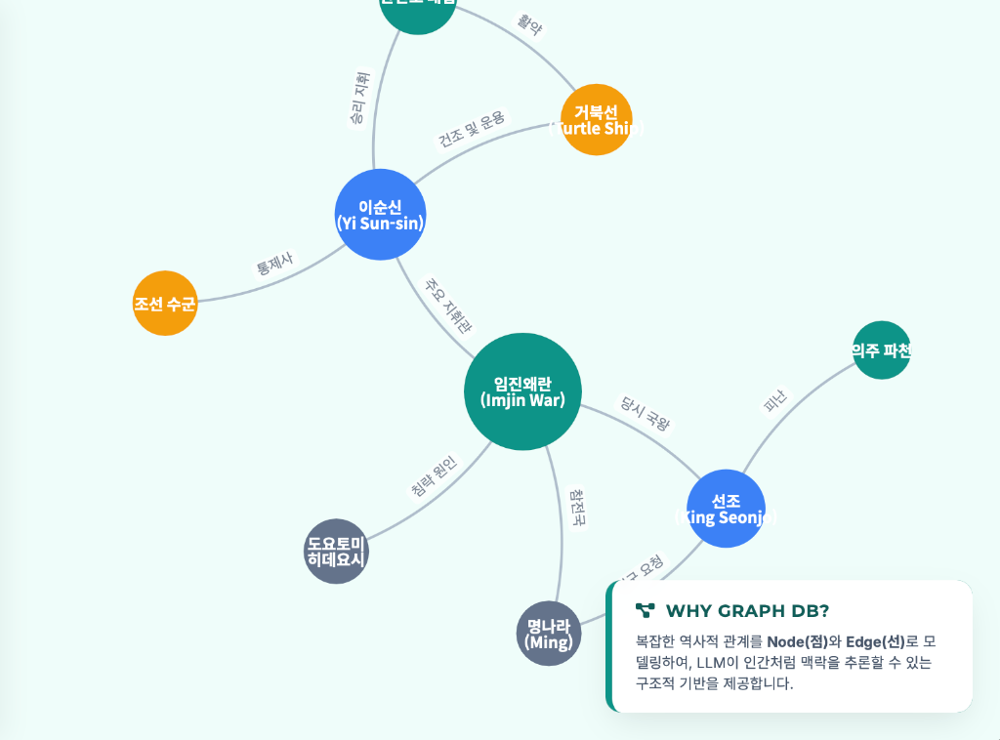

### 기술 스택 비교 및 선택

| 기술         | 접근 방식          | 쿼리 언어 | 강점                                     | HisToK 적용                                        |
| ------------ | ------------------ | --------- | ---------------------------------------- | -------------------------------------------------- |
| **Neo4j**    | 관계형 그래프      | Cypher    | 직관적 관계 표현, 다양한 그래프 알고리즘 | 영상 대본 인물-사건 관계 탐색, 챗봇/댓글 빠른 답변 |
| **Fuseki**   | 시맨틱 웹 (Triple) | SPARQL    | 논리적 추론, 지식의 표준화/재사용        | Thinking 챗봇 모호한 질문 처리, 추천 시스템        |
| **pgvector** | 벡터 유사도        | SQL (Ext) | 빠른 검색 속도, 의미적 유사성 파악       | 초기 필터링, Hybrid Search                         |

### 벡터DB & 청킹 전략 실험

**벡터DB 선정**: pgvector 채택 (Hybrid Search 지원 및 단일 인프라 효율성)

**청킹 전략 실험 결과**:

- Plan A (Length-based): 800자/600자/500자 실험 → 문맥 절단 현상 발생
- Plan B (LLM Summary): 문맥을 보존하며 요약 후 임베딩하는 2단계 프로세스 채택

**Plan B 성능 개선 (vs Plan A)**:

- Answer Relevancy: ▲ 1.9% (0.836 → 0.852)
- 응답 시간: ▼ 48.2% (23.18s → 11.99s)

### pgvector 데이터베이스 구성

| 항목                | 값                     |
| ------------------- | ---------------------- |
| Total Documents     | 10,353                 |
| Embedding Model     | text-embedding-3-small |
| Embedding Dimension | 1,536 dims             |
| Index Type          | HNSW                   |
| Similarity Metric   | Cosine Similarity      |

### Neo4j 최종 설계

| 항목        | 값                                                                                                                           |
| ----------- | ---------------------------------------------------------------------------------------------------------------------------- |
| Total Nodes | 10,666                                                                                                                       |
| Total Edges | 109,527                                                                                                                      |
| Node Types  | Event, Person, Organization, Heritage, Concept, System, Document, Object, Clothing, Policy, Work, Ritual, Place, Year (14종) |
| Properties  | Title, Year, Summary (w/ Embedding)                                                                                          |

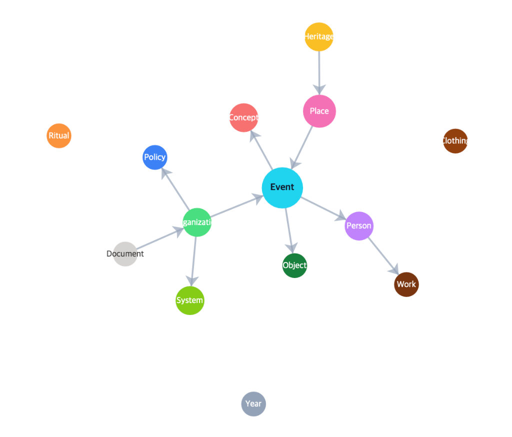

### Neo4j 최적화 실험

**중간 hop 노드 포함 실험**: ct_mid(중간 정보 저장) 방식이 no_mid 대비 Answer Relevancy 약 9.3% 향상 (0.837 → 0.915)

**Hop 수 최적화**: 2-3 Hop 구간이 최적 (1 Hop은 정보 부족, 4-5 Hop은 노이즈 증가)

| Hop   | Relevancy | Faithfulness | Time (s)  |
| ----- | --------- | ------------ | --------- |
| 1     | 0.842     | 0.879        | 34.70     |
| **2** | **0.915** | 0.835        | 24.92     |
| **3** | 0.859     | 0.845        | **21.87** |
| 4     | 0.861     | 0.849        | 29.03     |
| 5     | 0.883     | 0.859        | 25.93     |

---

## RAG 그래프 시스템

### Hybrid Search Strategy

두 가지 전략을 비교 실험하였습니다.

**Intent Router**: 의도 기반 경로 분기 (Simple → pgvector, Relation → Neo4j)
**Parallel Hybrid**: 병렬 실행 및 점수 통합

| 구분              | Answer Relevancy | Time_avg (sec) | Time_std (sec) |
| ----------------- | ---------------- | -------------- | -------------- |
| 의도기반 Fallback | 0.829            | 16.177         | 7.998          |
| **병렬 Hybrid**   | **0.852**        | 19.592         | **3.714**      |

→ 안정성이 더 높은 **병렬 그래프(Parallel Hybrid)** 채택

### Hybrid RAG의 한계와 Ontology 솔루션

**Q: "정흠지가 형조판서와 중추원사를 하면서 정치에 어떤 변화가 있었어?"**

| 방식             | 응답 특성          | 한계                                   |
| ---------------- | ------------------ | -------------------------------------- |
| LLM Only         | 일반적 서술        | 구체적 사건 연결 고리 부재             |
| Hybrid RAG       | 문서 의존적        | 직접 매칭 문서 부재 시 답변 회피       |
| **Ontology RAG** | 입체적 관계망 추론 | 인물-직위-제도 간 심층적 인과관계 도출 |

**온톨로지 설계 차별점**:

- **Semantic Expansion (의미 확장)**: 명성황후 → 을미사변 → 갑오개혁 → 동학농민운동 → 청일전쟁
- **Convergence (수렴 및 연결)**: 정약용 ↔ 거중기 ↔ 화성 ↔ 정조 (화성이 중심 수렴 노드)

### Fuseki Triple Structure

| 항목          | 값      |
| ------------- | ------- |
| Total Triples | 188,995 |
| Total Edges   | 73,548  |
| Total Nodes   | 48,444  |

비정형 텍스트를 Subject-Predicate-Object의 정형화된 트리플 구조로 변환하여 기계가 이해 가능한 지식으로 저장합니다.

예: "세종대왕은 1443년에 훈민정음을 창제했다." → `세종대왕 - authored - 훈민정음`

### Ontology Pipeline 5 Stages

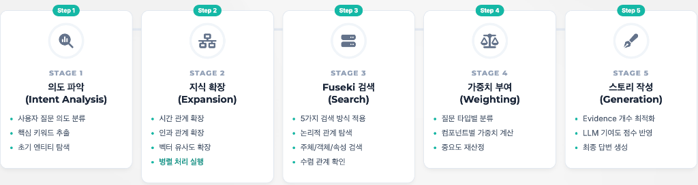

1. **의도 파악 (Intent Analysis)**: 사용자 질문 의도 분류, 핵심 키워드 추출, 초기 엔티티 탐색
2. **지식 확장 (Expansion)**: 시간 관계 확장, 인과 관계 확장, 벡터 유사도 확장 (병렬 처리)
3. **Fuseki 검색 (Search)**: 5가지 검색 방식 적용, 논리적 관계 탐색, 주체/객체/속성 검색
4. **가중치 부여 (Weighting)**: 질문 타입별 분류, 컴포넌트별 가중치 계산
5. **스토리 작성 (Generation)**: Evidence 개수 최적화, LLM 기여도 점수 반영, 최종 답변 생성

**Query-Type별 가중치 최적화**:

| Query Type    | Thread | Entity | Semantic | 특성           |
| ------------- | ------ | ------ | -------- | -------------- |
| Factual       | 0.60   | 0.30   | 0.10     | 정확성 우선    |
| Causal        | 0.45   | 0.20   | 0.35     | 인과 맥락 탐색 |
| Comparative   | 0.65   | 0.20   | 0.15     | 속성/관계 비교 |
| Deep Analysis | 0.35   | 0.25   | 0.40     | 넓은 지식 탐색 |

### Fine-tuning & Post-Processing

**영어 표기 파인튜닝**: 일반 LLM의 불규칙한 로마자 표기 문제 해결

- Before: "Lee Sun-shin made the Turtle Boat in 1592."
- After: "General Yi Sun-sin built the Geobukseon."

**파인튜닝 실험 과정**:

| 시도 | 모델          | 데이터                               | 결과              |
| ---- | ------------- | ------------------------------------ | ----------------- |
| 1st  | gemma-3-1b-it | 용어 정의 학습 (33,814 rows)         | 과적합, 환각 발생 |
| 2nd  | gemma-3-4b-it | 카테고리별 규칙 기반 (114,526 pairs) | 부분적 개선       |
| 3rd  | gemma-3-4b-it | RAG 구조 + Distractor (50,257 sets)  | 최종 채택         |

---

## 서비스 구현

### 비디오 파이프라인

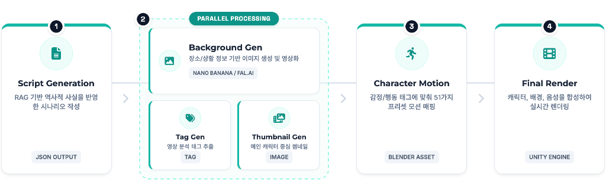

1. **Script Generation**: RAG 기반 역사적 사실을 반영한 시나리오 작성
2. **Parallel Processing**: Background Gen (Nano Banana/FAL.AI), Tag Gen, Thumbnail Gen 동시 생성
3. **Character Motion**: 감정/행동 태그에 맞춰 51가지 프리셋 모션 매핑 (Blender Asset), Lip-sync & AutoBlink 적용
4. **Final Render**: Unity Engine으로 캐릭터, 배경, 음성 합성하여 실시간 렌더링

### 추천시스템 파이프라인

Celery 비동기 처리 및 Ontology 관계 기반 키워드 확장 시스템

1. **초기 비디오 키워드 (Kiwi)**: 형태소 분석 → TTL 검증 → 비디오 키워드 저장
2. **Ontology 관계 기반 추천**: Entity 간 관계만 탐색 → 연관 Entity를 추천 키워드로 확보
3. **사용자별 추천 및 노출**: 시청 기록 기반 개인별 키워드 저장 → 매칭 시 노출

### 챗봇 시스템 답변 비교

**Q: "사화가 조선 정치에 미친 영향은?"**

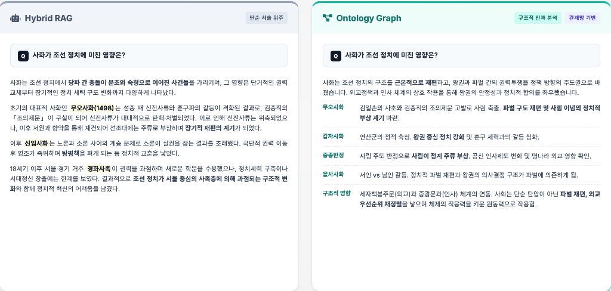

| Hybrid RAG                   | Ontology Graph                                               |
| ---------------------------- | ------------------------------------------------------------ |
| 단순 서술 위주의 일반적 설명 | 구조적 인과 분석 (무오사화 → 갑자사화 → 중종반정 → 을사사화) |
| 시간순 나열                  | 관계망 기반의 입체적 분석                                    |

---

## 기술 스택

### Comprehensive Tech Stack

| Layer        | Technology                            |
| ------------ | ------------------------------------- |
| **Frontend** | React + Vite, Unity WebGL             |
| **Backend**  | Django REST, Celery Workers           |
| **AI/LLM**   | LangGraph, RAGAS, Fine-tuning         |
| **Data**     | PostgreSQL w/ pgvector, Neo4j, Fuseki |
| **Infra**    | Docker, Nginx, AWS                    |

### AWS Infrastructure Architecture

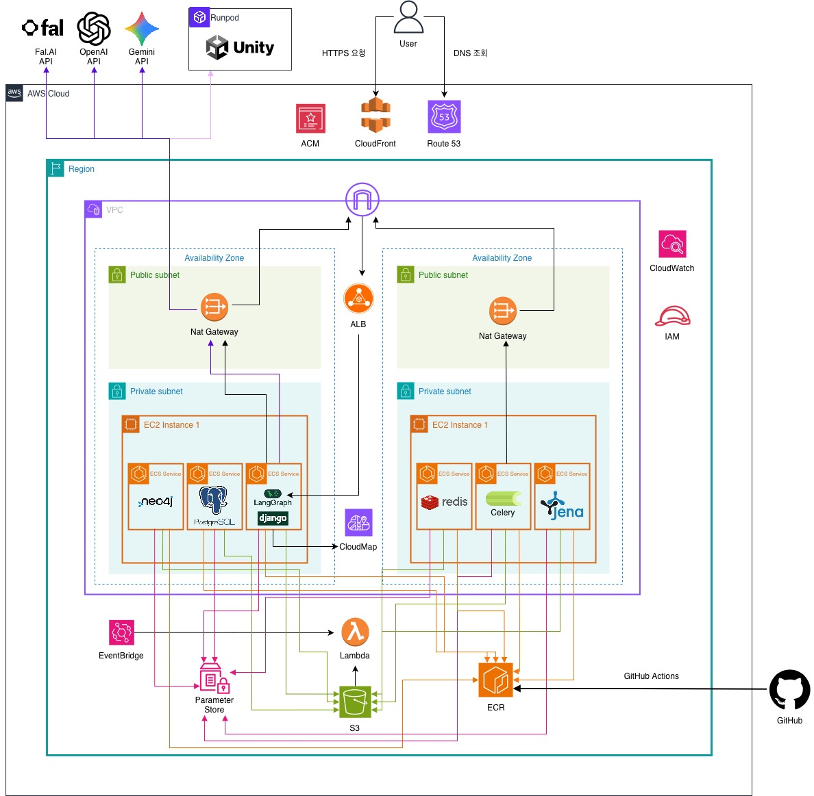

**데이터 흐름**:

1. **사용자 요청 수신**: User → ALB → VPC 진입
2. **서비스 라우팅**: ECS/EC2 Container → Django (Backend) / Unity (Client)
3. **RAG 및 검색 처리**: PostgreSQL (Vector) + Neo4j (Knowledge Graph) 병렬 검색
4. **비동기 작업 처리**: Lambda + S3 + EventBridge → Celery Queue → Redis
5. **응답 반환 및 로깅**: 최종 답변 생성 + CloudWatch 로깅

---

## 결론 및 향후 계획

### 프로젝트 회고

| 이슈                | 상태     | 분석                                    | 해결/계획                                                          |
| ------------------- | -------- | --------------------------------------- | ------------------------------------------------------------------ |
| TTS 애니메이션 연동 | DEFERRED | Unity WebGL 환경에서 립싱크 동기화 지연 | 서버 사이드 파형 분석 도입, Viseme JSON 전송 방식                  |
| 파인튜닝 전략       | PIVOTED  | sLLM '용어 설명' 역할 시 환각 발생      | sLLM 역할을 '어려운 용어 선정'으로 축소, 설명은 Dictionary DB 활용 |

### 서비스 범위 확대 로드맵

현재 서비스는 조선시대(Joseon Dynasty)에 집중되어 있으며, 한국 역사 전체로 확장 예정입니다.

- **Phase 1**: 근현대사 (Modern History)
- **Phase 2**: 삼국시대 (Three Kingdoms)
- **Phase 3**: 고려시대 (Goryeo Dynasty)

시대별 특화 데이터셋 및 Multi-Persona 구축 예정

---

## Team Members & Roles

| 이름   | 역할           | 담당                                   |
| ------ | -------------- | -------------------------------------- |
| 이상효 | PM             | Neo4j Architecture, Project Management |
| 박세영 | APM            | Hybrid LangGraph, AWS                  |
| 김영우 | Data Engineer  | Fine-tuning, Data Preprocessing        |
| 양진아 | Frontend       | Ontology Design, React Frontend        |
| 안시현 | Backend        | Django Backend, Unity Integration      |
| 장이건 | Video Pipeline | Unity Game Build, Blender & Video Gen  |

---

## 📎 Links

- **GitHub Repository**: [SKN18-FINAL-3TEAM](https://github.com/SKNETWORKS-FAMILY-AICAMP/SKN18-FINAL-3TEAM)
