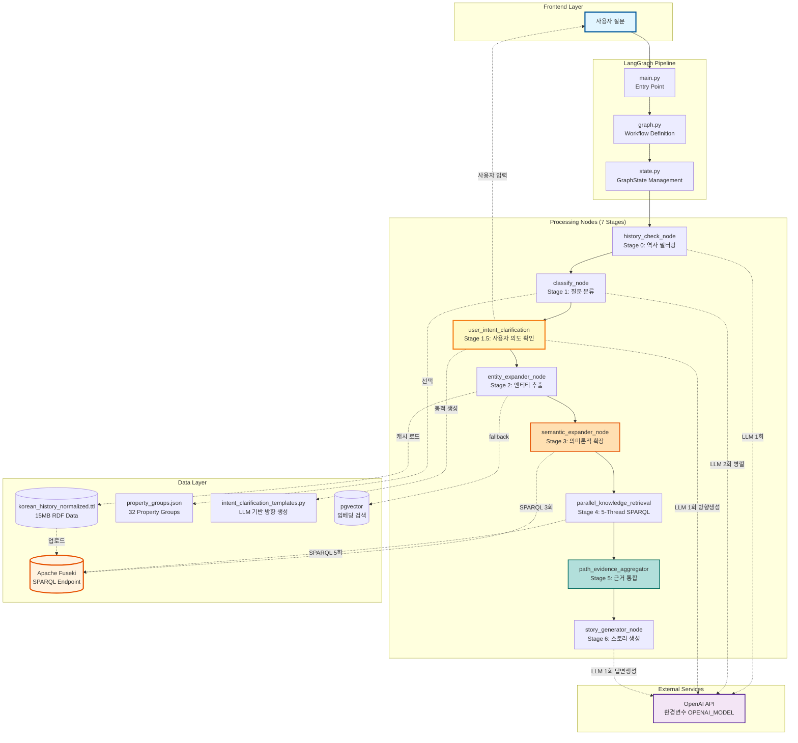
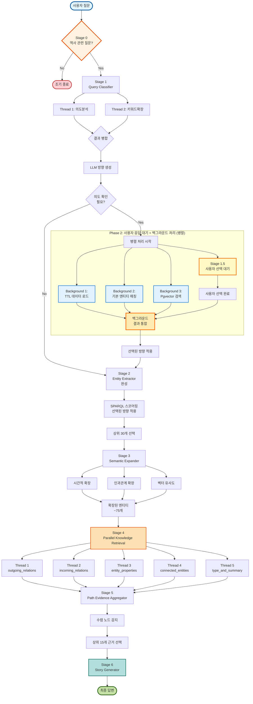
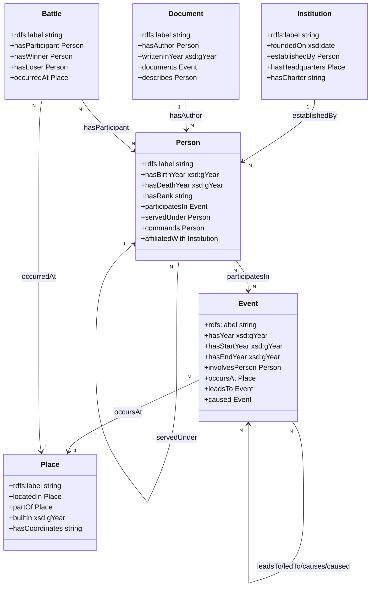

# 조선시대 역사 스토리텔링 LangGraph

> Apache Fuseki + LangGraph 기반 조선시대 역사 질의응답 시스템
> RDF 온톨로지, SPARQL, pgvector를 활용한 하이브리드 검색 및 스토리 생성

## 📑 목차

- [시스템 개요](#시스템-개요)
- [전체 아키텍처](#전체-아키텍처)
- [7단계 파이프라인](#7단계-파이프라인)
- [핵심 컴포넌트](#핵심-컴포넌트)
- [데이터 모델](#데이터-모델)
- [성능 최적화](#성능-최적화)
- [파일 구조](#파일-구조)
- [실행 방법](#실행-방법)

---

## 시스템 개요

조선시대 역사에 대한 자연어 질문을 받아 RDF 온톨로지와 SPARQL을 활용하여 스토리 형식의 답변을 생성하는 시스템입니다.

### 핵심 특징

- **7단계 파이프라인**: 역사 필터링 → 질문 분류 → 사용자 의도 확인 → 엔티티 추출 → 의미론적 확장 → 병렬 지식 검색 → 근거 통합 → 스토리 생성
- **대화형 의도 확인**: LLM이 질문을 분석하여 2-4가지 답변 방향을 자유롭게 제시하고 사용자 선택을 받아 검색 및 답변 생성에 반영
- **하이브리드 검색**: TTL 직접 매칭 + pgvector 유사도 검색 + SPARQL 연결 노드 분석
- **병렬 지식 검색**: 5개 Thread로 서로 다른 관점의 SPARQL 쿼리를 동시 실행
- **3단계 가중치 시스템**: Semantic Expansion → Thread Type → Entity Boost로 점수 계산
- **온톨로지 기반 스코어링**: 엔티티 매칭, 키워드 포함, Property Groups 매칭으로 근거 신뢰도 계산

### 주요 기술

| 기술              | 역할            | 사용                                                    |
| ----------------- | --------------- | ------------------------------------------------------- |
| **Apache Fuseki** | SPARQL Endpoint | RDF 트리플 저장 및 쿼리                                 |
| **LangGraph**     | 워크플로우 관리 | 7단계 파이프라인 정의                                   |
| **OpenAI GPT**    | LLM             | 질문 분석, 키워드 확장, 방향 생성, 스토리 생성 (총 5회) |
| **pgvector**      | 벡터 검색       | 엔티티 유사도 검색 (fallback)                           |
| **kiwipiepy**     | 형태소 분석     | 키워드 추출 (무료, 빠름)                                |
| **RDF/OWL**       | 온톨로지        | 조선시대 역사 지식 그래프 (15MB)                        |

---

## 전체 아키텍처



---

## 7단계 파이프라인

### 전체 플로우 (UX 최적화: 점진적 로딩)



**핵심 개선사항 (3단계 파이프라인)**:
- ✅ **Phase 1: 초고속 재질문** (0.2초) - Stage 1을 분할하여 재질문에 필요한 최소 데이터만 먼저 생성
- ✅ **Phase 2: 백그라운드 병렬 처리** - 사용자 선택 중 Stage 1-B(상세 분석) + Entity 준비(TTL 로드, 매칭, 벡터 검색) 동시 실행
- ✅ **Phase 3: 유연한 결과 통합** - 사용자 선택 속도에 따라 유연하게 대응 (빠른 선택 시 대기, 느린 선택 시 즉시 통합)
- ✅ **시간 단축**: 재질문 진입 2.5초 → 0.2초 (92% 단축!), 사용자 체감 시간 23.5초 → 11.2초 (52% 단축!)

**상세 분석**:
- [UX_OPTIMIZATION_ANALYSIS.md](UX_OPTIMIZATION_ANALYSIS.md) - 3단계 파이프라인 전략
- [STAGE1_OPTIMIZATION.md](STAGE1_OPTIMIZATION.md) - Stage 1 분할 전략

### 단계별 요약

| 단계          | 이름                         | LLM         | 사용자 입력 | SPARQL | 주요 작업                                                              |
| ------------- | ---------------------------- | ----------- | ----------- | ------ | ---------------------------------------------------------------------- |
| **Stage 0**   | History Check                | ✅ 1회      | ❌          | ❌     | 조선시대 역사 질문 필터링 (비역사 질문 조기 종료)                      |
| **Stage 1**   | Query Classifier             | ✅ 2회 병렬 | ❌          | ❌     | 질문 분석, 키워드 확장, 프로퍼티 그룹 선택                             |
| **Stage 1.5** | User Intent Clarification    | ✅ 1회      | ✅ 필요시   | ❌     | LLM이 질문 분석하여 2-4개 방향 제시, 사용자 선택                       |
| **Stage 2**   | Entity Extractor             | ❌          | ❌          | ✅ N회 | TTL 매칭 + pgvector 검색 + SPARQL 스코어링 → 상위 30개 선택            |
| **Stage 3**   | Semantic Expander            | ❌          | ❌          | ✅ 3회 | 시간적/인과/벡터 기반 엔티티 확장 (30개 → ~75개)                       |
| **Stage 4**   | Parallel Knowledge Retrieval | ❌          | ❌          | ✅ 5회 | 5개 관점 병렬 검색 + 양방향 BFS (최대 3-hop) + 프로퍼티 FILTER         |
| **Stage 5**   | Path Evidence Aggregator     | ❌          | ❌          | ❌     | 경로 추출 + 근거 통합 + 수렴 노드 감지 (1.1배 부스트) → 상위 15개 선택 |
| **Stage 6**   | Story Generator              | ✅ 1회      | ❌          | ❌     | 선택된 방향을 반영하여 최종 스토리 생성 (-입니다 체)                   |

**총 LLM 호출**: 5회 (역사 체크 1회 + Query Classifier 2회 병렬 + 방향 생성 1회 + Story Generator 1회)
**총 SPARQL 호출**: 9 + N회 (Semantic Expander 4회 + 병렬 검색 5회 + 엔티티 스코어링 N회)

---

## 핵심 컴포넌트

### Stage 0: History Check

**역할**: 조선시대 역사 질문인지 필터링하여 비역사 질문 조기 종료

```
질문: "파이썬 프로그래밍 방법은?"
  ↓
LLM 분석: is_historical = false
  ↓
조기 종료: "조선시대 역사 질문이 아닙니다"
  ↓
LLM 호출 1회만 사용 (비용 절감)
```

**효과**: 비역사 질문에 대해 불필요한 처리 방지 (약 75% 비용 절감)

---

### Stage 1: Query Classifier

**역할**: ThreadPoolExecutor로 LLM 2개를 병렬 실행하여 질문 분석

#### 1-1. kiwipiepy 키워드 추출 (전처리)

형태소 분석기로 질문에서 명사 추출:

```python
from kiwipiepy import Kiwi
kiwi = Kiwi()

# 질문 예시: "궁궐을 건축한 왕들은 누가 있는지?"
tokens = kiwi.tokenize(query)
keywords = [t.form for t in tokens if t.tag in ('NNG', 'NNP') and len(t.form) >= 1]
# 결과: ['궁궐', '건축', '왕']
```

#### 1-2. 병렬 실행 구조

```python
from concurrent.futures import ThreadPoolExecutor

with ThreadPoolExecutor(max_workers=2) as executor:
    # Thread 1: 의도 분석 + 프로퍼티 그룹 선택
    future1 = executor.submit(analyze_intent_and_properties)

    # Thread 2: 키워드 확장
    future2 = executor.submit(expand_keywords)

    # 결과 대기 (병렬 실행으로 약 40-50% 시간 단축)
    result1 = future1.result()  # query_type, intent, property_groups
    result2 = future2.result()  # expanded_keywords
```

#### Thread 1: 의도 분석 + 프로퍼티 그룹 선택

**작업 내용**:

1. 질문 유형 분류: `causal`, `factual`, `deep_analysis`, `comparative`
2. 핵심 의도 파악: 예) "궁궐을 건설한 왕 찾기"
3. 프로퍼티 그룹 선택: 최대 5개 (32개 그룹 중 선택)

**프로퍼티 그룹 선택 로직**:

```
질문: "궁궐을 지은 왕"
  ↓
프로퍼티 그룹 목록 제공 (명확한 행위 그룹만)
  - 건설, 설립, 통치, 임명, 사망, 처벌, 유배, 전쟁, 반란...
  - 제외: "속성"(623개), "기타"(1783개) 등 범용 그룹
  ↓
LLM이 관련 그룹 선택 (최대 5개)
  → ["건설", "설립", "통치"]
  ↓
선택된 그룹에서 실제 프로퍼티 추출
  → ["built", "builtBy", "constructed", "founded", "established", ...]
  ↓
SPARQL FILTER 적용 (Stage 4에서 사용)
  FILTER(?predicate IN (hist:built, hist:builtBy, hist:founded, ...))
```

**효과**:

- ✅ 정확도 향상: 관련 프로퍼티만 검색 → 노이즈 감소
- ✅ 속도 향상: FILTER로 검색 범위 축소
- ✅ 하드코딩 없음: 데이터 추가 시 `extract_property_groups.py` 재실행만 하면 자동 업데이트

#### Thread 2: 키워드 확장

**작업 내용**:

- 일반명사를 구체적 인스턴스로 확장 (5-10개)

```
질문: "궁궐을 건축한 왕들은?"
  ↓
키워드: ["궁궐", "건축", "왕"]
  ↓
LLM으로 키워드 확장
  → {"궁궐": ["경복궁", "창덕궁", "경덕궁", "창경궁"],
      "왕": ["태조", "세종", "숙종"]}
  ↓
Entity Extractor에서 TTL 매칭
  → 경복궁, 창덕궁, 태조, 세종 등 엔티티 발견
```

---

### Stage 1.5: User Intent Clarification

**역할**: LLM이 질문을 분석하여 최적의 답변 방향을 2-4개 자유롭게 제시하고 사용자 선택을 받아 검색 및 답변 생성에 반영

#### 동작 흐름

```
질문: "임진왜란이 조선에 미친 영향은?"
  ↓
Stage 1: query_type = "causal" 분류
  ↓
LLM이 질문 분석하여 답변 방향 동적 생성:
  - 시간축(직후 영향) + 시간축(장기 영향) + 범위(조선 내부) + 클래스(주요 인물)
  ↓
사용자에게 제시:
==================================================
"임진왜란이 조선에 미친 영향은?"는
여러 관점에서 답변할 수 있어요.

어떤 방향의 정보가 더 궁금하신가요?

1️⃣ 직후 영향
   전쟁 직후의 사회 구조와 경제 변화
   property_groups: ['시간', '사회', '경제', '정치']

2️⃣ 장기 영향
   제도·문화의 지속적 변화와 인식의 전환
   property_groups: ['시간', '제도', '문화', '정치', '경제']

3️⃣ 조선 내부 영향
   인구, 재정, 제도, 외교의 변화와 재편
   property_groups: ['정치', '경제', '사회', '제도', '외교']

4️⃣ 주요 인물 영향
   이순신, 선조 등 인물의 영향과 리더십
   property_groups: ['인물', '직위', '참여', '리더십']
==================================================

선택 (번호 입력):
  ↓
사용자 선택: 1
  ↓
선택된 방향 저장:
  - user_selected_direction = "immediate_impact"
  - direction_id = "immediate_impact"
  - property_groups = ['시간', '사회', '경제', '정치']
  ↓
Stage 2: 선택된 property_groups를 SPARQL FILTER에 적용
Stage 6: 선택된 방향을 프롬프트에 반영하여 답변 생성
```

#### LLM 기반 자유 조합 방식

**분석 차원**:

1. **시간축**: 원인(이전), 직후 결과, 장기 영향
2. **클래스**: 인물 중심, 사건 중심, 제도 중심
3. **범위**: 개인적, 제도적, 국가적, 국제적 영향
4. **깊이**: 기본 정보, 내용 비교, 성패 분석

**핵심 특징**:

- 같은 차원에서만 선택할 필요 없음
- 질문마다 최적의 2-4개 방향을 자유롭게 조합
- 예: "시간축(원인)" + "클래스(인물)" + "범위(국제)" 조합 가능

**LLM 프롬프트 구조**:

```python
prompt = f"""다음 질문을 분석하여, 사용자가 선택할 수 있는 2-4가지 답변 방향을 제시하세요.

질문: "{query}"
키워드: {', '.join(keywords)}

**사용 가능한 분석 차원:**
1. **시간축**: 원인(이전), 직후 결과, 장기 영향
2. **클래스**: 인물 중심, 사건 중심, 제도 중심
3. **범위**: 개인적, 제도적, 국가적, 국제적 영향
4. **깊이**: 기본 정보, 내용 비교, 성패 분석

**중요**: 질문에 가장 적합한 2-4가지 방향을 **자유롭게 조합**하세요.

**출력 형식 (JSON)**:
{{
  "directions": [
    {{
      "direction_id": "고유ID (영문_조합, 예: time_cause, class_person)",
      "title": "방향 제목 (15자 이내)",
      "description": "구체적 설명 (20-40자)",
      "property_groups": ["관련 프로퍼티 그룹 3-5개"]
    }}
  ]
}}
"""
```

#### 효과

- ✅ **질문별 최적화**: 질문마다 다른 방향 제시 (하드코딩 없음)
- ✅ **전략 혼합**: 시간/클래스/범위/깊이 차원을 자유롭게 조합
- ✅ **검색 정확도 향상**: 선택된 property_groups가 SPARQL FILTER에 적용
- ✅ **답변 품질 향상**: 선택된 방향이 Story Generator 프롬프트에 반영
- ✅ **RAGAS 지표 향상**:
  - nv_context_relevance: 불필요한 컨텍스트 제거
  - answer_relevancy: 사용자 의도에 맞는 답변 생성

---

### Stage 2: Entity Extractor

**역할**: Query Classifier에서 받은 확장된 키워드와 프로퍼티 그룹을 활용하여 관련 엔티티 추출

#### 입력 데이터

- ✅ 원본 키워드: `['궁궐', '건축', '왕']`
- ✅ 확장된 키워드: `{"궁궐": ["경복궁", "창덕궁"], "왕": ["태조", "세종"]}`
- ✅ 프로퍼티 그룹: `["건설", "설립", "통치"]`
- ✅ 사용자 선택 방향: `user_selected_direction` (Stage 1.5에서 설정)

#### 2-1. TTL 정확 매칭 (캐시 활용)

```python
# ⚡ 캐싱: 파일 변경 없으면 메모리에서 즉시 반환
_ttl_cache = None
_ttl_cache_mtime = None

def load_ttl_entities():
    if _ttl_cache and _ttl_cache_mtime == current_mtime:
        return _ttl_cache  # 즉시 반환 (~0ms)
    # 파일 읽기는 변경 시에만

# TTL 매칭 로직
for keyword in all_keywords:  # 확장된 키워드 + 원본 키워드
    # 1. 정확한 라벨 매칭
    if keyword in ttl_data["label_to_uri"]:
        entities.append({"uri": uri, "name": keyword, "match_method": "exact"})

    # 2. 부분 매칭
    for label, uri in ttl_data["label_to_uri"].items():
        if keyword in label:
            entities.append({"uri": uri, "name": label, "match_method": "partial"})
```

**장점**:

- ✅ 속도: 네트워크 통신 없음 (~0ms)
- ✅ 캐싱: 파일 I/O 최소화 (연속 질문 시 ~0.5초 절약)

#### 2-2. pgvector 유사도 검색 (Fallback)

TTL 정확 매칭으로 충분한 엔티티를 찾지 못한 경우:

```python
from backend.db_pipeline.services.postgres_service import PostgresVectorService

pgvector_service = PostgresVectorService()

# 확장된 키워드로 벡터 검색
query_text = " ".join(expanded_keywords)  # "경복궁 창덕궁 태조 세종"
results = pgvector_service.search(
    query=query_text,
    top_k=15,
    threshold=0.7  # 높은 유사도만 선택
)

# 결과에서 title 추출하여 TTL에서 URI 찾기
for result in results:
    entity_name = result["title"]
    if entity_name in ttl_data["label_to_uri"]:
        entities.append({
            "uri": ttl_data["label_to_uri"][entity_name],
            "name": entity_name,
            "match_method": "pgvector",
            "similarity": result["similarity"]
        })
```

#### 2-3. SPARQL 기반 엔티티 스코어링

**목적**: 키워드와 관련된 엔티티를 우선 선택하기 위해 연결된 노드를 분석하여 관련성 점수 계산

**점수 구성**:

1. 기본 점수: 정확 매칭 1.0, 부분 매칭 0.7, pgvector 0.0~1.0
2. 엔티티 이름 매칭: 키워드가 엔티티 이름에 포함되면 +0.5/keyword
3. 연결 노드 매칭: 연결된 노드의 label에 키워드 포함 시 +0.1/connection (최대 +0.3)

**SPARQL 쿼리 (양방향 연결 검색)**:

```sparql
PREFIX hist: <http://www.example.org/korean-history#>
PREFIX rdfs: <http://www.w3.org/2000/01/rdf-schema#>

SELECT DISTINCT ?connectedLabel WHERE {
    {
        # 나가는 관계
        <hist:Event_abc123> ?p ?connected .
        ?connected rdfs:label ?connectedLabel .
    }
    UNION
    {
        # 들어오는 관계
        ?connected ?p <hist:Event_abc123> .
        ?connected rdfs:label ?connectedLabel .
    }
} LIMIT 50
```

**예시**:

```
질문: "일본 왜군과 조선이 싸운 전투"
키워드: ["일본", "왜", "전투", "조선"]

엔티티: hist:Event_진주성전투 (label: "진주성 전투(1차)")
  ├─ 기본 점수: 1.0 (정확 매칭)
  ├─ 이름 매칭: +0.5 ("전투" 포함)
  └─ 연결 노드 분석 (SPARQL):
      ├─ hist:Nation_일본 (label: "일본") → +0.1 ("일본" 매칭!)
      ├─ hist:Nation_조선 (label: "조선") → +0.1 ("조선" 매칭!)
      └─ hist:Place_한산도 (label: "한산도") → 매칭 없음

총 점수: 1.0 + 0.5 + 0.2 = 1.7
```

#### 2-4. 우선순위 정렬 및 상위 30개 선택

```python
# 모든 엔티티에 대해 점수 계산
for entity in matched_entities:
    score = calculate_entity_score_with_connections(entity, all_keywords, ttl_data)
    entity["relevance_score"] = score

# 점수 기준으로 내림차순 정렬
matched_entities.sort(key=lambda x: x.get("relevance_score", 0), reverse=True)

# 상위 30개만 선택 (성능 최적화)
matched_entities = matched_entities[:30]
```

**효과**:

- ✅ 관련성 우선: 질문과 가장 관련 있는 엔티티부터 처리
- ✅ 성능 최적화: 30개로 제한하여 후속 처리 속도 향상
- ✅ 노이즈 감소: 낮은 점수의 무관한 엔티티 제거

---

### Stage 3: Semantic Expander

**역할**: Entity Extractor에서 추출된 엔티티(30개)를 3가지 방법으로 의미론적 확장 (temporal, causal_chain, pgvector)

#### 확장 방법

**1. 시간적 확장 (Temporal Expansion)**

사건 엔티티 기준 ±10년 범위 내의 다른 사건들을 검색:

```sparql
SELECT DISTINCT ?entity ?label ?year WHERE {
    ?entity rdf:type hist:Event .
    ?entity rdfs:label ?label .
    ?entity hist:hasYear ?year .
    FILTER(?year >= ?baseYear - 10 && ?year <= ?baseYear + 10)
} LIMIT 20
```

**2. 인과 체인 확장 (Causal Chain Expansion)**

인과관계(leadsTo, ledTo, causes)로 연결된 엔티티들을 1-3 hop까지 검색:

```sparql
SELECT DISTINCT ?related ?label ?type WHERE {
    {
        # 나가는 인과관계: entity → ... → related (1-3 hop)
        <hist:Event_base> (hist:leadsTo|hist:ledTo|hist:causes){1,3} ?related .
        ?related rdfs:label ?label .
        ?related rdf:type ?type .
    }
    UNION
    {
        # 들어오는 인과관계: related → ... → entity (1-3 hop)
        ?related (hist:leadsTo|hist:ledTo|hist:causes){1,3} <hist:Event_base> .
        ?related rdfs:label ?label .
        ?related rdf:type ?type .
    }
} LIMIT 30
```

**구현 특징**:

- ✅ **다중 hop 지원**: SPARQL Property Path를 사용하여 1-3 hop 체인 탐색
- ✅ **정확한 hop_count 계산**: 각 결과에 대해 최단 경로 hop 수를 별도로 계산
- ✅ **점수 감쇠 적용**: `decay_factor = 0.9 ** (hop_count - 1)`로 거리에 따른 관련성 감소
- ✅ **양방향 탐색**: 원인(들어오는 관계)과 결과(나가는 관계) 모두 검색

**3. 벡터 유사도 확장 (Vector Similarity Expansion)**

pgvector를 사용하여 의미적으로 유사한 엔티티 검색 (2단계):

```python
# 1단계: 원본 질문으로 검색
results1 = pgvector_service.search(query=original_query, top_k=15, threshold=0.5)

# 2단계: 추출된 엔티티 이름으로 재검색 (확장 강화)
for entity in extracted_entities[:5]:
    entity_name = entity["name"]
    results2 = pgvector_service.search(query=entity_name, top_k=5, threshold=0.5)
```

**특징**:

- 원본 질문으로 최초 검색 → 질문 맥락 반영
- 추출된 엔티티 이름으로 재검색 → 관련 엔티티 추가 발견
- 중복 제거 자동 처리

#### 가중치 적용

각 확장 방법별로 SPARQL 결과 메타데이터를 활용하여 관련성 점수를 세밀하게 계산:

```python
def calculate_relevance_score(similarity, expansion_method, **kwargs):
    """
    확장 방법별 관련성 점수 계산

    Args:
        similarity: 벡터 유사도 (0-1) 또는 None
        expansion_method: 확장 방법 ("causal_chain", "temporal", "pgvector")
        **kwargs: SPARQL 결과 메타데이터
            - year_distance: 연도 거리 (temporal용)
            - hop_count: hop 수 (causal_chain용)

    Returns:
        관련성 점수 (0-1 범위)
    """
    weight = FIXED_SCORES.get(expansion_method, 1.0)

    # 1. Temporal (시간적 확장): 연도 거리로 근접도 계산
    if expansion_method == "temporal":
        year_distance = kwargs.get("year_distance", 10)
        # 연도 거리가 가까울수록 높은 점수
        # 0년: 1.0, 10년: 0.5, 20년 이상: 0.0
        proximity_factor = max(0.0, 1.0 - (year_distance / 20.0))
        return weight * proximity_factor

    # 2. Causal Chain (인과관계 체인): hop 수로 감쇠 계산
    elif expansion_method == "causal_chain":
        hop_count = kwargs.get("hop_count", 1)
        # hop이 적을수록 높은 점수
        # 1-hop: 1.0, 2-hop: 0.9, 3-hop: 0.81
        decay_factor = 0.9 ** (hop_count - 1)
        return weight * decay_factor

    # 3. Pgvector (벡터 유사도): 벡터 유사도 사용
    elif expansion_method == "pgvector":
        if similarity is not None and USE_VECTOR_SIMILARITY_SCORE:
            return similarity * weight
        return weight

    return weight
```

**점수 계산 예시**:

| 확장 방법        | 메타데이터       | 계산식              | 결과 점수 | 비고             |
| ---------------- | ---------------- | ------------------- | --------- | ---------------- |
| **Temporal**     | year_distance=2  | 1.0 × (1.0 - 2/20)  | **0.90**  | 2년 차이         |
| **Temporal**     | year_distance=15 | 1.0 × (1.0 - 15/20) | **0.25**  | 15년 차이        |
| **Causal Chain** | hop_count=1      | 1.0 × 0.9^0         | **1.00**  | 직접 연결        |
| **Causal Chain** | hop_count=2      | 1.0 × 0.9^1         | **0.90**  | 2-hop            |
| **Causal Chain** | hop_count=3      | 1.0 × 0.9^2         | **0.81**  | 3-hop            |
| **Pgvector**     | similarity=0.88  | 0.88 × 1.0          | **0.88**  | 원본 질문 검색   |
| **Pgvector**     | similarity=0.75  | 0.75 × 1.0          | **0.75**  | 엔티티 이름 검색 |

**현재 가중치** (베이스라인 측정용):

- `FIXED_SCORE_CAUSAL_CHAIN = 1.0`
- `FIXED_SCORE_TEMPORAL = 1.0`
- `FIXED_SCORE_PGVECTOR = 1.0`

**효과**:

- ✅ **정밀한 점수 계산**: SPARQL 결과의 메타데이터를 활용하여 관련성을 더 정확하게 반영
- ✅ **거리 기반 감쇠**: 시간적 거리, hop 거리에 따라 점수가 자연스럽게 감소
- ✅ **의미적 확장 강화**: Pgvector 2단계 검색으로 관련 엔티티 추가 발견

#### 결과

```
입력: 30개 엔티티
  ↓
확장 결과:
  - Temporal: ~20개 (시간적 맥락, ±10년)
  - Causal Chain: ~30개 (인과관계, 1-3 hop)
  - Pgvector: ~25개 (원본 질문 15개 + 엔티티 이름 10개)
  ↓
중복 제거 후: ~75개 엔티티
  ↓
Stage 4 (Parallel Knowledge Retrieval)로 전달
```

**개선 사항**:

- ✅ **Category 확장 제거**: Type 기반 확장은 의미적 연관성이 낮아 노이즈 발생 → 제거
- ✅ **Causal Chain 3-hop 확장**: 1-hop → 3-hop으로 확장하여 인과관계 체인 추적 강화
- ✅ **정확한 hop_count 계산**: 최단 경로 기반 점수 감쇠 적용 (0.9^(hop-1))
- ✅ **Pgvector 2단계 검색**: 원본 질문 + 엔티티 이름 검색으로 관련 엔티티 발견율 향상
- ✅ **성능 최적화**: 불필요한 SPARQL 쿼리 제거로 처리 속도 개선

**효과**:

- ✅ 검색 범위 확대: 직접 매칭되지 않은 관련 엔티티 발견
- ✅ 맥락 이해: 시간적·의미적으로 연결된 정보 포함
- ✅ 인과관계 추적 강화: 3-hop까지 확장하여 원인-결과 체인 완전 추적
- ✅ 정확도 향상: hop 거리 기반 점수 감쇠로 관련성 정밀 측정

---

### Stage 4: Parallel Knowledge Retrieval

**역할**: 확장된 엔티티(~75개)에 대해 5개 관점의 SPARQL 쿼리를 병렬 실행

#### 5개 Thread 구성

```python
from concurrent.futures import ThreadPoolExecutor

with ThreadPoolExecutor(max_workers=5) as executor:
    futures = {
        "outgoing_relations": executor.submit(query_outgoing_relations),
        "incoming_relations": executor.submit(query_incoming_relations),
        "entity_properties": executor.submit(query_entity_properties),
        "connected_entities": executor.submit(query_connected_entities),
        "type_and_summary": executor.submit(query_type_and_summary)
    }

    results = {name: future.result() for name, future in futures.items()}
```

#### Thread 1: Outgoing Relations

엔티티에서 나가는 관계 검색 (A → B):

```sparql
SELECT DISTINCT ?predicate ?object ?objectLabel WHERE {
    <hist:Entity_base> ?predicate ?object .
    OPTIONAL { ?object rdfs:label ?objectLabel }
    FILTER(?predicate IN (hist:built, hist:builtBy, hist:founded, ...))  # 프로퍼티 그룹 FILTER
} LIMIT 50
```

#### Thread 2: Incoming Relations

엔티티로 들어오는 관계 검색 (B → A):

```sparql
SELECT DISTINCT ?subject ?subjectLabel ?predicate WHERE {
    ?subject ?predicate <hist:Entity_base> .
    OPTIONAL { ?subject rdfs:label ?subjectLabel }
    FILTER(?predicate IN (hist:built, hist:builtBy, hist:founded, ...))
} LIMIT 50
```

#### Thread 3: Entity Properties

엔티티의 리터럴 속성 검색:

```sparql
SELECT DISTINCT ?predicate ?value WHERE {
    <hist:Entity_base> ?predicate ?value .
    FILTER(isLiteral(?value))
} LIMIT 30
```

#### Thread 4: Connected Entities (양방향 BFS)

연결된 엔티티들을 BFS로 탐색 (최대 5-hop):

```sparql
SELECT DISTINCT ?connected ?connectedLabel ?distance WHERE {
    {
        <hist:Entity_base> ?p1 ?connected .
        BIND(1 AS ?distance)
    }
    UNION
    {
        <hist:Entity_base> ?p1 ?mid1 .
        ?mid1 ?p2 ?connected .
        BIND(2 AS ?distance)
    }
    UNION
    {
        <hist:Entity_base> ?p1 ?mid1 .
        ?mid1 ?p2 ?mid2 .
        ?mid2 ?p3 ?connected .
        BIND(3 AS ?distance)
    }
    OPTIONAL { ?connected rdfs:label ?connectedLabel }
} LIMIT 100
```

#### Thread 5: Type and Summary

엔티티의 타입과 요약 정보:

```sparql
SELECT DISTINCT ?type ?typeLabel WHERE {
    <hist:Entity_base> rdf:type ?type .
    OPTIONAL { ?type rdfs:label ?typeLabel }
    FILTER(?type != owl:NamedIndividual)
}
```

#### 효과

- ✅ 병렬 실행: 5개 쿼리가 동시에 실행되어 시간 단축
- ✅ 다양한 관점: 서로 다른 측면의 지식 수집
- ✅ 프로퍼티 FILTER: Stage 1.5에서 선택한 프로퍼티 그룹으로 검색 범위 축소
- ✅ 양방향 BFS: 직접 연결뿐 아니라 간접 연결까지 탐색

---

### Stage 5: Path Evidence Aggregator

**역할**: 5개 Thread 결과를 통합하여 추론 경로 추출 및 근거 점수 계산

#### 5-1. 추론 경로 추출

각 Thread 결과에서 의미 있는 경로 추출:

```python
# Thread 1 (outgoing_relations) 예시
# A → predicate → B
paths.append({
    "chain": [entity_A, predicate, entity_B],
    "type": "outgoing",
    "weight": 1.0
})

# Thread 4 (connected_entities) 예시
# A → mid1 → mid2 → B (3-hop)
paths.append({
    "chain": [entity_A, mid1, mid2, entity_B],
    "type": "connected",
    "weight": 0.8,  # 거리에 따라 감소
    "distance": 3
})
```

#### 5-2. 수렴 노드 감지 (Convergence Node Detection)

여러 엔티티가 공통으로 가리키는 노드 감지:

```python
# 각 노드가 몇 번 등장하는지 카운트
node_count = {}
for path in all_paths:
    for node in path["chain"]:
        node_count[node] = node_count.get(node, 0) + 1

# 2개 이상 엔티티와 연결된 노드는 수렴 노드로 표시
convergence_nodes = {node for node, count in node_count.items() if count >= 2}

# 수렴 노드를 포함한 경로에 1.1배 가중치 부여
for path in all_paths:
    if any(node in convergence_nodes for node in path["chain"]):
        path["weight"] *= 1.1
```

#### 5-3. 관련성 점수 계산

각 경로에 대해 최종 점수 계산:

```python
final_weight = base_weight * relevance_score * entity_boost * convergence_bonus

# relevance_score 계산 요소:
# - 엔티티 매칭 (×1.5)
# - 키워드 포함 (×1.3)
# - Property Groups 매칭 (×1.2)

# entity_boost:
# - exact_match: 1.5
# - partial_match: 1.3
# - normalized_match: 1.2
# - penalty_match: 0.8

# convergence_bonus: 1.1 (수렴 노드 포함 시)
```

#### 5-4. 상위 15개 근거 선택

```python
# 모든 경로를 final_weight 기준으로 정렬
all_paths.sort(key=lambda x: x["final_weight"], reverse=True)

# 상위 15개만 선택
top_evidences = all_paths[:15]
```

**출력 예시**:

```
근거 1 (weight: 2.5):
  경로: 명성황후 → assassinatedBy → 일본낭인
  타입: outgoing
  매칭: 엔티티 매칭(×1.5), 키워드 "일본" 포함(×1.3)
  수렴 노드: 일본낭인 (3개 엔티티와 연결)

근거 2 (weight: 2.3):
  경로: 을미사변 → leadsTo → 아관파천
  타입: causal_chain
  매칭: Property Groups "인과관계" 매칭(×1.2)

...

근거 15 (weight: 1.2):
  경로: 고종 → refugedTo → 러시아공사관
  타입: connected (2-hop)
```

**효과**:

- ✅ 신뢰도 높은 근거 우선: final_weight로 정렬
- ✅ 수렴 노드 강조: 여러 엔티티가 공통으로 가리키는 핵심 정보 부각
- ✅ 다양한 관점: 5개 Thread에서 고르게 선택

---

### Stage 6: Story Generator

**역할**: 상위 15개 근거를 바탕으로 사용자가 선택한 방향을 반영하여 최종 스토리 형식 답변 생성

#### 입력 데이터

- ✅ 사용자 질문
- ✅ 질문 유형 (causal, factual, deep_analysis, comparative)
- ✅ 추출된 엔티티 목록
- ✅ 상위 15개 근거 (경로 + 점수)
- ✅ **사용자가 선택한 답변 방향** (Stage 1.5에서 저장됨)

#### 프롬프트 구조

```python
# 사용자가 선택한 방향 정보 가져오기
user_selected_direction = state.get("user_selected_direction")
expansion_directions = state.get("expansion_directions", [])

selected_direction_detail = None
if user_selected_direction and expansion_directions:
    for direction in expansion_directions:
        if direction["direction_id"] == user_selected_direction:
            selected_direction_detail = direction
            break

prompt = f"""
당신은 조선시대 역사 전문가입니다. 다음 질문에 대해 제공된 근거를 바탕으로 답변을 작성하세요.

질문: {query}
질문 유형: {query_type}

추출된 주요 엔티티:
{entities}

근거 (신뢰도 순):
{evidences}
"""

# 사용자가 선택한 구체적 방향 추가
if selected_direction_detail:
    prompt += f"""

## 사용자가 선택한 답변 방향
**{selected_direction_detail['title']}**
{selected_direction_detail['description']}

→ 초기 질문에 답하되, 위에서 선택한 방향을 중심으로 답변을 구성하세요.
"""

prompt += """

답변 작성 규칙:
1. 반드시 "-입니다" 체를 사용하세요
2. 제공된 근거의 내용을 반드시 포함하세요
3. 추출된 엔티티를 반드시 언급하세요
4. 되묻거나 추가 질문하지 마세요
5. 역사적 사실만 서술하고 추측하지 마세요
6. 사용자가 선택한 방향에 집중하여 답변하세요

답변:
"""
```

#### 출력 예시

```
질문: "임진왜란이 조선에 미친 영향은?"
사용자 선택: 1️⃣ 직후 영향

답변:
임진왜란(1592-1598)은 전쟁 직후 조선 사회 전반에 막대한 영향을 미쳤습니다.

가장 즉각적인 변화는 인구 감소와 경제적 피해였습니다. 전쟁으로 인해 약 100만 명
이상의 인구가 감소했으며, 농지의 약 2/3가 황폐화되었습니다. 이로 인해 전쟁 직후
조선의 재정은 극도로 악화되었습니다.

사회 구조 측면에서는 양반 중심의 신분제가 동요하기 시작했습니다. 전쟁 중
공을 세운 노비들이 해방되거나 양민으로 신분 상승하는 경우가 늘어났으며,
이는 조선 후기 신분제 해체의 시발점이 되었습니다.

정치적으로는 왕권이 크게 약화되었습니다. 선조의 피난과 무능한 대응으로 인해
왕실에 대한 민중의 신뢰가 급격히 하락했으며, 이후 인조반정(1623) 등 정치적
불안정이 지속되는 원인이 되었습니다.
```

**효과**:

- ✅ 자연스러운 스토리: "-입니다" 체로 친근한 답변
- ✅ 근거 기반: 제공된 15개 근거 내용 반영
- ✅ 엔티티 언급: 추출된 엔티티를 자연스럽게 포함
- ✅ **방향 반영**: 사용자가 선택한 방향에 집중한 답변 생성
- ✅ 되묻기 없음: 명확한 답변 제공

---

## 데이터 모델

### RDF 온톨로지 구조



### 주요 통계

| 항목                 | 수량                                                          |
| -------------------- | ------------------------------------------------------------- |
| **TTL 파일 크기**    | 15MB (정규화됨)                                               |
| **총 트리플 수**     | ~50,000개                                                     |
| **엔티티 수**        | ~8,000개                                                      |
| **프로퍼티 수**      | 4,056개                                                       |
| **프로퍼티 그룹 수** | 32개                                                          |
| **클래스 수**        | 15개 (Person, Event, Institution, Place, Document, Battle 등) |

### 프로퍼티 그룹 예시

| 그룹     | 프로퍼티 수 | 예시 질문                |
| -------- | ----------- | ------------------------ |
| 건설     | 28개        | "궁궐을 지은 왕"         |
| 설립     | 60개        | "세종이 만든 정책"       |
| 임명     | 84개        | "세종이 임명한 인물"     |
| 사망     | 42개        | "을미사변에서 죽은 사람" |
| 처벌     | 22개        | "유배당한 인물"          |
| 전쟁     | 23개        | "임진왜란에 참여한 인물" |
| 인과관계 | 18개        | "명성황후 시해의 원인"   |
| 외교     | 35개        | "조선의 대일 외교"       |

---

## 성능 최적화

### 1. TTL 캐싱

```python
_ttl_cache = None
_ttl_cache_mtime = None

def load_ttl_entities():
    current_mtime = os.path.getmtime(ttl_path)

    if _ttl_cache and _ttl_cache_mtime == current_mtime:
        return _ttl_cache  # 즉시 반환 (~0ms)

    # 파일 변경 시에만 재로드
    _ttl_cache = parse_ttl_file(ttl_path)
    _ttl_cache_mtime = current_mtime
    return _ttl_cache
```

**효과**: 연속 질문 시 ~0.5초 절약

### 2. LLM 병렬 호출

```python
# Query Classifier에서 2개 작업 병렬 실행
with ThreadPoolExecutor(max_workers=2) as executor:
    future1 = executor.submit(analyze_intent_and_properties)
    future2 = executor.submit(expand_keywords)

    result1 = future1.result()
    result2 = future2.result()
```

**효과**: ~40-50% 시간 단축 (2회 호출이 1회 대기 시간으로 단축)

### 3. SPARQL 병렬 검색

```python
# Parallel Knowledge Retrieval에서 5개 쿼리 동시 실행
with ThreadPoolExecutor(max_workers=5) as executor:
    futures = {
        "outgoing": executor.submit(query_outgoing),
        "incoming": executor.submit(query_incoming),
        "properties": executor.submit(query_properties),
        "connected": executor.submit(query_connected),
        "type": executor.submit(query_type)
    }
```

**효과**: 5개 쿼리를 순차 실행 대비 ~80% 시간 단축

### 4. 엔티티 수 제한

- Entity Extractor: 상위 30개만 선택
- Semantic Expander: ~75개로 확장 (중복 제거)
- Path Evidence Aggregator: 상위 15개 근거만 선택

**효과**: 불필요한 처리 제거, 응답 시간 단축

### 5. SPARQL 쿼리 최적화

- LIMIT 50~100: 과도한 결과 방지
- Timeout 2초: 느린 쿼리 방지
- FILTER 조건: 프로퍼티 그룹으로 검색 범위 축소

**효과**: SPARQL 응답 시간 안정화

---

## 파일 구조

```
backend/langgraph_fuseki/
├── main.py                          # 대화형 CLI 실행
├── cli.py                           # Click CLI 명령어
├── graph.py                         # LangGraph 워크플로우 정의
├── state.py                         # GraphState TypedDict
├── config.py                        # 설정 & 경로 관리
├── ontology_schema.py               # OWL 스키마 정의
├── utils.py                         # 공통 유틸리티
│
├── nodes/                           # 처리 노드 (7 stages)
│   ├── history_check_node.py        # Stage 0: 역사 질문 필터링
│   ├── classify_node.py             # Stage 1: 질문 분류 & 키워드 확장
│   ├── user_intent_clarification_node.py  # Stage 1.5: 사용자 의도 확인
│   ├── intent_clarification_templates.py  # LLM 기반 동적 방향 생성
│   ├── entity_expander_node.py      # Stage 2: 엔티티 추출 (43KB)
│   ├── generate_node.py             # Stage 6: 스토리 생성 (30KB)
│   │
│   └── kg/                          # Knowledge Graph 연산
│       ├── semantic_expander_node.py         # Stage 3: 의미론적 확장 (31KB)
│       ├── parallel_knowledge_retrieval_node.py  # Stage 4: 5-Thread SPARQL
│       └── path_evidence_aggregator_node.py      # Stage 5: 근거 통합
│
├── ontology/                        # 온톨로지 데이터
│   ├── instances/
│   │   ├── korean_history_instances.ttl      # 원본 (17MB)
│   │   ├── korean_history_normalized.ttl     # 정규화 (15MB, 운영)
│   │   └── property_groups.json              # 32개 프로퍼티 그룹
│   │
│   └── scripts/                     # 온톨로지 관리 스크립트
│       ├── generate_all_ttl.py      # TTL 전체 생성
│       ├── load_ttl_to_fuseki.py    # Fuseki 업로드
│       ├── extract_property_groups.py  # 프로퍼티 그룹 추출
│       ├── normalize_ttl.py         # TTL 정규화
│       └── count_ttl_stats.py       # 통계 수집
│
├── utils/
│   └── inference_triple_generator.py  # 추론 결과 → TTL 변환
│
└── docs/                            # 문서
    ├── README.md                    # 전체 워크플로우 (이 문서)
    ├── SETUP.md                     # 설치 & 설정
    ├── ONTOLOGY_SCHEMA.md           # 스키마 상세
    ├── scoring_methodology.md       # 점수 계산 방법론
    ├── ontology_rag_evaluation.md    # 평가 프레임워크
    ├── conversational_intent_clarification.md  # 대화형 의도 확인
    └── langgraph_router.md          # 라우터 관련
```

### 핵심 파일

| 파일                                   | 크기   | 역할                                                        |
| -------------------------------------- | ------ | ----------------------------------------------------------- |
| `entity_expander_node.py`              | 43KB   | Stage 2: TTL 캐싱 + pgvector fallback + SPARQL 스코어링     |
| `semantic_expander_node.py`            | 31KB   | Stage 3: 3가지 확장 (시간적/인과/벡터)                      |
| `parallel_knowledge_retrieval_node.py` | ~25KB  | Stage 4: 5-Thread 병렬 SPARQL 검색                          |
| `path_evidence_aggregator_node.py`     | ~20KB  | Stage 5: 경로 추출 및 근거 점수 계산                        |
| `generate_node.py`                     | 30KB   | Stage 6: 사용자 방향 반영 스토리 생성 + 프롬프트 엔지니어링 |
| `user_intent_clarification_node.py`    | ~5KB   | Stage 1.5: 사용자 의도 확인 (입력 대기)                     |
| `intent_clarification_templates.py`    | ~10KB  | LLM 기반 동적 방향 생성 (자유 조합)                         |
| `korean_history_normalized.ttl`        | 15MB   | 운영 데이터 (정규화됨)                                      |
| `property_groups.json`                 | ~10KB  | 32개 프로퍼티 그룹 정의                                     |
| `graph.py`                             | ~150줄 | LangGraph 워크플로우 정의                                   |
| `state.py`                             | ~120줄 | GraphState TypedDict (Stage 1.5 필드 포함)                  |

---

## 실행 방법

### 1. 환경 설정

```bash
# Python 가상환경 생성
python -m venv venv
source venv/bin/activate  # Windows: venv\Scripts\activate

# 의존성 설치
pip install -r requirements.txt

# 환경변수 설정
cp .env.example .env
# .env 파일에서 OPENAI_API_KEY, OPENAI_MODEL, FUSEKI_URL 등 설정
```

### 2. Apache Fuseki 실행

```bash
# Fuseki 서버 시작
cd apache-jena-fuseki-4.x.x
./fuseki-server --port 3030

# TTL 데이터 업로드
python backend/langgraph_fuseki/ontology/scripts/load_ttl_to_fuseki.py
```

### 3. 대화형 실행

```bash
# main.py 실행
python backend/langgraph_fuseki/main.py

# 질문 입력
질문을 입력하세요: 임진왜란이 조선에 미친 영향은?

# Stage 1.5에서 확장 방향 선택 (자동 생성)
==================================================
"임진왜란이 조선에 미친 영향은?"는
여러 관점에서 답변할 수 있어요.

어떤 방향의 정보가 더 궁금하신가요?

1️⃣ 직후 영향
   전쟁 직후의 사회 구조와 경제 변화

2️⃣ 장기 영향
   제도·문화의 지속적 변화와 인식의 전환

3️⃣ 조선 내부 영향
   인구, 재정, 제도, 외교의 변화와 재편

4️⃣ 주요 인물 영향
   이순신, 선조 등 인물의 영향과 리더십
==================================================

선택 (번호 입력): 1

# 최종 답변 출력 (선택한 방향에 집중)
```

### 4. CLI 명령어

```bash
# 단일 질문 실행
python backend/langgraph_fuseki/cli.py query "궁궐을 건축한 왕들은?"

# RAGAS 평가
python backend/langgraph_fuseki/cli.py evaluate --dataset data/test_qa.json

# 통계 수집
python backend/langgraph_fuseki/ontology/scripts/count_ttl_stats.py
```

---

## 기술 스택

| 카테고리        | 기술               | 버전        | 용도                                                 |
| --------------- | ------------------ | ----------- | ---------------------------------------------------- |
| **워크플로우**  | LangGraph          | ^0.0.40     | 7단계 파이프라인 정의                                |
| **LLM**         | OpenAI GPT         | 환경변수    | 질문 분석, 키워드 확장, 방향 생성, 스토리 생성       |
| **지식 그래프** | Apache Fuseki      | 4.x.x       | SPARQL Endpoint (RDF 트리플 저장)                    |
| **온톨로지**    | RDF/OWL            | -           | 조선시대 역사 지식 그래프 (15MB)                     |
| **벡터 검색**   | pgvector           | -           | 엔티티 유사도 검색 (PostgreSQL 확장)                 |
| **형태소 분석** | kiwipiepy          | ^0.16.0     | 키워드 추출 (무료, 빠름)                             |
| **병렬 처리**   | ThreadPoolExecutor | Python 내장 | LLM 병렬 호출, SPARQL 병렬 검색                      |
| **평가**        | RAGAS              | ^0.1.0      | nv_context_relevance, answer_relevancy, faithfulness |

---

## 참고 문서

### 설치 및 설정

- [SETUP.md](SETUP.md): 설치 및 설정 가이드 (TTL 파일 업로드, 환경 설정)

### 스키마 및 구조

- [ONTOLOGY_SCHEMA.md](ONTOLOGY_SCHEMA.md): 온톨로지 스키마 상세 (클래스, 프로퍼티 정의)

### 점수 계산 및 평가

- [scoring_methodology.md](scoring_methodology.md): 점수 계산 방법론 (3단계 가중치 시스템, 실제 코드 로직)
- [ontology_rag_evaluation.md](ontology_rag_evaluation.md): 평가 프레임워크 (이론적 평가 방법론, RAGAS 대안)

### 기능 설명

- [conversational_intent_clarification.md](conversational_intent_clarification.md): 대화형 의도 확인 시스템 (Stage 1.5)
- [langgraph_router.md](langgraph_router.md): 라우터 관련 (모드 전환, 메모리 관리)

---

**마지막 업데이트**: 2025-12-24
**버전**: LLM 기반 자유 조합 방식 (Stage 1.5 동적 방향 생성 + Stage 6 방향 반영)
