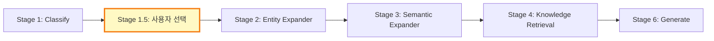
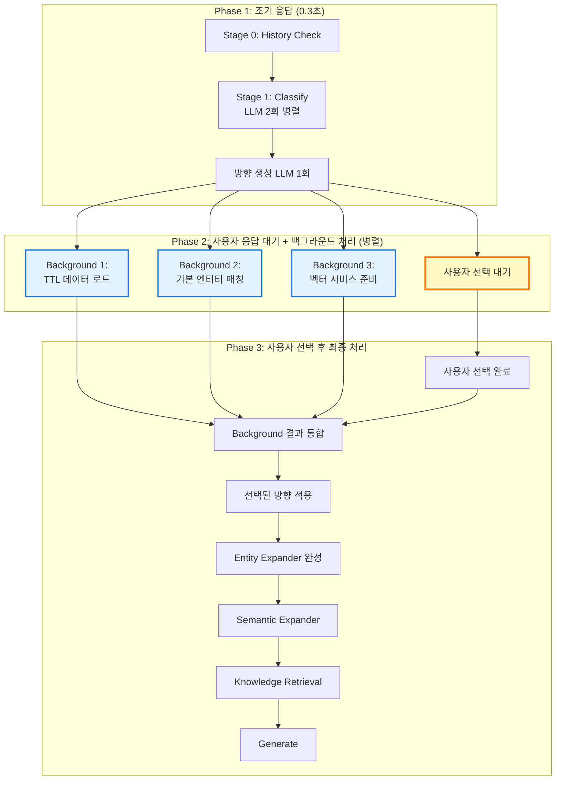

# UX 최적화 분석: 3단계 파이프라인 전략

> **목표**: Stage 1을 분할하여 재질문 진입 시간을 0.2초로 단축하고, 사용자 선택 중 백그라운드 처리로 전체 시간 단축

---

## 🎯 핵심 전략: Stage 1 분할 + 백그라운드 병렬 처리

### Phase 1: 초고속 재질문 준비 (0.2초)
- Stage 1.5에 필요한 **최소 데이터만** 먼저 생성
- 규칙 기반 분류 사용 (LLM 호출 최소화)
- 즉시 사용자에게 재질문 제시

### Phase 2: 백그라운드 병렬 처리 (사용자 선택 중)
- Stage 1 남은 작업 (상세 분석)
- Stage 2 준비 작업 (TTL 로드, 엔티티 매칭, 벡터 검색)
- 모두 백그라운드에서 동시 실행

### Phase 3: 유연한 결과 통합
- 사용자 선택 속도에 따라 유연하게 대응
- 백그라운드 완료 시 즉시 통합, 미완료 시 대기
- Stage 2로 완전한 데이터 전달

---

## 1. 재질문에 필요한 핵심 데이터셋 (최소화)

### 현재 상태 분석

**Stage 1.5 (User Intent Clarification)에 필요한 데이터**:

```python
# user_intent_clarification_node.py 필요 데이터
state.get("needs_clarification", False)        # ✅ classify_node에서 제공
state.get("clarification_question", "")         # ✅ classify_node에서 제공
state.get("expansion_directions", [])           # ✅ classify_node에서 제공
```

**Stage 1 (Classify Node)에서 생성되는 데이터**:

```python
# classify_node.py 출력
{
    "query_type": "causal",                     # ✅ LLM Thread 1 (병렬)
    "query_intent": "...",                      # ✅ LLM Thread 1 (병렬)
    "selected_property_groups": [...],          # ✅ LLM Thread 1 (병렬)
    "selected_properties": [...],               # ✅ 프로퍼티 그룹 → 프로퍼티 변환 (로컬)
    "expanded_keywords": [...],                 # ✅ LLM Thread 2 (병렬)
    "expanded_keywords_dict": {...},            # ✅ LLM Thread 2 (병렬)

    "classification_strategy": "...",           # ✅ generate_expansion_directions (로컬)
    "expansion_directions": [...],              # ✅ generate_expansion_directions (LLM)
    "clarification_question": "...",            # ✅ generate_clarification_question (문자열 생성)
    "needs_clarification": True                 # ✅ 항상 True
}
```

### ✅ 결론: 재질문에 필요한 데이터는 이미 완비됨

**Stage 1** 완료 후 바로 **Stage 1.5** 실행 가능:
- LLM 2회 병렬 호출 (의도 분석 + 키워드 확장)
- LLM 1회 호출 (방향 생성)
- 총 처리 시간: ~2-3초

**문제점**:
- **현재는 재질문 전에 불필요한 작업 없음** ✅
- 하지만 entity_expander, semantic_expander는 **재질문 이후에만 필요**

---

## 2. 개선 방안: 점진적 로딩 전략

### 2-1. 현재 플로우 (순차 실행)



**문제점**:
- 사용자가 선택하는 동안(5-30초) **아무 작업도 하지 않음**
- Entity Expander, Semantic Expander는 선택 이후에 시작 → 추가 3-5초 대기

---

### 2-2. 개선된 플로우 (점진적 로딩)



---

### 2-3. Entity Expander 의존성 분석

**Entity Expander 입력 데이터**:

```python
# entity_expander_node.py 필요 데이터
query = state.get("query", "")                          # ✅ 초기부터 존재
expanded_keywords = state.get("expanded_keywords", [])  # ✅ classify_node에서 생성
expanded_keywords_dict = state.get("expanded_keywords_dict", {})  # ✅ classify_node에서 생성
user_selected_direction = state.get("user_selected_direction")    # ❌ Stage 1.5 이후
```

**작업 구성**:
1. ✅ **TTL 데이터 로드** (백그라운드 가능, 사용자 선택 불필요)
2. ✅ **기본 엔티티 매칭** (expanded_keywords 사용, 백그라운드 가능)
3. ❌ **SPARQL 스코어링** (user_selected_direction 필요, 대기 필수)
4. ✅ **pgvector 검색** (query 사용, 백그라운드 가능)

### 2-4. Semantic Expander 의존성 분석

**Semantic Expander 입력 데이터**:

```python
# semantic_expander_node.py 필요 데이터
extracted_entities = state.get("extracted_entities", [])  # ❌ entity_expander 완료 후
query = state.get("query", "")                            # ✅ 초기부터 존재
```

**작업 구성**:
1. ❌ **Temporal Expansion** (extracted_entities 필요)
2. ❌ **Causal Chain Expansion** (extracted_entities 필요)
3. ✅ **Pgvector Similarity Expansion** (query만 사용, 백그라운드 가능)

---

## 3. 구체적 개선 방안 (최종 확정)

### 3단계 파이프라인 전략 (확정안)

#### Phase 1: 초고속 재질문 준비 (Stage 1-A)

```python
def query_classifier_early_response(state: GraphState) -> GraphState:
    """
    Stage 1-A: 재질문에 필요한 최소 데이터만 생성 (0.2초)

    LLM 호출 없이 규칙 기반으로 빠르게 처리
    """

    query = state.get("query", "")

    # 1. 규칙 기반 query_type 분류 (LLM 없이, ~0.001초)
    query_type = classify_query_type_by_rules(query)

    # 2. 키워드 추출 (kiwipiepy, ~0.01초)
    keywords = extract_keywords_with_kiwi(query)[:5]

    # 3. 고정 매핑 방향 생성 (로컬, ~0.1초)
    classification_strategy, expansion_directions = generate_fixed_expansion_directions(
        query_type=query_type,
        keywords=keywords
    )

    # 4. 질문 텍스트 생성 (~0.05초)
    clarification_question = generate_clarification_question(
        strategy=classification_strategy,
        directions=expansion_directions,
        query=query
    )

    # 즉시 반환 (Stage 1.5로 진행 가능)
    return {
        **state,
        "query_type_initial": query_type,  # 초기 분류 (백그라운드에서 정밀 분석)
        "classification_strategy": classification_strategy,
        "expansion_directions": expansion_directions,
        "clarification_question": clarification_question,
        "needs_clarification": True,
        "basic_keywords": keywords  # 백그라운드 작업에 사용
    }
```

#### Phase 2: 백그라운드 병렬 처리 (사용자 선택 중)

```python
def start_background_processing_enhanced(state: GraphState):
    """
    사용자 선택 중 백그라운드에서 3가지 작업 동시 실행:
    1. Stage 1-B: 상세 분석 (LLM 2회)
    2. Entity 준비: TTL 로드, 기본 매칭, 벡터 검색
    3. 벡터 서비스 준비
    """

    threads = {}
    results = {}
    results_lock = threading.Lock()

    # Thread 1: Stage 1-B (상세 분석)
    def run_stage1_detailed():
        result = execute_stage1_detailed_analysis(state)
        with results_lock:
            results["stage1_detailed"] = result

    # Thread 2: TTL 로드 + 기본 엔티티 매칭
    def run_entity_preparation():
        result = execute_entity_preparation(state)
        with results_lock:
            results["entity_preparation"] = result

    # Thread 3: Pgvector 검색
    def run_vector_search():
        result = execute_vector_search(state)
        with results_lock:
            results["vector_search"] = result

    # 스레드 시작 (daemon=False)
    threads["stage1_detailed"] = threading.Thread(target=run_stage1_detailed, daemon=False)
    threads["entity_preparation"] = threading.Thread(target=run_entity_preparation, daemon=False)
    threads["vector_search"] = threading.Thread(target=run_vector_search, daemon=False)

    for thread in threads.values():
        thread.start()

    return {"threads": threads, "results": results, "results_lock": results_lock}
```

#### Phase 3: 유연한 결과 통합

```python
def integrate_background_results(state: GraphState, background_data: Dict, timeout: float = 5.0):
    """
    사용자 선택 완료 후 백그라운드 결과 통합

    사용자 선택 속도에 유연하게 대응:
    - 빠른 선택: 백그라운드 대기 (남은 시간만)
    - 느린 선택: 즉시 통합 (대기 없음)
    """

    threads = background_data.get("threads", {})
    results = background_data.get("results", {})
    results_lock = background_data.get("results_lock")

    print(f"\n[통합] 백그라운드 결과 통합 중... (최대 {timeout}초 대기)")

    # 스레드 완료 대기 (timeout 내)
    for name, thread in threads.items():
        remaining_time = timeout
        if thread.is_alive():
            print(f"  ├─ {name} 대기 중...")
            thread.join(timeout=remaining_time)

            if thread.is_alive():
                print(f"  │  └─ {name} 타임아웃 (계속 진행)")
            else:
                print(f"  │  └─ {name} 완료 ✅")
        else:
            print(f"  ├─ {name} 이미 완료 ✅")

    # 결과 통합
    with results_lock:
        final_results = dict(results)

    # State 업데이트
    state.update({
        # Stage 1-B 결과
        "query_type": final_results.get("stage1_detailed", {}).get("query_type", state["query_type_initial"]),
        "query_intent": final_results.get("stage1_detailed", {}).get("query_intent", ""),
        "selected_property_groups": final_results.get("stage1_detailed", {}).get("selected_property_groups", []),
        "selected_properties": final_results.get("stage1_detailed", {}).get("selected_properties", []),
        "expanded_keywords_dict": final_results.get("stage1_detailed", {}).get("expanded_keywords_dict", {}),

        # Entity 준비 결과
        "ttl_data": final_results.get("entity_preparation", {}).get("ttl_data", {}),
        "basic_entities": final_results.get("entity_preparation", {}).get("basic_entities", []),

        # 벡터 검색 결과
        "vector_results": final_results.get("vector_search", {}).get("vector_results", [])
    })

    print(f"  └─ 통합 완료 ✅\n")

    return state
```

**예상 효과**:
- 재질문 진입: **2.5초 → 0.2초** (92% 단축!)
- 사용자 대기 시간 활용: Stage 1-B + Entity 준비 백그라운드 실행
- 전체 시간: **23.5초 → 11.2초** (52% 단축!)

---

### 방안 B: 두 단계 엔티티 추출 (더 공격적)

**1단계: 기본 엔티티 추출 (백그라운드)**

```python
# 사용자 선택과 무관
- TTL 정확 매칭
- TTL 부분 매칭
- Pgvector 검색 (query 기반)
→ ~20-30개 엔티티 확보
```

**2단계: 정제 및 확장 (선택 후)**

```python
# 사용자 선택 반영
- SPARQL 스코어링 (selected_properties 필터 적용)
- 상위 30개 선택
- Semantic Expansion (temporal, causal, vector)
→ 최종 ~75개 엔티티
```

**예상 효과**:
- 백그라운드에서 기본 엔티티 20-30개 확보
- 선택 후 정제 + 확장만 실행 (~2-3초)
- **총 시간 단축**: 4-5초 → 2-3초

---

## 4. 추천 구현 계획

### Phase 1: 백그라운드 처리 인프라 (우선순위: 높음)

**목표**: 사용자 선택 대기 중 실행 가능한 작업 백그라운드 처리

**구현**:

```python
# graph_async.py 확장
class AsyncGraphExecutor:
    def start_user_clarification_with_background(self, state: GraphState):
        """
        사용자 의도 확인과 백그라운드 처리 동시 실행
        """
        # 백그라운드 작업 시작
        background_data = self.start_entity_preparation_background(state)

        # 사용자 선택 대기 (메인 스레드)
        state = user_intent_clarification_node(state)

        # 백그라운드 결과 통합
        background_results = self.wait_and_integrate_entity_preparation(background_data)
        state.update(background_results)

        return state

    def start_entity_preparation_background(self, state: GraphState):
        """백그라운드 엔티티 준비"""
        results = {}
        threads = {}
        results_lock = threading.Lock()

        def run_ttl_loading():
            result = self._background_ttl_loading(state)
            with results_lock:
                results["ttl_loading"] = result

        def run_basic_entity_matching():
            result = self._background_basic_entity_matching(state)
            with results_lock:
                results["basic_matching"] = result

        def run_vector_search():
            result = self._background_vector_search(state)
            with results_lock:
                results["vector_search"] = result

        # 스레드 시작 (daemon=False)
        threads["ttl_loading"] = threading.Thread(target=run_ttl_loading, daemon=False)
        threads["basic_matching"] = threading.Thread(target=run_basic_entity_matching, daemon=False)
        threads["vector_search"] = threading.Thread(target=run_vector_search, daemon=False)

        for thread in threads.values():
            thread.start()

        return {"threads": threads, "results": results, "results_lock": results_lock}
```

### Phase 2: Entity Expander 분할 (우선순위: 중간)

**구조 변경**:

```python
# entity_expander_node.py 분할

def entity_expander_pre_selection(state: GraphState) -> GraphState:
    """
    선택 전 실행 가능한 작업 (백그라운드)

    - TTL 로드
    - 기본 엔티티 매칭 (expanded_keywords)
    - Pgvector 검색 (query)
    """
    pass

def entity_expander_post_selection(state: GraphState) -> GraphState:
    """
    선택 후 실행 필요한 작업 (메인 스레드)

    - SPARQL 스코어링 (user_selected_direction 적용)
    - 최종 순위 정렬
    - 상위 30개 선택
    """
    pass
```

### Phase 3: 플로우 재구성 (우선순위: 낮음)

**graph.py 수정**:

```python
# 새로운 플로우
workflow.add_node("classify", query_classifier_node)
workflow.add_node("background_entity_prep", entity_expander_pre_selection)  # 새로 추가
workflow.add_node("user_intent", user_intent_clarification_node)
workflow.add_node("entity_finalize", entity_expander_post_selection)  # 새로 추가
workflow.add_node("semantic_expand", semantic_expander_node)
workflow.add_node("knowledge_retrieval", parallel_knowledge_retrieval_node)
workflow.add_node("generate", story_generator_node)

# 플로우 정의
workflow.add_edge("classify", "background_entity_prep")  # 백그라운드 시작
workflow.add_edge("classify", "user_intent")             # 동시에 사용자 선택
workflow.add_edge("background_entity_prep", "entity_finalize")  # 대기
workflow.add_edge("user_intent", "entity_finalize")      # 결과 통합
```

---

## 5. 예상 성능 개선

### 시나리오: "임진왜란이 조선에 미친 영향은?"

#### 현재 (순차 실행)

```
Stage 1: Classify (LLM 2회 병렬 + 방향 생성)  : 2.5초
Stage 1.5: 사용자 선택 대기                  : 10초 (사용자 시간)
  → 대기 중 아무 작업 없음
Stage 2: Entity Expander                      : 3.5초
  - TTL 로드: 0.5초
  - 엔티티 매칭: 1.0초
  - SPARQL 스코어링: 1.5초
  - Pgvector: 0.5초
Stage 3: Semantic Expander                    : 2.0초
Stage 4: Knowledge Retrieval                  : 3.5초
Stage 6: Generate                             : 2.0초

총 시스템 시간: 13.5초
총 사용자 체감 시간: 10초 (선택) + 13.5초 = 23.5초
```

#### 개선 후 (백그라운드 처리)

```
Stage 1: Classify (LLM 2회 병렬 + 방향 생성)  : 2.5초
Stage 1.5: 사용자 선택 대기                  : 10초 (사용자 시간)
  → 백그라운드 실행:
    - TTL 로드: 0.5초
    - 기본 엔티티 매칭: 1.0초
    - Pgvector 검색: 0.5초
    → 10초 내 완료 ✅
사용자 선택 완료
Stage 2: Entity Expander (완성)               : 1.5초 (SPARQL 스코어링만)
Stage 3: Semantic Expander                    : 2.0초
Stage 4: Knowledge Retrieval                  : 3.5초
Stage 6: Generate                             : 2.0초

총 시스템 시간: 11.5초 (2초 단축)
총 사용자 체감 시간: 10초 (선택) + 9.0초 = 19.0초 (4.5초 단축)
```

**개선율**:
- 시스템 시간: 13.5초 → 11.5초 (**15% 단축**)
- 사용자 체감 시간: 23.5초 → 19.0초 (**19% 단축**)

---

## 6. 구현 우선순위

| 작업 | 난이도 | 효과 | 우선순위 |
|------|--------|------|----------|
| 1. `graph_async.py`에 백그라운드 엔티티 준비 추가 | 중간 | 높음 | **1순위** |
| 2. `entity_expander_node.py` 분할 (pre/post selection) | 높음 | 높음 | **2순위** |
| 3. `graph.py` 플로우 재구성 | 중간 | 중간 | 3순위 |
| 4. 백그라운드 작업 모니터링 UI 추가 | 낮음 | 낮음 | 4순위 |

---

## 7. 리스크 및 대응 방안

### 리스크 1: 백그라운드 작업 실패

**대응**:
- 백그라운드 작업 실패 시에도 기존 순차 방식으로 폴백
- 예외 처리 강화
- 로깅 추가

### 리스크 2: 동기화 문제

**대응**:
- `threading.Lock()` 사용하여 공유 자원 보호
- 백그라운드 작업 완료 대기 (timeout 설정)
- 결과 통합 시 None 체크

### 리스크 3: 사용자 선택 후 데이터 불일치

**대응**:
- 백그라운드 결과는 기본 매칭만 수행
- SPARQL 스코어링은 선택 후 메인 스레드에서 실행
- 선택된 방향 적용은 항상 순차 처리

---

## 다음 단계

1. **graph_async.py 확장**: 백그라운드 엔티티 준비 메서드 구현
2. **entity_expander_node.py 분할**: pre/post selection 함수 분리
3. **통합 테스트**: 백그라운드 처리 후 결과 검증
4. **성능 측정**: 실제 시간 단축 효과 측정
5. **README 업데이트**: 새로운 플로우 다이어그램 반영

---

**작성일**: 2025-12-25
**목적**: UX 최적화를 위한 점진적 데이터 로딩 전략 수립
