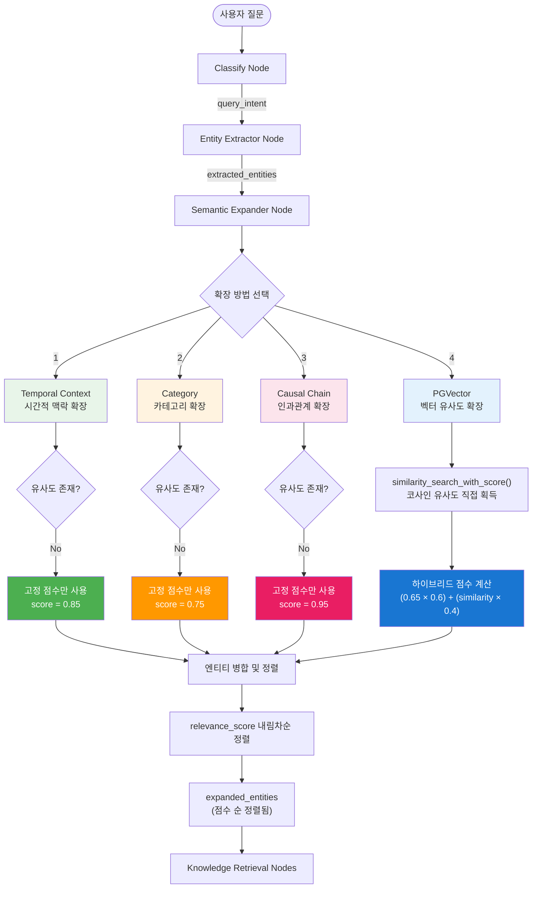
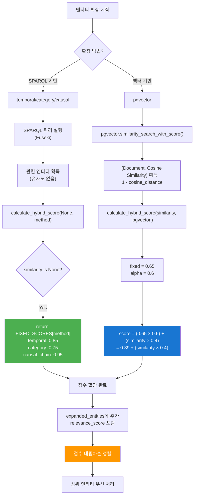

# 엔티티 관련성 점수 매기기 방식 (Scoring Methodology)

> 한국사 RAG 시스템에서 엔티티 관련성을 정량화하는 하이브리드 점수 계산 방법론

---

## 📋 목차

1. [개요](#개요)
2. [핵심 개념](#핵심-개념)
3. [점수 계산 흐름도](#점수-계산-흐름도)
4. [하이브리드 점수 계산 공식](#하이브리드-점수-계산-공식)
5. [코사인 유사도 직접 사용](#코사인-유사도-직접-사용)
6. [확장 방법별 점수 책정](#확장-방법별-점수-책정)
7. [실제 적용 예시](#실제-적용-예시)
8. [버전 히스토리](#버전-히스토리)

---

## 개요

한국사 RAG 시스템은 4가지 방법으로 엔티티를 확장하며, 각 엔티티의 관련성을 정량화하여 우선순위를 결정합니다:

- **SPARQL 기반 확장** (temporal, category, causal_chain): 온톨로지 관계 기반
- **pgvector 확장**: 벡터 임베딩 유사도 기반

**핵심 과제:**

- SPARQL은 벡터 유사도를 제공하지 않음 → 고정 점수 필요
- pgvector는 코사인 유사도를 제공 → 직접 활용

**해결책: 하이브리드 점수 (ver2)**

- 고정 점수(안정성) + 실제 유사도(정확성)의 가중평균
- SPARQL은 유사도 없으므로 고정 점수로 fallback
- pgvector는 코사인 유사도를 직접 사용하여 하이브리드 계산

---

## 핵심 개념

### 1️⃣ **코사인 거리 (Cosine Distance)**

**정의:** 두 벡터 간의 각도 차이를 측정

$$
\text{Cosine Distance} = 1 - \text{Cosine Similarity} = 1 - \frac{A \cdot B}{||A|| \times ||B||}
$$

**특징:**

- **값이 작을수록** 두 벡터가 더 유사함
- pgvector의 `<=>` 연산자가 코사인 거리 계산
- 범위: `[0, 2]` (0 = 완전히 동일, 2 = 정반대 방향)
- **정규화된 벡터 (OpenAI 임베딩)에 최적화**

**PostgreSQL 예시:**

```sql
SELECT content, (embedding <=> query_vector) AS cosine_dist
FROM korean_history
ORDER BY cosine_dist ASC  -- 거리 오름차순 = 유사도 내림차순
LIMIT 10;
```

**OpenAI 임베딩과의 관계:**

OpenAI `text-embedding-3-small`은 정규화된 벡터 반환 (`||벡터|| = 1`)

- 코사인 거리: **내적 연산만** 필요 → 빠름 ⚡
- L2 거리: 뺄셈 + 제곱 + 합 + 제곱근 → 느림 🐌
- **성능 차이: 약 15-30% 향상**

---

### 2️⃣ **코사인 유사도 (Cosine Similarity)**

**정의:** 두 벡터 간의 방향 유사도 (0-1 범위)

**코사인 거리 → 유사도 변환 공식:**

$$
\text{Cosine Similarity} = 1 - \text{Cosine Distance}
$$

**변환 테이블:**

| Cosine Distance | Cosine Similarity | 해석           |
| --------------- | ----------------- | -------------- |
| 0.0             | 1.000             | 완전히 동일    |
| 0.1             | 0.900             | 매우 유사      |
| 0.2             | 0.800             | 유사           |
| 0.5             | 0.500             | 보통           |
| 1.0             | 0.000             | 무관           |
| 2.0             | -1.000            | 정반대 (극히 드뭄) |

**특징:**

- **값이 클수록** 더 유사함 (거리와 반대)
- 범위: `[-1, 1]` (정규화 임베딩에서는 `[0, 1]`)
- 벡터의 **방향만** 고려 (크기 무시)
- OpenAI 임베딩에 **최적화된 메트릭**

---

### 3️⃣ **고정 점수 (Fixed Score)**

**정의:** 확장 방법(expansion method)에 따라 미리 정해진 기준 점수

**목적:**

- SPARQL 기반 확장은 벡터 유사도가 없으므로 고정 점수 사용
- 온톨로지 관계의 의미론적 중요도 반영
- 점수의 안정성 보장

**확장 방법별 고정 점수:**

```python
FIXED_SCORES = {
    "causal_chain": 0.95,   # 인과관계 (가장 높은 관련성)
    "temporal": 0.85,       # 시간적 맥락 (높은 관련성)
    "category": 0.75,       # 카테고리 (중간 관련성)
    "pgvector": 0.65        # 벡터 유사도 (보통 관련성)
}
```

**설계 원칙:**

- 인과관계(`leadsTo`, `causedBy`) → 직접적 관련성 → **0.95** (최고)
- 시간적 맥락(±10년) → 간접적 관련성 → **0.85**
- 카테고리(동일 주제) → 배경 지식 → **0.75**
- pgvector(벡터 검색) → 의미적 유사성 → **0.65** (기준)

---

### 4️⃣ **하이브리드 점수 (Hybrid Score)**

**정의:** 고정 점수와 실제 유사도를 가중평균한 최종 관련성 점수

**공식:**

$$
\text{Hybrid Score} = (\text{Fixed Score} \times \alpha) + (\text{Similarity} \times (1 - \alpha))
$$

**파라미터:**

- **α (alpha)**: 고정 점수 가중치 (0-1)
  - `α = 0.6` (기본): 고정 60%, 유사도 40%
  - `α = 0.8`: 고정 우선 (안정성 중시)
  - `α = 0.4`: 유사도 우선 (정확도 중시)

**fallback 처리:**

```python
if similarity is None:
    return fixed_score  # SPARQL 기반 확장
else:
    return (fixed_score * alpha) + (similarity * (1 - alpha))
```

---

## 점수 계산 흐름도

### 🔄 LangGraph 노드별 점수 계산 흐름



### 📊 점수 계산 상세 흐름



---

## 하이브리드 점수 계산 공식

### 🧮 수식 정의

```python
def calculate_hybrid_score(similarity, expansion_method, alpha=0.6):
    """
    하이브리드 점수 = (고정 점수 × α) + (유사도 × (1 - α))

    Args:
        similarity: 벡터 유사도 (0-1) 또는 None
        expansion_method: 확장 방법 문자열
        alpha: 고정 점수 가중치 (0-1)

    Returns:
        최종 관련성 점수 (0-1)
    """
    FIXED_SCORES = {
        "causal_chain": 0.95,
        "temporal": 0.85,
        "category": 0.75,
        "pgvector": 0.65
    }

    fixed_score = FIXED_SCORES.get(expansion_method, 0.5)

    # SPARQL 기반 확장 (유사도 없음)
    if similarity is None:
        return fixed_score

    # pgvector 확장 (유사도 있음)
    return (fixed_score * alpha) + (similarity * (1 - alpha))
```

### 📐 alpha 값에 따른 가중치 분배

| Alpha   | 고정 점수 가중치 | 유사도 가중치 | 특징                             |
| ------- | ---------------- | ------------- | -------------------------------- |
| 0.8     | 80%              | 20%           | 안정성 우선 (온톨로지 관계 신뢰) |
| **0.6** | **60%**          | **40%**       | **균형** (기본값) ⭐             |
| 0.4     | 40%              | 60%           | 정확도 우선 (실제 유사도 신뢰)   |
| 0.0     | 0%               | 100%          | 유사도만 사용 (고정 점수 무시)   |
| 1.0     | 100%             | 0%            | 고정 점수만 사용 (ver1 방식)     |

---

## 코사인 유사도 직접 사용

### 🔢 pgvector에서 코사인 유사도 계산

```python
# custom_pgvector.py에서 이미 처리
def similarity_search_with_score(self, query: str, k: int = 4):
    """코사인 유사도를 직접 반환 (변환 불필요)"""
    query_emb = self.embedding_fn.embed_query(query)

    # 코사인 거리 → 유사도 변환을 SQL에서 직접 수행
    cur.execute("""
        SELECT content, metadata,
               1 - (embedding <=> %s::vector) AS similarity
        FROM korean_history
        ORDER BY (embedding <=> %s::vector) ASC
        LIMIT %s
    """, (query_emb, query_emb, k))

    return [(Document(...), float(similarity)) for row in rows]
```

### 📈 코사인 거리 vs 유사도 관계

```
Cosine Similarity vs Cosine Distance

1.0 |●
    |   ●
0.9 |      ●
    |         ●
0.8 |            ●
    |               ●
0.7 |                  ●
    |                     ●
0.6 |                        ●
    |                           ●
0.5 |                              ●
    |                                 ●
0.4 |                                    ●
    |                                       ●
0.3 |                                          ●
    |                                             ●
0.2 |                                                ●
    |                                                   ●
0.1 |                                                      ●
    |                                                         ●
0.0 |____________________________________________________________●
    0.0  0.1  0.2  0.3  0.4  0.5  0.6  0.7  0.8  0.9  1.0
                     Cosine Distance

    Similarity = 1 - Distance (완벽한 선형 관계)
```

### 🎯 실전 예시

**질문:** "을미사변의 원인은?"

**pgvector 검색 결과 (코사인 유사도 직접 반환):**

| 엔티티        | Cosine Distance | Cosine Similarity | 해석           |
| ------------- | --------------- | ----------------- | -------------- |
| 명성황후 시해 | 0.12            | 0.880             | 매우 관련 높음 |
| 아관파천      | 0.18            | 0.820             | 관련 높음      |
| 갑오개혁      | 0.25            | 0.750             | 관련 있음      |
| 청일전쟁      | 0.35            | 0.650             | 보통 관련      |
| 동학농민운동  | 0.50            | 0.500             | 약간 관련      |

**사용 코드:**

```python
# similarity는 이미 코사인 유사도로 변환됨 (0-1 범위)
for doc, similarity in doc_scores:
    print(f"{doc.metadata['title']}: similarity={similarity:.3f}")
```

---

## 확장 방법별 점수 책정

### 1️⃣ **시간적 맥락 확장 (Temporal Context)**

**SPARQL 쿼리:**

```sparql
SELECT ?entity ?label ?year WHERE {
    ?entity hist:hasYear ?year .
    ?entity rdfs:label ?label .
    FILTER(?year >= {min_year} && ?year <= {max_year})
}
```

**점수 계산:**

```python
# 유사도 없음 (SPARQL 기반)
"relevance_score": calculate_hybrid_score(None, "temporal")
# → return FIXED_SCORES["temporal"] = 0.85
```

**예시:**

- 질문: "임진왜란의 영향은?" (1592년)
- 확장 엔티티: 광해군 즉위 (1608년) → 점수 **0.85**

---

### 2️⃣ **카테고리 확장 (Category)**

**SPARQL 쿼리:**

```sparql
SELECT ?entity ?label WHERE {
    ?entity hist:hasCategory "{category}" .
    ?entity rdfs:label ?label .
}
```

**점수 계산:**

```python
"relevance_score": calculate_hybrid_score(None, "category")
# → return FIXED_SCORES["category"] = 0.75
```

**예시:**

- 질문: "강화도 조약의 배경은?" (카테고리: 조약)
- 확장 엔티티: 병자수호조약, 한미수호조약 → 점수 **0.75**

---

### 3️⃣ **인과관계 체인 확장 (Causal Chain)**

**SPARQL 쿼리:**

```sparql
SELECT ?related ?label WHERE {
    {
        <{uri}> ?predicate ?related .
        FILTER(?predicate IN (hist:leadsTo, hist:causedBy, hist:triggeredBy))
    }
    UNION
    {
        ?related ?predicate <{uri}> .
        FILTER(?predicate IN (hist:leadsTo, hist:causedBy))
    }
}
```

**점수 계산:**

```python
"relevance_score": calculate_hybrid_score(None, "causal_chain")
# → return FIXED_SCORES["causal_chain"] = 0.95
```

**예시:**

- 질문: "갑신정변의 원인은?"
- 확장 엔티티 (leadsTo): 갑신정변 → 한성조약 → 점수 **0.95**

---

### 4️⃣ **pgvector 벡터 유사도 확장**

**PostgreSQL 쿼리 (코사인 거리 사용):**

```sql
SELECT content, metadata,
       1 - (embedding <=> query_vector) AS similarity
FROM korean_history
ORDER BY (embedding <=> %s::vector) ASC
LIMIT 15;
```

**점수 계산 (하이브리드):**

```python
# similarity는 이미 코사인 유사도 (0-1 범위)
# CustomPGVector에서 이미 변환됨: 1 - cosine_distance

# 하이브리드 점수 계산
score = calculate_hybrid_score(similarity, "pgvector", alpha=0.6)
# → (0.65 × 0.6) + (similarity × 0.4)
# → 0.39 + (similarity × 0.4)
```

**예시 (alpha=0.6):**

| Cosine Distance | Cosine Similarity | 하이브리드 점수 | 계산식               |
| --------------- | ----------------- | --------------- | -------------------- |
| 0.05            | 0.950             | **0.770**       | 0.39 + (0.950 × 0.4) |
| 0.12            | 0.880             | **0.742**       | 0.39 + (0.880 × 0.4) |
| 0.20            | 0.800             | **0.710**       | 0.39 + (0.800 × 0.4) |
| 0.35            | 0.650             | **0.650**       | 0.39 + (0.650 × 0.4) |
| 0.50            | 0.500             | **0.590**       | 0.39 + (0.500 × 0.4) |

**코드:**

```python
doc_scores = pgvector.similarity_search_with_score(query=query, k=15)

for doc, similarity in doc_scores:
    # similarity는 이미 코사인 유사도로 변환됨 (변환 불필요)
    relevance_score = calculate_hybrid_score(similarity, "pgvector")

    expanded_entities.append({
        "name": doc.metadata["title"],
        "pgvector_similarity": similarity,
        "relevance_score": relevance_score
    })
```

---

## 실제 적용 예시

### 📝 케이스 스터디: "을미사변의 원인은?"

#### **1단계: Entity Extractor Node**

```python
extracted_entities = [
    {"name": "을미사변", "uri": "hist:UlmiIncident", "type": "Event"}
]
```

#### **2단계: Semantic Expander Node - 4가지 확장**

##### **A. 시간적 맥락 확장 (1895년 ±10년)**

```python
temporal_entities = [
    {
        "name": "갑오개혁",
        "expansion_method": "temporal",
        "relevance_score": 0.85  # calculate_hybrid_score(None, "temporal")
    },
    {
        "name": "청일전쟁",
        "expansion_method": "temporal",
        "relevance_score": 0.85
    }
]
```

##### **B. 카테고리 확장 (정치사건)**

```python
category_entities = [
    {
        "name": "갑신정변",
        "expansion_method": "category",
        "relevance_score": 0.75  # calculate_hybrid_score(None, "category")
    }
]
```

##### **C. 인과관계 확장 (causedBy)**

```python
causal_entities = [
    {
        "name": "아관파천",
        "expansion_method": "causal_chain",
        "causal_relation": "leadsTo",
        "relevance_score": 0.95  # calculate_hybrid_score(None, "causal_chain")
    }
]
```

##### **D. pgvector 벡터 유사도 확장**

```python
pgvector_entities = [
    {
        "name": "명성황후 시해",
        "expansion_method": "pgvector",
        "pgvector_similarity": 0.880,  # 코사인 유사도 (직접 반환)
        "relevance_score": 0.742  # (0.65 × 0.6) + (0.880 × 0.4)
    },
    {
        "name": "고종황제",
        "expansion_method": "pgvector",
        "pgvector_similarity": 0.820,  # 코사인 유사도
        "relevance_score": 0.718  # (0.65 × 0.6) + (0.820 × 0.4)
    },
    {
        "name": "러시아 공사관",
        "expansion_method": "pgvector",
        "pgvector_similarity": 0.750,  # 코사인 유사도
        "relevance_score": 0.690  # (0.65 × 0.6) + (0.750 × 0.4)
    }
]
```

#### **3단계: 엔티티 병합 및 점수 순 정렬**

```python
expanded_entities = [
    {"name": "아관파천",      "method": "causal_chain", "score": 0.95},  # 1위
    {"name": "갑오개혁",       "method": "temporal",     "score": 0.85},  # 2위
    {"name": "청일전쟁",       "method": "temporal",     "score": 0.85},  # 2위
    {"name": "갑신정변",       "method": "category",     "score": 0.75},  # 4위
    {"name": "명성황후 시해",  "method": "pgvector",     "score": 0.742}, # 5위 (코사인 유사도)
    {"name": "고종황제",       "method": "pgvector",     "score": 0.718}, # 6위 (코사인 유사도)
    {"name": "러시아 공사관",  "method": "pgvector",     "score": 0.690}  # 7위 (코사인 유사도)
]
```

#### **4단계: 최종 RAG 컨텍스트 구성**

```
[질문] 을미사변의 원인은?

[관련 엔티티 - 점수 순]
1. 아관파천 (인과관계, 0.95) ⭐ 직접적 결과
2. 갑오개형 (시간적, 0.85)
3. 청일전쟁 (시간적, 0.85)
4. 갑신정변 (카테고리, 0.75)
5. 명성황후 시해 (벡터, 0.698) ⭐ 핵심 사건
6. 고종황제 (벡터, 0.640)
7. 러시아 공사관 (벡터, 0.590)

→ Knowledge Retrieval에서 상위 엔티티 우선 검색
```

---

## 버전 히스토리

### 🚫 **ver0 - 초기 (문제 있음)**

**문제:**

```python
"relevance_score": similarity * 0.8  # ❌ 0.8 곱하면 점수 감소!
```

**예시:**

- 벡터 유사도 0.9 → 0.9 × 0.8 = **0.72** (감소!)
- 관련도가 높을수록 점수가 낮아지는 논리적 모순

**문제점:**

- 0 < x < 1을 곱하면 점수 **감소** (패널티)
- 부스트가 아닌 페널티 효과

---

### ✅ **ver1 - 고정 가중치 × 배수 (개선)**

**개선:**

```python
RELEVANCE_MULTIPLIERS = {
    "causal_chain": 1.9,
    "temporal": 1.7,
    "category": 1.5,
    "pgvector": 1.3
}
BASE_SCORE = 0.5

"relevance_score": BASE_SCORE * RELEVANCE_MULTIPLIERS["causal_chain"]
# → 0.5 × 1.9 = 0.95
```

**장점:**

- ✅ 1 이상의 배수로 점수 **증가** (논리적)
- ✅ 단순하고 예측 가능
- ✅ 디버깅 용이

**한계:**

- ❌ 실제 벡터 유사도 무시
- ❌ 모든 pgvector 결과에 동일한 점수 (0.65)

---

### ⭐ **ver2 - 하이브리드 (현재) [2025-12-07]**

**공식:**

```python
def calculate_hybrid_score(similarity, expansion_method, alpha=0.6):
    fixed_score = FIXED_SCORES[expansion_method]
    if similarity is None:
        return fixed_score
    return (fixed_score * alpha) + (similarity * (1 - alpha))
```

**장점:**

- ✅ **고정 점수의 안정성** + **실제 유사도의 정확성** 결합
- ✅ alpha 값으로 밸런스 조정 가능
- ✅ SPARQL 확장은 고정 점수로 fallback
- ✅ pgvector 확장은 실제 코사인 거리 활용

**적용:**

- SPARQL (temporal, category, causal_chain): 고정 점수만
- pgvector: 코사인 거리 → 유사도 변환 → 하이브리드 계산

**예시:**

```python
# SPARQL 기반
calculate_hybrid_score(None, "temporal")
→ 0.85

# pgvector 기반 (cosine distance = 0.12)
similarity = 1 - 0.12 = 0.880  # 코사인 유사도
calculate_hybrid_score(0.880, "pgvector", alpha=0.6)
→ (0.65 × 0.6) + (0.880 × 0.4) = 0.742
```

---

## 참고 자료

### 📚 관련 문서

- [README.md](./README.md) - 전체 시스템 아키텍처
- [semantic_expander_node.py](../nodes/semantic_expander_node.py) - 점수 계산 구현
- [custom_pgvector.py](../../db_pipeline/services/custom_pgvector.py) - 코사인 거리 검색

### 🔧 핵심 파일

- `semantic_expander_node.py:36-62` - `calculate_hybrid_score()` 함수
- `semantic_expander_node.py:403-447` - pgvector 확장 + 하이브리드 점수
- `custom_pgvector.py:143-170` - `similarity_search_with_score()` 구현

### 📊 수식 참고

- 코사인 거리: [Cosine Similarity](https://en.wikipedia.org/wiki/Cosine_similarity)
- 하이브리드 점수: 가중평균 (Weighted Average)
- pgvector 연산자: [pgvector Operators](https://github.com/pgvector/pgvector#vector-operators)

---

**작성일:** 2025-12-07
**버전:** ver2 (하이브리드 점수)
**작성자:** Claude Code
