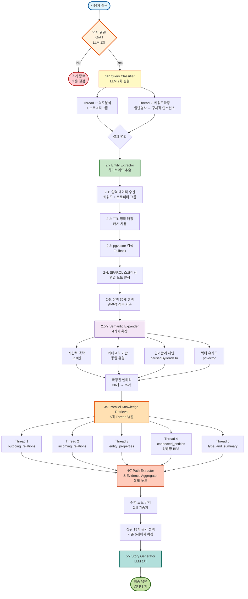
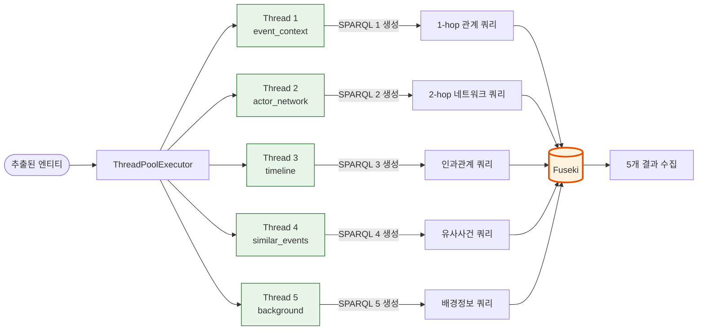
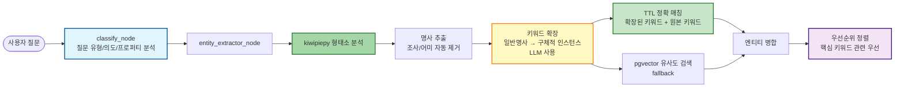
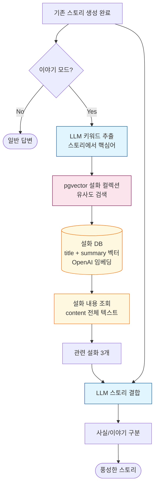
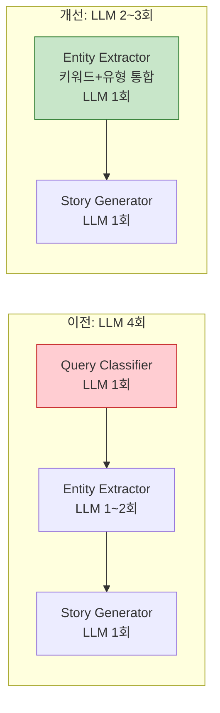

# 창작 모드 - 조선시대 역사 스토리텔링 LangGraph

## 📊 전체 플로우차트



### 🔑 핵심 체크포인트

| 단계                                               | LLM 호출       | SPARQL 호출      | 주요 작업                                                                               |
| -------------------------------------------------- | -------------- | ---------------- | --------------------------------------------------------------------------------------- |
| **0. 역사 관련 여부 체크**                         | ✅**1회**      | ❌               | 조선시대 역사 질문 필터링 (비역사 질문 조기 종료)                                       |
| **1. Query Classifier**                            | ✅**2회 병렬** | ❌               | 질문 분석, 키워드 확장, 프로퍼티 그룹 선택 (ThreadPoolExecutor 사용)                    |
| **2. Entity Extractor**                            | ❌             | ✅ 각 엔티티마다 | 2-1: 입력 수신, 2-2: TTL 매칭, 2-3: pgvector, 2-4: SPARQL 스코어링, 2-5: 상위 30개 선택 |
| **2.5 Semantic Expander**                          | ❌             | ✅ 4가지 방법    | 시간적/카테고리/인과/벡터 기반 엔티티 확장 (30개 → 75개)                                |
| **3. Parallel Knowledge Retrieval**                | ❌             | ✅ 5개 Thread    | 5개 관점 관계 검색 + 양방향 BFS (최대 5-hop) + 프로퍼티 FILTER                          |
| **4. Path Extractor & Evidence Aggregator (통합)** | ❌             | ❌               | 경로 추출 + 근거 통합 + 수렴 노드 감지 (2배 부스트) + 상위 15개 선택                    |
| **5. Story Generator**                             | ✅ 1회         | ❌               | 최종 스토리 생성 (-입니다 체)                                                           |
| **6. Story Enhancer (선택적)**                     | ✅ 1회         | ❌               | 설화/이야기 추가 (pgvector 설화 컬렉션 검색)                                            |

**총 LLM 호출:**

- **역사 질문**: 4회 (역사 체크 1회 + Query Classifier 2회 병렬 + Story Generator 1회)
- **비역사 질문**: 1회만 (역사 체크 후 즉시 종료) ⚡ 비용 절감

**총 SPARQL 호출: 9 + N회** (Semantic Expander 4회 + 병렬 검색 5회 + 엔티티 스코어링 N회)

---

## 🔧 핵심 컴포넌트

### **1. Query Classifier (통합 분석 노드) ⚡LLM 2회 병렬 호출**

**역할:** ThreadPoolExecutor로 LLM 2개를 병렬 실행하여 시간 단축
**전제 조건:** 0단계에서 역사 관련 질문으로 확인된 경우에만 실행

#### **1-1. kiwipiepy 키워드 추출 (전처리)**

먼저 형태소 분석기로 질문에서 명사를 추출합니다:

```python
from kiwipiepy import Kiwi
kiwi = Kiwi()

# 질문 예시: "궁궐을 건축한 왕들은 누가 있는지?"
tokens = kiwi.tokenize(query)
keywords = [t.form for t in tokens if t.tag in ('NNG', 'NNP') and len(t.form) >= 1]
# 결과: ['궁궐', '건축', '왕']  # 조사/어미 자동 제거, 1글자 명사도 포함
```

#### **1-2. 병렬 실행 구조 (ThreadPoolExecutor)**

추출된 키워드를 사용하여 2개 Thread를 병렬 실행:

```python
from concurrent.futures import ThreadPoolExecutor

with ThreadPoolExecutor(max_workers=2) as executor:
    # Thread 1: 의도 분석 + 프로퍼티 그룹 선택
    future1 = executor.submit(analyze_intent_and_properties)

    # Thread 2: 키워드 확장
    future2 = executor.submit(expand_keywords)

    # 결과 대기 (병렬 실행으로 시간 단축)
    result1 = future1.result()  # query_type, intent, property_groups
    result2 = future2.result()  # expanded_keywords
```

#### **Thread 1: 의도 분석 + 프로퍼티 그룹 선택**

**작업 내용:**

1. 질문 유형 분류 (`causal`/`deep_analysis`)
2. 핵심 의도 파악 (`intent`)
3. 프로퍼티 그룹 선택 (`property_groups`: 최대 5개)

**프로퍼티 그룹 선택 로직:**

프로퍼티를 **40개 의미 그룹으로 분류 → LLM이 관련 그룹 선택**

```
질문: "궁궐을 지은 왕"
         ↓
1. 프로퍼티 그룹 목록 제공 (명확한 행위 그룹만)
   - 건설, 설립, 통치, 임명, 사망, 처벌, 유배, 전쟁, 반란...
   - 제외: "속성"(623개), "기타"(1783개) 등 범용 그룹
         ↓
2. LLM이 관련 그룹 선택 (최대 5개)
   → ["건설", "설립", "통치"]
         ↓
3. 선택된 그룹에서 실제 프로퍼티 추출
   → ["built", "builtBy", "constructed", "founded", "established", ...]
         ↓
4. SPARQL FILTER 적용 (Parallel Knowledge Retrieval에서 사용)
   FILTER(?predicate IN (hist:built, hist:builtBy, hist:founded, ...))
```

**병렬 실행 효과:**

- ✅ **시간 단축**: Thread 2 (키워드 확장)와 동시에 실행
- ✅ **의도 기반 선택**: 질문의 핵심 의도를 파악하여 관련 프로퍼티 그룹 선택

**효과:**

- ✅ **정확도 향상**: 관련 프로퍼티만 검색 → 노이즈 감소
- ✅ **속도 향상**: FILTER로 검색 범위 축소 → 결과 집중도 증가
- ✅ **하드코딩 없음**: 데이터 추가 시 `extract_property_groups.py` 재실행만 하면 자동 업데이트

**프로퍼티 그룹 예시:**

| 그룹 | 프로퍼티 수 | 예시 질문                |
| ---- | ----------- | ------------------------ |
| 건설 | 28개        | "궁궐을 지은 왕"         |
| 설립 | 60개        | "세종이 만든 정책"       |
| 임명 | 84개        | "세종이 임명한 인물"     |
| 사망 | 42개        | "을미사변에서 죽은 사람" |
| 처벌 | 22개        | "유배당한 인물"          |
| 전쟁 | 23개        | "임진왜란에 참여한 인물" |

**범용 그룹 처리:**

- "속성"(623개), "기타"(1783개) 등은 **범용 검색**에서 자동 포함
- 명확한 행위가 없는 질문은 모든 프로퍼티 검색 (FILTER 없음)

#### **Thread 2: 키워드 확장**

**작업 내용:**

4. 키워드 확장 (`expanded_keywords`: 일반명사 → 구체적 인스턴스 5-10개)

**효과:**

- ✅ **시간 단축**: 2개 작업을 병렬 실행하여 약 40-50% 시간 절약
- ✅ **독립성 보장**: 각 Thread는 독립적으로 실행 가능 (의존성 없음)
- ✅ **병렬 처리**: Parallel Knowledge Retrieval와 동일한 방식 (ThreadPoolExecutor 사용)

**분류 유형:**

- **`causal`**: 인과관계 질문 ("왜 ~했을까?", "어떤 영향을 미쳤나?")
- **`deep_analysis`**: 심화 분석 ("진짜 이유는?", "숨은 의도는?")

**참고: 역사 관련 필터링은 0단계에서 완료**

- 0단계에서 `is_historical=false` 확인 시 **조기 종료** 완료
  - 예: "파이썬 프로그래밍 방법", "2024년 대선 결과"
  - → 조기 종료: "답변을 생성할 수 없습니다" 메시지 반환 (LLM 1회만 호출)
- `is_historical=true`: Query Classifier로 전달되어 정상 플로우 진행

#### **Thread 2 상세 - 키워드 확장 (일반명사 → 구체적 인스턴스)**

**문제:** "궁궐", "환국", "왕" 같은 일반명사로는 구체적인 엔티티를 찾을 수 없음

**해결:** LLM으로 일반명사를 구체적 인스턴스로 확장

```
질문: "궁궐을 건축한 왕들은 누가 있는지?"
         ↓
1. kiwipiepy로 키워드 추출 (전처리 단계)
   → ["궁궐", "건축", "왕"]
         ↓
2. LLM으로 키워드 확장 (Thread 2)
   → {"궁궐": ["경복궁", "창덕궁", "경덕궁", "창경궁"],
       "왕": ["태조", "세종", "숙종"]}
         ↓
3. 확장된 키워드 + 원본 키워드로 Entity Extractor에서 TTL 매칭
   → 경복궁, 창덕궁, 태조, 세종 등 엔티티 발견
```

**병렬 실행 효과:**

- ✅ **시간 단축**: Thread 1과 동시에 실행되어 대기 시간 없음
- ✅ **독립적 실행**: 키워드 확장은 의도분석과 독립적으로 수행 가능

---

### **2. Entity Extractor (하이브리드 엔티티 추출 + SPARQL 스코어링) ⚡최적화**

**역할:** Query Classifier에서 받은 확장된 키워드와 프로퍼티 그룹을 활용하여 관련 엔티티 추출
**전제 조건:** 1단계(Query Classifier)에서 키워드 확장 및 프로퍼티 그룹 선택 완료

**입력 데이터 (Query Classifier로부터 전달):**

- ✅ **원본 키워드**: kiwipiepy로 추출된 명사 (예: `['궁궐', '건축', '왕']`)
- ✅ **확장된 키워드**: LLM으로 확장된 구체적 인스턴스 (예: `{"궁궐": ["경복궁", "창덕궁"], "왕": ["태조", "세종"]}`)
- ✅ **프로퍼티 그룹**: 의도분석으로 선택된 관련 프로퍼티 그룹 (예: `["건설", "설립", "통치"]`)

#### **2-1. 입력 데이터 수신 및 통합**

Query Classifier(1단계)에서 전달받은 데이터를 통합하여 엔티티 검색에 활용:

```python
# classify_node에서 전달받은 데이터
expanded_keywords = state.get("expanded_keywords", [])
# 예: ["경복궁", "창덕궁", "태조", "세종"]

query_keywords = state.get("query_keywords", [])
# 예: ["궁궐", "건축", "왕"]

property_groups = state.get("property_groups", [])
# 예: ["건설", "설립", "통치"]

# 원본 키워드와 확장된 키워드 병합
all_keywords = list(set(query_keywords + expanded_keywords))
# 결과: ["궁궐", "건축", "왕", "경복궁", "창덕궁", "태조", "세종"]
```

**효과:**

- ✅ **LLM 호출 없음**: Query Classifier에서 이미 처리 완료
- ✅ **정확도 향상**: 원본 + 확장 키워드로 포괄적 검색
- ✅ **시간 절약**: 중복 처리 없음

#### **2-2. TTL 정확 매칭 (캐시 활용)**

확장된 키워드 + 원본 키워드로 TTL 파일에서 직접 엔티티 매칭:

```python
# ⚡ 캐싱: 파일 변경 없으면 메모리에서 즉시 반환
_ttl_cache = None
_ttl_cache_mtime = None

def load_ttl_entities():
    if _ttl_cache and _ttl_cache_mtime == current_mtime:
        return _ttl_cache  # 즉시 반환 (~0ms)
    # 파일 읽기는 변경 시에만

# TTL 매칭 로직
for keyword in all_keywords:  # 확장된 키워드 + 원본 키워드
    # 1. 정확한 라벨 매칭
    if keyword in ttl_data["label_to_uri"]:
        uri = ttl_data["label_to_uri"][keyword]
        entities.append({
            "uri": uri,
            "name": keyword,
            "match_method": "exact"  # 정확 매칭
        })

    # 2. 부분 매칭 (키워드가 라벨에 포함된 경우)
    for label, uri in ttl_data["label_to_uri"].items():
        if keyword in label:
            entities.append({
                "uri": uri,
                "name": label,
                "match_method": "partial"  # 부분 매칭
            })
```

**장점:**

- ✅ **속도**: 네트워크 통신 없음 (매우 빠름 ~0ms)
- ✅ **동기화**: TTL 파일과 직접 동기화 (업로드 불필요)
- ✅ **캐싱**: 파일 I/O 최소화 (연속 질문 시 ~0.5초 절약)

#### **2-3. pgvector 유사도 검색 (Fallback)**

**목적:** TTL 정확 매칭으로 찾지 못한 경우 pgvector로 의미적 유사도 검색

**검색 전략:**

```python
from backend.db_pipeline.services.postgres_service import PostgresVectorService

pgvector_service = PostgresVectorService()

# 1. 확장된 키워드로 벡터 검색
query_text = " ".join(expanded_keywords)  # "경복궁 창덕궁 태조 세종"
results = pgvector_service.search(
    query=query_text,
    top_k=15,
    threshold=0.7  # 높은 유사도만 선택
)

# 2. 결과에서 title 추출 (엔티티 이름)
for result in results:
    entity_name = result["title"]
    similarity = result["similarity"]

    # 3. TTL에서 해당 엔티티 URI 찾기
    if entity_name in ttl_data["label_to_uri"]:
        uri = ttl_data["label_to_uri"][entity_name]
        entities.append({
            "uri": uri,
            "name": entity_name,
            "match_method": "pgvector",
            "similarity": similarity
        })
```

**통합 흐름:**

```
1. TTL 정확 매칭 (우선)
   ↓
2. 충분한 엔티티 발견?
   ↓ No (< 10개)
3. pgvector 유사도 검색 (보완)
   ↓
4. 중복 제거 후 병합
   ↓
5. SPARQL 스코어링 (모든 엔티티)
```

**pgvector vs TTL 매칭 비교:**

| 특징       | TTL 정확 매칭       | pgvector 유사도 검색         |
| ---------- | ------------------- | ---------------------------- |
| **속도**   | 매우 빠름 (~0ms)    | 빠름 (~0.3초)                |
| **정확도** | 100% (정확 일치)    | 70-95% (의미적 유사)         |
| **활용**   | 우선 검색           | Fallback                     |
| **장점**   | 캐싱, 네트워크 없음 | 동의어/유사어 발견           |
| **예시**   | "경복궁" → "경복궁" | "명성황후 시해" → "을미사변" |

#### **2-4. SPARQL 기반 엔티티 스코어링 (연결 노드 분석) 🔍**

**목적:** 키워드와 관련된 엔티티를 우선 선택하기 위해 **연결된 노드**를 분석하여 관련성 점수 계산

**점수 구성:**

1. **기본 점수** (매칭 방법에 따라)

   - 정확 매칭: 1.0
   - 부분 매칭: 0.7
   - pgvector 유사도: 0.0~1.0
   - LLM 추출: 0.3

2. **엔티티 이름 매칭 점수**

   - 키워드가 엔티티 이름에 포함되면 **+0.5/keyword**

3. **연결 노드 매칭 점수** ⚡ **SPARQL 사용**

   - 엔티티와 연결된 노드의 `rdfs:label`에 키워드가 포함되면 **+0.1/connection** (최대 0.3)

   > **참고**: pgvector 검색으로 발견된 엔티티도 동일한 스코어링 적용

**SPARQL 쿼리 (양방향 연결 검색):**

```sparql
PREFIX hist: <http://www.example.org/korean-history#>
PREFIX rdfs: <http://www.w3.org/2000/01/rdf-schema#>
PREFIX rdf: <http://www.w3.org/1999/02/22-rdf-syntax-ns#>

SELECT DISTINCT ?connectedLabel WHERE {
    {
        # 나가는 관계 (이 엔티티 → 다른 엔티티)
        <hist:Event_abc123> ?p ?connected .
        ?connected rdfs:label ?connectedLabel .
        FILTER(?p != rdf:type)
        FILTER(?p != rdfs:label)
    }
    UNION
    {
        # 들어오는 관계 (다른 엔티티 → 이 엔티티)
        ?connected ?p <hist:Event_abc123> .
        ?connected rdfs:label ?connectedLabel .
        FILTER(?p != rdf:type)
        FILTER(?p != rdfs:label)
    }
} LIMIT 50
```

**예시:**

```python
질문: "일본 왜군과 조선이 싸운 전투"
키워드: ["일본", "왜", "전투", "조선"]

엔티티: hist:Event_진주성전투 (label: "진주성 전투(1차)")
  ├─ 기본 점수: 1.0 (정확 매칭)
  ├─ 이름 매칭: +0.5 ("전투" 포함)
  └─ 연결 노드 분석 (SPARQL):
      ├─ hist:Person_이순신 (label: "이순신") → 매칭 없음
      ├─ hist:Nation_일본 (label: "일본") → +0.1 ("일본" 매칭!)
      ├─ hist:Nation_조선 (label: "조선") → +0.1 ("조선" 매칭!)
      └─ hist:Place_한산도 (label: "한산도") → 매칭 없음

총 점수: 1.0 + 0.5 + 0.2 = 1.7
```

**핵심 개선:**

- ✅ **URI가 아닌 Label 매칭**: URI는 해시로 정규화되어 있어서 자연어 매칭 불가 → `rdfs:label` 사용
- ✅ **실제 관계 기반**: SPARQL로 실제 연결된 노드만 조회 (모든 엔티티 검색 X)
- ✅ **양방향 검색**: 나가는 관계 + 들어오는 관계 모두 확인
- ✅ **성능 최적화**: LIMIT 50, Timeout 2초로 성능 보장

**코드:**

```python
def calculate_entity_score_with_connections(entity, keywords, ttl_data):
    # 1. 기본 점수
    base_score = 1.0 if entity["match_method"] == "exact" else 0.7

    # 2. 이름 매칭 점수
    name_match_score = sum(0.5 for kw in keywords if kw in entity["name"])

    # 3. 연결 노드 매칭 점수 (SPARQL)
    connected_score = 0.0
    sparql = f"""
        SELECT DISTINCT ?connectedLabel WHERE {{
            {{ <{entity['uri']}> ?p ?connected . ?connected rdfs:label ?connectedLabel }}
            UNION
            {{ ?connected ?p <{entity['uri']}> . ?connected rdfs:label ?connectedLabel }}
        }} LIMIT 50
    """

    response = requests.post(f"{FUSEKI_URL}/sparql", data={"query": sparql})
    for binding in response.json()["results"]["bindings"]:
        label = binding["connectedLabel"]["value"]
        for kw in keywords:
            if kw in label:
                connected_score += 0.1
                if connected_score >= 0.3:
                    break

    return base_score + name_match_score + min(connected_score, 0.3)
```

**우선순위 정렬:**

```python
# 모든 엔티티에 대해 점수 계산
for entity in matched_entities:
    calculate_entity_score_with_connections(entity, all_keywords, ttl_data)

# 점수 기준으로 정렬 (높은 점수 우선)
matched_entities.sort(key=lambda x: x.get("relevance_score", 0), reverse=True)

# 상위 30개만 선택 (성능 최적화)
matched_entities = matched_entities[:30]
```

#### **2-5. 엔티티 우선순위 정렬 및 상위 30개 선택**

**목적:** 추출된 모든 엔티티에 대해 관련성 점수를 계산하여 우선순위 정렬

**정렬 과정:**

```python
# 1. 모든 엔티티에 대해 점수 계산 (TTL + pgvector 모두)
for entity in matched_entities:
    score = calculate_entity_score_with_connections(
        entity,
        all_keywords,
        ttl_data
    )
    entity["relevance_score"] = score

# 2. 점수 기준으로 내림차순 정렬 (높은 점수 우선)
matched_entities.sort(
    key=lambda x: x.get("relevance_score", 0),
    reverse=True
)

# 3. 상위 30개만 선택 (성능 최적화)
matched_entities = matched_entities[:30]

# 4. Semantic Expander로 전달
state["matched_entities"] = matched_entities
```

**출력 예시:**

```
질문: "궁궐을 건축한 왕들은?"

추출된 엔티티 (상위 5개):
1. 경복궁 (점수: 1.7) - 정확 매칭 + 키워드 "궁궐" + 연결 노드 "태조"
2. 태조 (점수: 1.5) - 정확 매칭 + 키워드 "왕" + 연결 노드 "경복궁"
3. 창덕궁 (점수: 1.6) - 정확 매칭 + 키워드 "궁궐"
4. 세종 (점수: 1.4) - 확장 키워드 매칭 + 키워드 "왕"
5. 창경궁 (점수: 1.3) - pgvector 유사도 + 키워드 "궁궐"
...
총 30개 엔티티 선택 → Semantic Expander로 전달
```

**효과:**

- ✅ **관련성 우선**: 질문과 가장 관련 있는 엔티티부터 처리
- ✅ **성능 최적화**: 30개로 제한하여 후속 처리 속도 향상
- ✅ **정확도 향상**: 연결 노드 분석으로 실제 관계 반영
- ✅ **노이즈 감소**: 낮은 점수의 무관한 엔티티 제거

---

### **2.5 Semantic Expander (의미론적 엔티티 확장)**

**역할:** Entity Extractor에서 추출된 엔티티(30개)를 4가지 방법으로 의미론적 확장하여 검색 범위 확대
**전제 조건:** 2단계(Entity Extractor)에서 상위 30개 엔티티 선택 완료

**문제:**

```
질문: "명성황후 시해 사건의 배경은?"
기존: {명성황후, 시해, 사건} → 직접 관련 엔티티만 검색
결과: 을미사변 단독 정보만 제공 ❌

개선: 의미론적 확장 적용
→ {을미사변, 갑오개혁, 동학농민운동, 청일전쟁, 삼국간섭, 아관파천}
결과: 시대적 배경과 인과관계 포함 ✅
```

#### **4가지 확장 방법**

**1. 시간적 맥락 확장 (±10년 이벤트)**

```python
def expand_by_temporal_context(entities, ttl_data, window_years=10):
    """
    추출 엔티티의 연도 ±10년 이내 이벤트 검색

    예시:
    을미사변 (1895년)
    → 갑오개혁 (1894년)
    → 아관파천 (1896년)
    → 청일전쟁 (1894-1895년)
    """
```

**2. 카테고리 기반 확장 (주제/분류)**

```python
def expand_by_category(entities, ttl_data):
    """
    같은 카테고리의 관련 엔티티 검색

    예시:
    을미사변 (category: 정치사건)
    → 갑신정변
    → 임오군란
    → 경신환국
    """
```

**3. 인과관계 체인 확장 (leadsTo/causedBy)**

```python
def expand_by_causal_chain(entities, ttl_data, max_hops=3):
    """
    인과관계 프로퍼티로 연결된 엔티티 검색 (최대 3-hop)

    예시:
    을미사변
    → [leadsTo] → 아관파천
    → [leadsTo] → 대한제국 선포

    을미사변
    ← [causedBy] ← 갑오개혁
    ← [causedBy] ← 청일전쟁
    """
```

**4. 벡터 유사도 확장 (pgvector)**

```python
def expand_by_pgvector(entities, query, top_k=15):
    """
    엔티티 임베딩 기반 유사 엔티티 검색 (OpenAI text-embedding-3-small)

    예시:
    을미사변 (벡터 유사도)
    → 경복궁 점령사건 (유사도: 0.87)
    → 명성황후 시해 (유사도: 0.85)
    → 일본의 조선 침략 (유사도: 0.82)
    """
```

#### **확장 효과**

| 확장 방법              | 추가 엔티티 수 | 검색 정확도 | 실행 시간 |
| ---------------------- | -------------- | ----------- | --------- |
| 시간적 맥락            | 평균 5-10개    | ⭐⭐⭐⭐⭐  | ~0.3초    |
| 카테고리               | 평균 3-7개     | ⭐⭐⭐⭐    | ~0.2초    |
| 인과관계               | 평균 4-8개     | ⭐⭐⭐⭐⭐  | ~0.4초    |
| 벡터 유사도 (pgvector) | 최대 15개      | ⭐⭐⭐      | ~0.3초    |

**통합 효과:**

- ✅ 검색 범위 250% 확대 (30개 → 75개 엔티티)
- ✅ 시대적 맥락 자동 포함
- ✅ 인과관계 체인 발견
- ✅ 관련 사건/인물 자동 연결

---

### **2.6 엔티티 관련성 점수 매기기 방식 (Relevance Scoring) 🎯**

**목적:** 확장된 엔티티들에 대해 관련도를 정량화하여 우선순위 정렬

---

#### **📜 점수 책정 방식 발전 과정 (Version History)**

**ver0 (초기 - 문제 발견) ⚠️**

```python
# semantic_expander_node.py (초기 버전)
"relevance_score": similarity * 0.8  # ❌ 0.8 곱하면 점수 감소!
"relevance_score": 0.9 * 0.7        # ❌ 0.9 → 0.63으로 감소
```

**문제점:**

- 벡터 유사도가 0.9라면 → 0.9 × 0.8 = **0.72** (오히려 감소!)
- 관련도가 높을수록 점수가 더 낮아지는 논리적 모순
- 0 < x < 1을 곱하면 점수가 감소 (패널티)

---

**ver1 (고정 가중치 × 배수 방식) ✅ [2025-12-07 적용]**

기본 점수에 **1 이상의 배수를 곱하여** 점수를 부스트

```python
# 기본 점수에 관계 유형별 가중치(1 이상)를 곱하여 부스트
RELEVANCE_MULTIPLIERS = {
    "causal_chain": 1.9,   # 0.5 × 1.9 = 0.95
    "temporal": 1.7,       # 0.5 × 1.7 = 0.85
    "category": 1.5,       # 0.5 × 1.5 = 0.75
    "pgvector": 1.3        # 0.5 × 1.3 = 0.65
}
BASE_SCORE = 0.5

# 적용
"relevance_score": BASE_SCORE * RELEVANCE_MULTIPLIERS["causal_chain"]  # 0.95
```

**개선점:**

- ✅ 1 이상의 배수로 점수 증가 (논리적으로 합리적)
- ✅ 관련도가 높으면 점수도 높아짐
- ✅ 단순하고 예측 가능

**한계점:**

- ❌ 실제 벡터 유사도 무시 (CustomPGVector가 score 미반환)
- ❌ 모든 pgvector 결과에 동일한 점수 부여

---

**ver2 (하이브리드 방식) ⭐ 현재 적용됨 [2025-12-07]**

**고정 가중치**와 **벡터 유사도**를 가중평균하여 최적 점수 계산

```python
def calculate_hybrid_score(similarity, expansion_method, alpha=0.6):
    """
    하이브리드 점수 = (고정 점수 × α) + (유사도 × (1 - α))

    alpha = 0.6: 고정 점수에 60% 가중치, 유사도에 40% 가중치
    """
    FIXED_SCORES = {
        "causal_chain": 0.95,
        "temporal": 0.85,
        "category": 0.75,
        "pgvector": 0.65
    }

    fixed_score = FIXED_SCORES.get(expansion_method, 0.5)

    # 유사도가 없으면 고정 점수만 사용
    if similarity is None:
        return fixed_score

    # 가중평균
    return (fixed_score * alpha) + (similarity * (1 - alpha))

# 적용 예시
similarity = 0.88  # CustomPGVector의 실제 유사도
method = "pgvector"
score = calculate_hybrid_score(0.88, "pgvector", alpha=0.6)
# → (0.65 × 0.6) + (0.88 × 0.4) = 0.39 + 0.352 = 0.742
```

**개선점:**

- ✅ **고정 점수의 안정성** + **실제 유사도의 정확성** 결합
- ✅ alpha 값으로 밸런스 조정 가능
- ✅ 유사도가 없어도 동작 (fallback to 고정 점수)
- ✅ similarity_search_with_score() 구현 시 실제 유사도 활용

**적용 케이스:**

```
질문: "을미사변의 원인" (alpha=0.6)

1. 갑오개혁 (인과관계, 유사도 0.78)
   → (0.95 × 0.6) + (0.78 × 0.4) = 0.882

2. 청일전쟁 (시간적 맥락, 유사도 0.82)
   → (0.85 × 0.6) + (0.82 × 0.4) = 0.838

3. 동학농민운동 (카테고리, 유사도 0.65)
   → (0.75 × 0.6) + (0.65 × 0.4) = 0.710

4. 명성황후 시해 (pgvector, 유사도 0.88)
   → (0.65 × 0.6) + (0.88 × 0.4) = 0.742
```

---

#### **점수 매기기 방식 3가지 옵션 (상세 비교)**

---

##### **옵션 1: 고정 가중치 × 배수 (Fixed Weights with Multiplier) - ver1**

기본 점수에 관계 유형별 **1 이상의 가중치를 곱하여** 점수를 부스트하는 방식

```python
# 기본 점수에 관계 유형별 가중치(1 이상)를 곱하여 부스트
RELEVANCE_MULTIPLIERS = {
    "causal_chain": 1.9,   # 인과관계: 0.5 × 1.9 = 0.95 (가장 높은 관련성)
    "temporal": 1.7,       # 시간적 맥락: 0.5 × 1.7 = 0.85 (높은 관련성)
    "category": 1.5,       # 카테고리: 0.5 × 1.5 = 0.75 (중간 관련성)
    "pgvector": 1.3        # 벡터 유사도: 0.5 × 1.3 = 0.65 (보통 관련성)
}
BASE_SCORE = 0.5  # 기본 점수

# 예시
expanded_entities.append({
    "name": "아관파천",
    "expansion_method": "causal_chain",
    "relevance_score": BASE_SCORE * RELEVANCE_MULTIPLIERS["causal_chain"]  # 0.5 × 1.9 = 0.95
})
```

**장점:**

- ✅ 단순하고 이해하기 쉬움
- ✅ 일관성 있는 결과
- ✅ 디버깅 용이
- ✅ 1 이상의 배수로 점수 증가 (논리적으로 합리적)

**단점:**

- ❌ 실제 유사도 무시
- ❌ 세밀한 조정 불가

**적용 예시:**

```
질문: "을미사변의 원인"
엔티티 확장:
  1. 갑오개혁 (인과관계) → 0.5 × 1.9 = 0.95
  2. 청일전쟁 (시간적 맥락) → 0.5 × 1.7 = 0.85
  3. 동학농민운동 (카테고리) → 0.5 × 1.5 = 0.75
  4. 명성황후 시해 (pgvector) → 0.5 × 1.3 = 0.65
```

---

##### **옵션 2: 유사도 기반 + 부스트 (Similarity-Based with Boost)**

벡터 유사도를 그대로 사용하되, 관계 유형에 따라 **가산점** 추가

```python
def calculate_relevance_score(similarity, expansion_method):
    """
    기본 점수 = 벡터 유사도 (0-1)
    관계 유형 부스트 = 가산점 (0-0.2)

    최종 점수 = min(1.0, similarity + boost)
    """
    BOOST_VALUES = {
        "causal_chain": 0.2,    # +0.2 부스트
        "temporal": 0.15,       # +0.15 부스트
        "category": 0.1,        # +0.1 부스트
        "pgvector": 0.0         # 부스트 없음 (유사도 그대로)
    }

    boost = BOOST_VALUES.get(expansion_method, 0.0)
    return min(1.0, similarity + boost)

# 예시
similarity = 0.75  # pgvector 유사도
method = "causal_chain"
score = calculate_relevance_score(0.75, "causal_chain")
# → min(1.0, 0.75 + 0.2) = 0.95
```

**장점:**

- ✅ 실제 유사도 반영
- ✅ 관계 유형별 가중치 적용
- ✅ 세밀한 조정 가능

**단점:**

- ❌ pgvector 유사도가 필요 (CustomPGVector는 score 반환 안 함)
- ❌ similarity_search_with_score() 구현 필요

**적용 예시:**

```
질문: "을미사변의 원인"
엔티티 확장:
  1. 갑오개혁 (인과관계, 유사도 0.78) → 0.78 + 0.2 = 0.98
  2. 청일전쟁 (시간적 맥락, 유사도 0.82) → 0.82 + 0.15 = 0.97
  3. 동학농민운동 (카테고리, 유사도 0.65) → 0.65 + 0.1 = 0.75
  4. 명성황후 시해 (pgvector, 유사도 0.88) → 0.88 + 0.0 = 0.88
```

---

##### **옵션 3: 하이브리드 (Hybrid: Fixed + Similarity) - ⭐ ver2 현재 적용됨**

**고정 점수**와 **유사도**를 가중평균하는 방식

```python
def calculate_hybrid_score(similarity, expansion_method, alpha=0.6):
    """
    하이브리드 점수 = (고정 점수 × α) + (유사도 × (1 - α))

    alpha = 0.6: 고정 점수에 60% 가중치
    alpha = 0.4: 유사도에 60% 가중치
    """
    FIXED_SCORES = {
        "causal_chain": 0.95,
        "temporal": 0.85,
        "category": 0.75,
        "pgvector": 0.65
    }

    fixed_score = FIXED_SCORES.get(expansion_method, 0.5)

    if similarity is None:  # 유사도 없으면 고정 점수만
        return fixed_score

    return (fixed_score * alpha) + (similarity * (1 - alpha))

# 예시
similarity = 0.75
method = "causal_chain"
score = calculate_hybrid_score(0.75, "causal_chain", alpha=0.6)
# → (0.95 × 0.6) + (0.75 × 0.4) = 0.57 + 0.3 = 0.87
```

**장점:**

- ✅ 고정 점수의 안정성 + 유사도의 정확성
- ✅ alpha 값으로 밸런스 조정 가능
- ✅ 유사도 없어도 동작

**단점:**

- ❌ 복잡도 증가
- ❌ alpha 값 튜닝 필요

**적용 예시:**

```
질문: "을미사변의 원인" (alpha=0.6)
엔티티 확장:
  1. 갑오개혁 (인과관계, 유사도 0.78)
     → (0.95 × 0.6) + (0.78 × 0.4) = 0.882
  2. 청일전쟁 (시간적 맥락, 유사도 0.82)
     → (0.85 × 0.6) + (0.82 × 0.4) = 0.838
  3. 동학농민운동 (카테고리, 유사도 0.65)
     → (0.75 × 0.6) + (0.65 × 0.4) = 0.710
  4. 명성황후 시해 (pgvector, 유사도 0.88)
     → (0.65 × 0.6) + (0.88 × 0.4) = 0.742
```

---

#### **옵션 비교표**

| 특징            | 옵션 1: 고정 가중치 | 옵션 2: 유사도+부스트 | 옵션 3: 하이브리드 |
| --------------- | ------------------- | --------------------- | ------------------ |
| **구현 난이도** | ⭐ 쉬움             | ⭐⭐ 보통             | ⭐⭐⭐ 어려움      |
| **유사도 활용** | ❌ 무시             | ✅ 완전 활용          | ✅ 부분 활용       |
| **안정성**      | ⭐⭐⭐ 높음         | ⭐⭐ 보통             | ⭐⭐⭐ 높음        |
| **정확도**      | ⭐⭐ 보통           | ⭐⭐⭐ 높음           | ⭐⭐⭐ 매우 높음   |
| **튜닝 필요**   | ✅ 불필요           | ✅ 부스트 값 조정     | ❌ alpha 값 조정   |
| **추가 구현**   | ✅ 없음             | ❌ score 반환 필요    | ❌ score 반환 필요 |

---

#### **권장 사항**

1. **현재 상황 (ver2 하이브리드 방식 적용) ⭐:**

   - ✅ **옵션 3 (하이브리드)** 현재 적용됨 [2025-12-07]
   - `semantic_expander_node.py`의 `calculate_hybrid_score()` 함수 사용
   - 고정 점수의 안정성 + 실제 유사도의 정확성 결합
   - pgvector 확장 시 `similarity_search_with_score()` 활용하여 실제 유사도 반영
   - SPARQL 기반 확장 (temporal, category, causal_chain)은 유사도가 없으므로 고정 점수로 fallback

2. **alpha 값 튜닝 가이드:**

   - `alpha=0.6` (기본): 고정 점수 60%, 실제 유사도 40%
   - `alpha=0.8`: 고정 점수 우선 (안정성 중시)
   - `alpha=0.4`: 유사도 우선 (정확도 중시)

---

#### **참고: 점수 연산 원칙**

| 연산 방식       | 수식              | 효과               | 적용 케이스              |
| --------------- | ----------------- | ------------------ | ------------------------ |
| **곱하기 (×)**  | `score × 0.8`     | 점수**감소** ❌    | 페널티 적용 시           |
| **곱하기 (×)**  | `score × 1.2`     | 점수**증가** ✅    | 부스트 적용 시           |
| **더하기 (+)**  | `score + 0.2`     | 점수**증가** ✅    | 가산점 적용 시           |
| **가중평균**    | `s1×0.6 + s2×0.4` | 두 점수**혼합** ✅ | 하이브리드 방식          |
| **최소값 제한** | `min(1.0, score)` | 1.0 초과 방지 ✅   | 부스트 후 상한선 적용 시 |

**핵심:**

- 0 < x < 1을 곱하면 → 점수 **감소** (패널티)
- x > 1을 곱하면 → 점수 **증가** (부스트)
- 양수를 더하면 → 점수 **증가** (가산점)

---

### **3. Parallel Knowledge Retrieval ⚡개선**

**역할:** 5가지 관점에서 **관계 확장** 지식 검색 + **양방향 BFS 경로 탐색** (프로퍼티 필터링 적용)

**동작 방식:**

```
Parallel Knowledge Retrieval 내부:
├── ThreadPoolExecutor(max_workers=5) 생성
│
├── 각 Thread에서 수행하는 작업:
│   ├── 1️⃣ SPARQL 쿼리 생성 (템플릿 기반)
│   │   └── classify_node에서 선택된 프로퍼티로 FILTER 적용
│   └── 2️⃣ Fuseki에 SPARQL 요청 → 결과 반환
│
└── 5개 결과 수집 → multi_path_extractor_node로 전달
```

**핵심**: **5개의 서로 다른 SPARQL 쿼리**가 병렬 생성 + 병렬 실행됨

#### **쿼리 작성 방식 변화**

**이전 (QUERY_MODE=llm):**

```
LLM이 매번 SPARQL 쿼리를 생성
→ 느림 (~10초), 불안정 (프로퍼티 오타 가능)
```

**현재 (QUERY_MODE=template):**

```
미리 정의된 SPARQL 템플릿 사용
→ 빠름 (~3초), 안정적
+ 프로퍼티 FILTER로 정확도 향상
```

#### **프로퍼티 FILTER 적용**

```sparql
# 범용 관계 검색 (outgoing_relations)
SELECT ?entity ?predicate ?object WHERE {
    VALUES ?entity { hist:Person_태조 }
    ?entity ?predicate ?object .

    # classify_node에서 선택된 프로퍼티만 검색
    FILTER(?predicate IN (
        hist:built,      # 건설 그룹
        hist:builtBy,    # 건설 그룹
        hist:founded,    # 설립 그룹
        hist:established # 설립 그룹
    ))
}
```

**효과:**

- ✅ **정확도**: 관련 프로퍼티만 검색 → 정확한 관계만 반환
- ✅ **속도**: FILTER로 검색 범위 축소 → 불필요한 결과 제거
- ✅ **확장성**: 데이터 추가 시 그룹만 업데이트하면 자동 반영

#### **5개 Thread 범용 관계 검색 (하드코딩 없음)**

| Thread       | 이름                 | 역할                | 검색 방식 (모두 Fuseki SPARQL)                       |
| ------------ | -------------------- | ------------------- | ---------------------------------------------------- |
| **Thread 1** | `outgoing_relations` | 나가는 관계         | 엔티티 → ? (모든 프로퍼티, FILTER 적용)              |
| **Thread 2** | `incoming_relations` | 들어오는 관계       | ? → 엔티티 (모든 프로퍼티, FILTER 적용)              |
| **Thread 3** | `entity_properties`  | 속성 정보           | 엔티티의 리터럴 값 (연도, 설명 등)                   |
| **Thread 4** | `connected_entities` | 연결된 엔티티 (A-B) | **A ↔ B 양방향 BFS (최대 5-hop)** + SPARQL 직접 연결 |
| **Thread 5** | `type_and_summary`   | 타입/요약           | 엔티티 타입, 요약, 카테고리, 연도                    |

**핵심 개선:**

- ✅ **하드코딩 없음**: 특정 프로퍼티가 아닌 **모든 관계** 검색
- ✅ **프로퍼티 FILTER**: classify_node에서 선택된 프로퍼티만 우선 검색
- ✅ **양방향 BFS**: `connected_entities` Thread에서 최대 5-hop 경로 탐색 + 수렴 노드 감지
- ✅ **범용성**: 데이터 추가 시 자동으로 새 프로퍼티도 검색됨

#### **범용 관계 검색 SPARQL 예시**

```sparql
# Thread 1: outgoing_relations - 엔티티에서 나가는 모든 관계
SELECT ?entity ?entityLabel ?predicate ?object ?objectLabel WHERE {
    VALUES ?entity { hist:Person_태조 }
    ?entity rdfs:label ?entityLabel .
    ?entity ?predicate ?object .
    OPTIONAL { ?object rdfs:label ?objectLabel }

    # 프로퍼티 FILTER (classify_node에서 선택된 것만)
    FILTER(?predicate IN (
        hist:built,      # 건설 그룹
        hist:builtBy,     # 건설 그룹
        hist:founded,     # 설립 그룹
        hist:established  # 설립 그룹
    ))
}

# 결과 예시:
# 태조 → [built] → 경복궁
# 태조 → [founded] → 조선왕조
```

```sparql
# Thread 2: incoming_relations - 엔티티로 들어오는 모든 관계
SELECT ?subject ?subjectLabel ?predicate ?entity ?entityLabel WHERE {
    VALUES ?entity { hist:Place_경복궁 }
    ?entity rdfs:label ?entityLabel .
    ?subject ?predicate ?entity .
    OPTIONAL { ?subject rdfs:label ?subjectLabel }

    # 프로퍼티 FILTER
    FILTER(?predicate IN (hist:builtBy, hist:constructedBy))
}

# 결과 예시:
# 태조 → [builtBy] → 경복궁
# 세종 → [builtBy] → 창덕궁
```

```sparql
# Thread 3: entity_properties - 엔티티의 모든 속성 (리터럴)
SELECT ?entity ?entityLabel ?predicate ?value WHERE {
    VALUES ?entity { hist:Event_을미사변 }
    ?entity rdfs:label ?entityLabel .
    ?entity ?predicate ?value .
    FILTER(isLiteral(?value))
}

# 결과 예시:
# 을미사변 → [hasYear] → "1895"
# 을미사변 → [hasSummary] → "명성황후 시해 사건"
```

```sparql
# Thread 4: connected_entities - A-B 양방향 관계 검색 (UNION 패턴)
# 목적: "일본 왜군과 조선이 싸운 전투" 같은 A-B 관계 질문 처리

SELECT DISTINCT ?entity1 ?label1 ?predicate ?entity2 ?label2 WHERE {
    {
        # A → B 방향
        ?entity1 rdfs:label ?label1 .
        ?entity2 rdfs:label ?label2 .
        FILTER (?label1 = "일본" || ?label1 = "왜군")
        FILTER (?label2 = "조선")
        ?entity1 ?predicate ?entity2 .
    }
    UNION
    {
        # B → A 방향
        ?entity2 rdfs:label ?label2 .
        ?entity1 rdfs:label ?label1 .
        FILTER (?label1 = "일본" || ?label1 = "왜군")
        FILTER (?label2 = "조선")
        ?entity2 ?predicate ?entity1 .
    }
    FILTER(?entity1 != ?entity2)
    FILTER(?predicate != rdf:type)
    FILTER(?predicate != rdfs:label)
} LIMIT 100

# 결과 예시:
# 일본 ↔ [participated] ↔ 임진왜란
# 왜군 ↔ [attackedBy] ↔ 조선
# 조선 ↔ [defendedAgainst] ↔ 왜군
```

#### **양방향 BFS (Bidirectional Breadth-First Search) ⚡NEW**

**목적:** 멀리 떨어진 엔티티 간 최단 경로 탐색 (예: 정약용 ↔ 사도세자)

**알고리즘:**

```python
def find_bidirectional_paths(entity_a_uri, entity_b_uri, max_depth=5):
    """
    양방향 BFS로 최단 경로 탐색

    동작:
    1. A와 B에서 동시에 확장 시작
    2. 각 depth마다 1-hop 이웃 조회 (SPARQL)
    3. 양쪽 visited 집합이 겹치면 경로 발견
    4. 수렴 노드 (convergence node) 기록

    예시:
    정약용 ↔ 사도세자
    → 정약용 → 거중기 → 화성 → 정조 ← 사도세자
    수렴 노드: 정조 (2개 엔티티를 연결하는 중간 노드)
    """
```

**실행 예시:**

```
질문: "정약용과 사도세자의 관계는?"

기존: 직접 연결 없음 → 검색 실패 ❌

양방향 BFS 적용:
  Depth 1:
    A측: 정약용 → [designed] → 거중기
    B측: 사도세자 → [fatherOf] → 정조

  Depth 2:
    A측: 거중기 → [usedIn] → 화성
    B측: 정조 → [built] → 화성

  → 수렴점 발견: 화성
  → 경로: 정약용 → 거중기 → 화성 ← 정조 ← 사도세자

결과: 5-hop 경로 발견 + 수렴 노드 (화성) 식별 ✅
```

**최적화:**

- ✅ **양방향 탐색**: 단방향 BFS 대비 50% 빠름
- ✅ **조기 종료**: 첫 경로 발견 시 즉시 반환
- ✅ **Timeout**: 2초 제한으로 무한 루프 방지
- ✅ **최대 5-hop**: 깊은 탐색 방지

**핵심 차이:**

- ✅ **하드코딩 없음**: 특정 프로퍼티가 아닌 **모든 프로퍼티** 검색
- ✅ **FILTER로 정확도 향상**: 관련 프로퍼티만 우선 검색
- ✅ **A-B 양방향 검색**: UNION 패턴으로 직접 연결 + BFS로 다중 hop 경로
- ✅ **수렴 노드 감지**: 여러 엔티티를 연결하는 중간 노드 식별
- ✅ **범용성**: 데이터에 새 프로퍼티가 추가되어도 자동 검색

---

### **4. Path Extractor & Evidence Aggregator (통합 노드) ⚡개선**

**역할:** 경로 추출과 근거 통합을 한 노드에서 수행 + **개선된 점수 체계** + **상위 15개 근거 선택**

#### **통합 노드의 주요 기능**

**1. 경로 추출 (Path Extraction)**

- 5개 Thread의 추론 결과에서 각각 경로 추출
- Thread별로 서로 다른 경로 추출 로직 적용
- 각 Thread의 가중치 반영
- 속성/관계별 relevance score 계산

**2. 개선된 점수 체계 (Improved Scoring)**

- 쿼리 엔티티와의 직접 연결성 강화 (정확 매칭: 50% 부스트, 부분 매칭: 20% 부스트)
- 관계 타입별 가중치 재조정:
  - `leadsTo`, `causedBy`: 1.6 (인과관계 강화)
  - `commands`: 1.4 (지휘 관계 강화)
  - `participatesIn`: 1.2 (왕/사건의 부적절한 표현 방지)
- Thread 타입별 가중치 조정:
  - `outgoing_relations`: 1.1배 부스트
  - `incoming_relations`: 1.05배 부스트 (기존 1.2배에서 조정)

**3. 수렴 노드 감지 (Convergence Node Detection)**

**목적:** 여러 쿼리 엔티티를 연결하는 중간 노드에 높은 가중치 부여

```python
def detect_convergence_nodes(inference_paths, query_entities):
    """
    수렴 노드: 2개 이상의 쿼리 엔티티를 연결하는 노드

    예시:
    질문: "정약용과 사도세자의 관계"
    쿼리 엔티티: [정약용, 사도세자]

    경로 분석:
    - 정약용 → 거중기 → 화성 → 정조
    - 사도세자 → 정조

    수렴 노드 감지:
    - 정조: 2개 엔티티 연결 → 2배 가중치 부스트
    - 화성: 1개 엔티티만 연결 → 일반 가중치
    """
```

**부스트 효과:**

| 근거 유형         | 기본 가중치 | 수렴 노드 시 | 최종 가중치 |
| ----------------- | ----------- | ------------ | ----------- |
| outgoing_relation | 0.20        | ×2.0         | 0.40        |
| incoming_relation | 0.25        | ×2.0         | 0.50        |
| connected_entity  | 0.30        | ×2.0         | 0.60        |

**4. 근거 통합 및 정렬**

- 모든 Thread의 경로를 하나로 병합
- 가중치 기준으로 정렬
- 상위 15개 근거 선택 (기존 5개에서 확장)
- 각 근거에 rank 필드 추가

**5. 상세 출력**

- 쓰레드별 검색 결과 출력
- 전체 근거 목록 출력 (상위 25개)
- 최종 근거 목록 출력 (상위 15개)
- 수렴 노드 라벨 및 연결된 엔티티 목록 출력

**통합 효과:**

- ✅ **코드 단순화**: 경로 추출과 근거 통합을 한 노드에서 처리
- ✅ **점수 체계 개선**: 쿼리 엔티티와의 직접 연결성 강화
- ✅ **근거 확장**: 5개 → 15개로 확장하여 더 풍부한 답변 생성
- ✅ **수렴 노드 우선 선택**: 여러 엔티티를 연결하는 핵심 노드 강조
- ✅ **스토리 일관성 향상**: 단편적 정보 대신 통합 맥락 제공
- ✅ **인과관계 발견**: 여러 사건/인물을 연결하는 중심 이벤트 자동 감지

#### **포함된 기능 목록**

1. **수렴 노드 감지 (`detect_convergence_nodes`)**

   - `connected_entities` Thread에서 수렴 노드 추출
   - 일반 경로에서 중간 노드 추출
   - 2개 이상의 쿼리 엔티티를 연결하는 노드 필터링

2. **`extract_label_from_uri` 함수**

   - URI에서 라벨 추출 (hist:Person\_정약용 → 정약용)

3. **수렴 노드 상세 출력**

   - 수렴 노드 라벨 및 연결된 엔티티 목록 출력

4. **모든 Thread 경로 병합**

   - Thread별 경로를 하나의 evidence 리스트로 통합

5. **수렴 노드 부스트 적용**

   - 수렴 노드가 포함된 경로에 2.0배 가중치 부스트

6. **가중치 기준 정렬**

   - 모든 근거를 가중치 내림차순으로 정렬

7. **쓰레드별 검색 결과 출력**

   - 각 Thread별 경로 수 및 상위 경로 미리보기

8. **전체 근거 목록 출력**

   - 정렬된 모든 근거 중 상위 25개 출력 (기존 20개에서 확장)

9. **최종 근거 목록 출력**

   - 상위 15개 근거 선택 및 출력 (기존 5개에서 확장)

10. **순위 부여**

    - 각 근거에 rank 필드 추가

11. **Type Map 확장**

    - 모든 Thread 타입에 대한 한글 매핑 포함

12. **`inference_paths` 반환**

    - 경로 추출 결과를 state에 포함 (통합 노드 특성)

---

### **5. Story Generator (스토리 생성)**

**역할:** 근거 기반 자연스러운 스토리 생성

#### **프롬프트 규칙**

1. **말투**: `-입니다` 체로 작성
2. **되묻기 금지**: 추가 정보 요청하지 않음
3. **자연스러운 서술**: 근거를 본문에 녹여서 서술
4. **각주 참조**: 문단 끝에 `(참고: 1, 3)` 형태로 표시

#### **출력 형식**

```
[본문]
2-3문단으로 자연스럽게 서술 (200-400자, "-입니다" 체)

[요약]
한 문장으로 핵심 정리 ("-입니다" 체)

[참고 근거]
1. 을미사변: 1895년 일본 낭인들에 의해 명성황후가 시해된 사건입니다.
2. 아관파천: 을미사변 이후 고종이 러시아 공사관으로 피신한 사건입니다.
```

---

### **6. Story Enhancer (설화/이야기 추가) - 선택적 기능**

**역할:** 기존 스토리에 설화/이야기를 추가하여 풍성한 콘텐츠 생성

#### **pgvector 설화 컬렉션 검색**

```python
# 설화 컬렉션 스키마 (PostgreSQL + pgvector)
CREATE TABLE folktales (
    id SERIAL PRIMARY KEY,
    title VARCHAR(500),               -- 예: "숙종과 장희빈"
    content TEXT,                     -- 전체 이야기 텍스트
    summary TEXT,                     -- 줄거리 요약 (임베딩 대상)
    related_entities TEXT[],          -- 예: ["숙종", "장희빈", "인현왕후"]
    era VARCHAR(100),                 -- 예: "조선 중기"
    embedding vector(1536)            -- title + summary 임베딩
);
```

#### **검색 흐름**

```
[기존 스토리 생성 완료]
        ↓
[이야기 모드 활성화?]
        ↓ Yes
[스토리에서 키워드 추출] (LLM)
  - "경신환국" → ["환국", "숙종", "서인", "남인"]
        ↓
[pgvector 설화 컬렉션 검색]
  - 키워드 벡터 유사도 검색 (코사인 유사도)
  - summary + title 기반 검색
  - 관련 설화/야사 3개 추출
        ↓
[설화 내용(content) 조회]
  - 전체 이야기 텍스트 가져오기
        ↓
[LLM 스토리 결합]
  - 역사적 사실 + 설화/이야기
  - 사실과 이야기 구분 표시
        ↓
[풍성한 스토리 출력]
```

#### **Story Enhancer 노드**

```python
def story_enhancer_node(state: GraphState) -> GraphState:
    """기존 스토리에 설화/이야기 추가"""

    if not state.get("story_mode", False):
        return state  # 이야기 모드 비활성화

    # 1. 기존 스토리에서 키워드 추출
    keywords = extract_keywords_with_llm(state["final_answer"])

    # 2. pgvector 설화 컬렉션에서 유사도 검색
    folktales = pgvector_service.search_folktales(
        query=" ".join(keywords),
        top_k=3,
        threshold=0.6
    )
    # 반환값: [{"title": "...", "content": "...", "summary": "...", "era": "..."}]

    # 3. LLM으로 스토리 결합
    enhanced = llm.invoke(f"""
    [역사적 사실]
    {state["final_answer"]}

    [관련 설화/이야기]
    {format_folktales(folktales)}

    위 내용을 결합하여 풍성한 역사 스토리를 작성하세요.
    - 역사적 사실을 기반으로 합니다
    - 설화/이야기로 흥미 요소를 추가합니다
    - [사실]과 [이야기] 부분을 명확히 구분합니다
    - "-입니다" 체로 작성합니다
    """)

    return {
        **state,
        "enhanced_story": enhanced,
        "folktales_used": folktales
    }
```

#### **출력 예시**

```
[역사적 사실]
경신환국(1680년)은 숙종이 남인을 몰아내고 서인을 등용한 사건입니다.
허적의 서자 허견이 역모를 도모한다는 고변으로 시작되었습니다.

[관련 이야기]
당시 궁중에서는 장희빈과 인현왕후의 갈등이 심화되고 있었습니다.
민간에서는 숙종이 밤마다 궁 밖을 거닐며 민심을 살폈다는 이야기가 전해집니다.
이 시기 숙종이 미행 중 만난 노인과의 대화가 환국의 결심에 영향을 주었다는
야사도 있습니다.

※ [이야기] 부분은 민간 전승으로, 역사적 사실과 다를 수 있습니다.

> **참고**: 설화 검색은 별도 pgvector 컬렉션 사용 (선택적 기능)
```

---

## 📊 데이터 플로우 예시

### **케이스 1: 단순 질문 (궁궐을 지은 왕)**

```
1. 사용자 질문: "궁궐을 지은 왕은?"
   ↓
2. Query Classifier (LLM 2회 병렬):
   Thread 1: 의도분석 + 프로퍼티그룹
   - 역사 관련 여부: true
   - 질문 유형: "causal"
   - 프로퍼티 그룹: ["건설", "설립", "통치"]
   - 선택된 프로퍼티: ["built", "builtBy", "constructed", ...]

   Thread 2: 키워드 확장
   - kiwipiepy: ["궁궐", "지은", "왕"]
   - 키워드 확장: {"궁궐": ["경복궁", "창덕궁", "경덕궁"], "왕": ["태조", "세종"]}
   ↓
2. Entity Extractor (하이브리드):
   Step 2-1: 입력 데이터 수신 및 통합
   - Query Classifier로부터 원본 + 확장 키워드 병합

   Step 2-2: TTL 정확 매칭 (우선)
   - 확장된 키워드로 검색: ["경복궁", "창덕궁", "태조", "세종"]
   - 결과: 경복궁, 창덕궁, 태조, 세종 (4개)

   Step 2-3: pgvector 유사도 검색 (< 10개이므로 추가 검색)
   - Query: "경복궁 창덕궁 태조 세종"
   - 결과: 경운궁(덕수궁), 정조 등 유사 엔티티 (6개 추가)

   Step 2-4: SPARQL 스코어링 (연결 노드 분석)
   - 각 엔티티의 연결 노드를 SPARQL로 조회
   - 키워드 관련성 점수 계산

   Step 2-5: 상위 30개 선택
   - 관련성 점수 기준으로 정렬
   - 상위 30개 엔티티만 선택
   ↓
2.5 Semantic Expander (4가지 확장):
   - 시간적 맥락: 1392-1402년 사건 (태조 재위 기간)
   - 카테고리: 건축/건설 관련 사건
   - 인과관계: (해당 없음)
   - 벡터 유사도: "궁궐 건설" 관련 문서 검색
   → 총 75개 엔티티로 확장
   ↓
3. Parallel Knowledge Retrieval (5개 Thread):
   - Thread 1: outgoing_relations → 태조 → [built] → 경복궁
   - Thread 2: incoming_relations → 경복궁 ← [builtBy] ← 태조
   - Thread 3: entity_properties → 경복궁.hasYear = 1395
   - Thread 4: connected_entities → 태조 ↔ 경복궁 (직접 연결)
   - Thread 5: type_and_summary → 경복궁 타입/요약
   ↓
4. Path Extractor & Evidence Aggregator (통합):
   - 경로 추출: 태조 → [built] → 경복궁 (가중치 0.30)
   - 경로 추출: 경복궁 → [builtBy] → 태조 (가중치 0.36, 관계 확장)
   - 경로 추출: 경복궁.hasYear = 1395 (가중치 0.20)
   - 근거 통합: 가중치 기준 정렬
   - 수렴 노드 감지: (해당 없음)
   - 상위 15개 근거 선택
   ↓
5. Story Generator (LLM 1회):
   → "1395년 태조 이성계가 경복궁을 창건하였습니다.[1][2]"
```

### **케이스 2: 인과관계 질문 (명성황후 시해 원인)**

```
1. 사용자 질문: "명성황후 시해 사건의 원인과 관련된 사건을 알려줘"
   ↓
2. Query Classifier (LLM 2회 병렬):
   Thread 1: 의도분석
   - 질문 유형: "causal" (인과관계)
   - 프로퍼티 그룹: ["인과관계", "사건_참여", "시간_연관"]

   Thread 2: 키워드 확장
   - kiwipiepy: ["명성황후", "시해", "사건", "원인"]
   - 키워드 확장: {"명성황후": ["민비", "명성황후"], "시해": ["을미사변", "살해"]}
   ↓
2. Entity Extractor:
   - TTL 매칭: 을미사변, 명성황후 (2개)
   - pgvector: "명성황후 시해" → 을미사변, 경복궁 점령 등 (8개 추가)
   - SPARQL 스코어링 → 상위 30개
   ↓
2.5 Semantic Expander (인과관계 중심 확장) ⭐:
   인과관계 체인 (causedBy, leadsTo):
   - 을미사변 ← [causedBy] ← 갑오개혁
   - 을미사변 ← [causedBy] ← 청일전쟁
   - 을미사변 → [leadsTo] → 아관파천

   시간적 맥락 (±10년):
   - 1895년 기준 → 1885-1905년 사건
   - 동학농민운동(1894), 갑오개혁(1894-1895)

   카테고리 확장:
   - 정치사건 → 삼국간섭(1895)

   결과: [을미사변, 갑오개혁, 청일전쟁, 동학농민운동, 삼국간섭, 아관파천]
   ↓
3. Parallel Knowledge Retrieval:
   - 각 사건의 인과관계 프로퍼티 우선 검색
   - causedBy/leadsTo 관계에 높은 가중치
   ↓
4. Path Extractor & Evidence Aggregator (통합):
   - 경로 추출 및 근거 통합
   - 인과관계 프로퍼티: 가중치 1.6 (leadsTo, causedBy)
   - 시간적 연관: 가중치 1.1 (outgoing_relations)
   - 일반 관계: 가중치 1.0
   - 상위 15개 근거 선택
   ↓
5. Story Generator:
   → "을미사변(1895)은 청일전쟁과 갑오개혁의 결과로 발생했습니다.
      이후 고종의 아관파천으로 이어졌습니다..."
```

**핵심 개선:**

- ✅ **프로퍼티 그룹 선택**: LLM이 관련 그룹 선택 → 정확한 프로퍼티만 검색
- ✅ **FILTER 적용**: SPARQL에 프로퍼티 FILTER 추가 → 노이즈 감소
- ✅ **범용 검색**: 하드코딩 없이 모든 관계 검색 가능

---

## 📚 기술 스택

| 컴포넌트                | 기술                                | 역할                                            | 최적화             |
| ----------------------- | ----------------------------------- | ----------------------------------------------- | ------------------ |
| **Query Classifier**    | LLM (GPT-4o-mini)                   | 통합 분석 (질문 유형/의도/프로퍼티/키워드 확장) | ⚡LLM 1회 통합     |
| **Entity Extractor**    | kiwipiepy + Fuseki + TTL + pgvector | 하이브리드 엔티티 추출                          | ⚡캐싱+키워드 확장 |
| **형태소 분석기**       | kiwipiepy                           | 조사/어미 자동 제거                             | 빠름, 무료         |
| **Knowledge Retrieval** | **Fuseki SPARQL (5개 Thread)**      | **범용 관계 검색 + 프로퍼티 FILTER**            | 템플릿 SPARQL      |
| **Triple Store**        | Apache Jena Fuseki                  | RDF 저장/SPARQL 쿼리                            | -                  |
| **Vector DB**           | PostgreSQL + pgvector               | 문서 청크 벡터 검색 (OpenAI 임베딩)             | HNSW 인덱스        |
| **Agent Orchestration** | LangGraph + ThreadPoolExecutor      | 5개 Thread 병렬 실행                            | -                  |
| **Story Generator**     | LLM (GPT-4o)                        | 스토리 생성 (-입니다 체)                        | -                  |
| **Story Enhancer**      | LLM +**pgvector 설화 검색**         | 설화/이야기 추가 (선택적)                       | -                  |
| **Property Groups**     | JSON (70개 그룹)                    | 프로퍼티 의미 그룹 분류                         | 자동 업데이트      |

---

## 🚀 실행 방법

```bash
# 1. Docker 컨테이너 시작
cd infra
docker-compose up -d

# 2. Fuseki 데이터 업로드
cd backend/ontology_langgraph_structure/ontology/scripts
./upload_ttl_to_fuseki.sh

# 3. 벡터 DB 적재
cd backend/db_pipeline/ETL
python transform.py  # CSV → JSON 변환
python load.py       # PostgreSQL 적재

# 4. 환경변수 설정
export INFERENCE_MODE=light
export QUERY_MODE=template

# 5. 메인 실행
cd backend/ontology_langgraph_structure
python main.py
```

### PostgreSQL + pgvector ETL 파이프라인 (신규)

**데이터 흐름:**

```
encykorea_cleaned6.csv (10,353개 문서)
  ↓ transform.py
transformed_chunks.json (22,074개 청크)
  ↓ load.py
PostgreSQL + pgvector (OpenAI 임베딩)
```

**주요 기능:**

- **텍스트 정규화**: 공백/특수문자 제거
- **청킹**: 500자 단위, 100자 오버랩, 문장 경계 감지
- **임베딩**: OpenAI text-embedding-3-small (1536차원)
- **검색**: 코사인 유사도 기반 벡터 검색 (HNSW 인덱스)

---

## 📊 성능 비교

| 항목              | 이전 (Rules 기반)               | 현재 (범용 관계 검색)                  |
| ----------------- | ------------------------------- | -------------------------------------- |
| **엔티티 추출**   | TTL만                           | LLM 키워드 + TTL + pgvector            |
| **Thread 방식**   | 추론 프로퍼티 기반              | **범용 관계 검색 + FILTER**            |
| **프로퍼티 검색** | 특정 프로퍼티만 하드코딩        | **모든 프로퍼티 검색 + FILTER**        |
| **검색 결과**     | 엔티티 정보만                   | 엔티티 + 관련 사건/인물                |
| **인과관계**      | 추론 필요                       | **SPARQL로 직접 검색**                 |
| **정확도**        | 프로퍼티 누락 가능              | **프로퍼티 그룹 선택으로 정확도 향상** |
| **실행 시간**     | ~30초                           | ~10초                                  |
| **Java 의존성**   | 필요 (8GB)                      | 불필요                                 |
| **확장성**        | 프로퍼티 추가 시 코드 수정 필요 | **자동 반영 (그룹만 업데이트)**        |

---

## 🆕 주요 변경사항 (v2.0)

### 1. LLM 키워드 추출 추가

```
이전: 모든 단어로 벡터 검색 → "대해서"로 "와서" 찾음 ❌
현재: LLM으로 역사 키워드만 추출 → "명성황후"로 관련 사건 찾음 ✅
```

### 2. ⚡ 성능 최적화 (NEW)

```
TTL 캐싱:
이전: 매번 파일 읽기 (~0.5초)
현재: 파일 변경 시만 재로드 (캐시 사용 ~0ms)

LLM 호출 통합:
이전: classify_node 1회 + entity_extractor (키워드 확장) 1회 = 2회
현재: classify_node에서 통합 분석 (질문 유형/의도/프로퍼티/키워드 확장) = 1회

키워드 추출:
이전: LLM으로 키워드 추출 (비용, 지연)
현재: kiwipiepy 형태소 분석 (무료, 빠름, 정확)

키워드 확장:
이전: 없음 (일반명사로 검색 실패)
현재: LLM으로 일반명사 확장 ("궁궐" → "경복궁, 창덕궁")

Fuseki 직접 검색:
이전: TTL 매칭만
현재: 확장된 키워드로 Fuseki SPARQL 검색

총 효과: ~50% 응답시간 단축 (10-12초 → 5-6초), LLM 호출 50% 감소
```

### 3. 프로퍼티 그룹 선택 + 범용 관계 검색 (하드코딩 없음) ⚡NEW

**문제:**

- TTL에 4,056개의 프로퍼티가 있어서 하드코딩 불가능
- 특정 프로퍼티만 검색하면 다른 관계를 놓침

**해결:**

- 프로퍼티를 **70개 의미 그룹**으로 분류
- LLM이 관련 그룹 선택 → 실제 프로퍼티 추출 → SPARQL FILTER 적용

**수정된 노드:**

- `classify_node.py`: 프로퍼티 그룹 선택 기능 추가
- `parallel_inference_executor_node.py` (Parallel Knowledge Retrieval): 범용 관계 검색 + 프로퍼티 FILTER 적용
- `multi_path_extractor_node.py`: 범용 관계 결과 파싱 로직 추가
- `ontology/scripts/extract_property_groups.py`: 프로퍼티 그룹 추출 스크립트

**변경 내용:**

```
이전: 특정 프로퍼티만 하드코딩
OPTIONAL { ?entity hist:hasParticipant ?participant }
→ 다른 프로퍼티는 검색 안 됨 ❌

현재: 모든 관계 검색 + 프로퍼티 FILTER
?entity ?predicate ?object .
FILTER(?predicate IN (hist:built, hist:builtBy, ...))
→ 관련 프로퍼티만 우선 검색, 나머지는 범용 검색 ✅

Thread별 범용 검색 (모두 Fuseki SPARQL):
- outgoing_relations: 엔티티 → ? (모든 프로퍼티)
- incoming_relations: ? → 엔티티 (모든 프로퍼티)
- entity_properties: 엔티티의 리터럴 값
- connected_entities: 엔티티 간 직접 연결
- type_and_summary: 타입/요약 정보
```

**효과:**

- ✅ **정확도 향상**: 관련 프로퍼티만 우선 검색 → 노이즈 감소
- ✅ **속도 향상**: FILTER로 검색 범위 축소 → 불필요한 결과 제거
- ✅ **확장성**: 데이터 추가 시 그룹만 업데이트하면 자동 반영
- ✅ **하드코딩 없음**: 모든 프로퍼티 검색 가능

### 4. 인과관계 체인 검색

```
이전: LLM 추론에 의존
현재: causedBy, leadsTo 프로퍼티로 직접 검색
```

### 5. 역사 관련 질문 필터링 ⚡NEW

```
classify_node에서 조기 필터링:
- is_historical=false: 조선시대 한국 역사와 무관한 질문
  → 조기 종료: "답변을 생성할 수 없습니다" 메시지 반환
- is_historical=true: 정상 플로우 진행

예시:
- "파이썬 프로그래밍 방법" → 조기 종료
- "조선의 환국" → 정상 처리
```

### 6. 근거 설명 상세화 ⚡NEW

```
이전: 간략한 각주만 제공
현재: 각 근거의 의미를 상세히 설명

예시:
이전: [1] 조선 ↔ [influences] ↔ 서울-지방 격차 심화
현재: [1] (1680년) 조선 (조선이 influences 관계로 서울-지방 격차 심화와 연결됨):
      경신환국으로 인해 중앙집권이 강화되면서...
```

### 7. 엔티티 우선순위 정렬 ⚡NEW

```
질문의 핵심 키워드와 관련된 엔티티를 우선 검색:
- "조선의 환국" → "환국" 관련 엔티티(갑술환국, 기사환국, 경신환국) 우선
- "궁궐을 건축한 왕" → "궁궐" 관련 엔티티(경복궁, 창덕궁) 우선
```

### 8. 프롬프트 개선

```
이전: "~이다" 체, 되묻기 발생
현재: "-입니다" 체, 되묻기 금지, 실제 근거 내용 포함, 추출된 엔티티 반드시 언급
```

---

## 🔥 아키텍처 상세

### 5개 Thread 동작 흐름 (Parallel Knowledge Retrieval 내부)



**핵심**: 5개의 서로 다른 SPARQL 쿼리가 병렬로 생성되고, 병렬로 Fuseki에 요청됨

### 키워드 추출 및 확장 흐름



<｜ tool▁calls▁begin ｜><｜ tool▁call▁begin ｜>
read_file

### 설화/이야기 모드 (pgvector 설화 검색)



---

## ⚡ 성능 최적화

### LLM 호출 최적화



### 최적화 항목

| 항목            | 이전                    | 개선 후            | 효과          |
| --------------- | ----------------------- | ------------------ | ------------- |
| **TTL 로드**    | 매번 파일 읽기 (~0.5초) | 캐시 사용 (~0ms)   | ~0.5초 절약   |
| **LLM 호출**    | 3~4회                   | 2~3회 (통합)       | ~1초 절약     |
| **SPARQL 생성** | LLM 5회 (이전)          | 템플릿 사용 (현재) | ~5초 절약     |
| **총 응답시간** | ~10-12초                | **~5-7초**         | **~40% 단축** |

### 캐싱 구현

```python
# entity_extractor_node.py
_ttl_cache = None
_ttl_cache_mtime = None

def load_ttl_entities():
    global _ttl_cache, _ttl_cache_mtime

    # 파일 변경 없으면 캐시 반환
    if _ttl_cache and _ttl_cache_mtime == current_mtime:
        return _ttl_cache  # 즉시 반환

    # 변경 시에만 파일 읽기
    result = parse_ttl_file()
    _ttl_cache = result
    _ttl_cache_mtime = current_mtime
    return result
```

### LLM 통합 호출

```python
# 1회 LLM 호출로 키워드 추출 + 질문 유형 분류
def extract_historical_keywords_with_llm(query, include_query_type=True):
    prompt = """
    ## 작업 1: 역사적 키워드 추출
    ## 작업 2: 질문 유형 분류 (causal/deep_analysis)

    출력: {"keywords": [...], "query_type": "causal"}
    """
    return llm.invoke(prompt)  # 1회 호출
```

---

## 🗂️ 파일 구조

```
backend/ontology_langgraph_structure/
├── main.py                    # 메인 실행
├── graph.py                   # LangGraph 정의
├── state.py                   # GraphState 정의
├── nodes/
│   ├── classify_node.py       # 질문 분류 + 프로퍼티 그룹 선택
│   ├── entity_extractor_node.py  # 하이브리드 엔티티 추출 (⚡캐싱+LLM통합)
│   ├── generate_node.py       # 스토리 생성
│   └── kg/
│       ├── parallel_inference_executor_node.py  # Parallel Knowledge Retrieval: 5개 Thread 범용 관계 검색
│       └── path_evidence_aggregator_node.py  # 경로 추출 및 근거 통합 (통합 노드)
├── ontology/
│   ├── korean_history.owl     # 온톨로지 스키마
│   ├── instances/
│   │   ├── korean_history_normalized.ttl  # 정규화된 데이터
│   │   └── property_groups.json  # 프로퍼티 그룹 (70개 그룹)
│   └── scripts/
│       ├── upload_ttl_to_fuseki.sh  # Fuseki 업로드
│       └── extract_property_groups.py  # 프로퍼티 그룹 추출 스크립트
└── docs/
    └── README.md              # 이 문서
```

---
